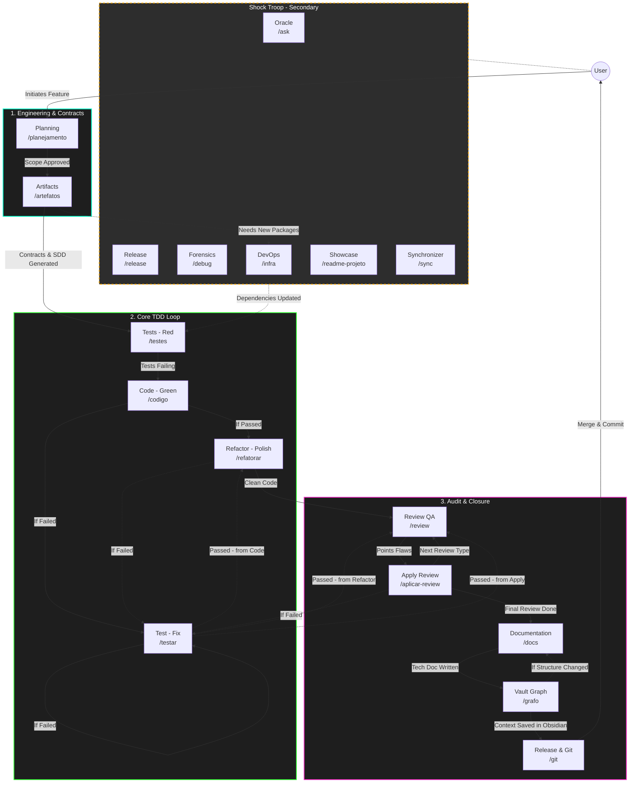

# Agent Architecture: Antigravity IDE

The foundation of artificial intelligence within the **Antigravity IDE** lies in fragmentation. Instead of using a single massive prompt prone to cognitive hallucinations (context exhaustion), the architecture separates responsibilities into "Specialist Agents". Each agent acts in a specific stage of the Software Development Life Cycle (SDLC) with well-defined architectural constraints and boundaries, operating as a State Machine.

---

## 🔀 The Router and Execution Architecture (Dynamic Context)

To completely eliminate prompt hallucination and cognitive overload, **Antigravity IDE** employs a strict "Router" vs "Execution" dichotomy for all agents:

1. **Lightweight Routers (`workflows/`):** The agent files in the `workflows/` directory act merely as State Machine Routers. They contain almost zero heavy logic. Their sole purpose is to identify the current trigger (e.g., `/planejamento`, `/codigo`) and determine the state.
2. **Dynamic Execution via MCP (`templates-and-workflows/`):** Once the state is identified, the router commands the AI to use the `obsidian_knowledge_graph` MCP tool to fetch the exact, heavy instructions from the `templates-and-workflows/` directory.

By dynamically loading only the exact execution template needed for the current phase/state, the AI's context window remains completely clean and hyper-focused on the immediate task.

---

## 🗺️ The Ecosystem (Workflows)

---

## 🏗️ 1. Planning Focused on BDD and SDD
This is the initial Requirements Engineering phase. No line of production code is generated here. The focus is to extract business rules and lock them into architectural contracts.

* **[Planning Agent](file:///d:/Codigos/antigravity-agentic-workflows/docs/agente-planejamento.md) (`/planejamento`):** 
  Operates by structuring features in Gherkin (BDD: *Given, When, Then*). Uses the Interview technique (*Grill Me*) to reject vague requirements. It focuses strictly on aligning the business expectation with the human.
* **[Artifacts Agent](file:///d:/Codigos/antigravity-agentic-workflows/docs/agente-artefatos.md) (`/artefatos`):**
  Takes the behavioral requirements (BDD) and transcribes them into Contracts (SDD - *Software Design Description*). It generates the physical Implementation Plan and draws all Sequence, Flow, and Database diagrams. If new dependencies or infrastructure changes are needed, it routes to `/infra` before starting tests.

## 🔁 2. Continuous Implementation Loop (Core TDD)
In this phase, logical implementation enters an isolated pipeline. Agents are strictly instructed to consult the SDD (Artifacts) and use the **Iterative Update of `task.md`** rule to avoid exploding the cognitive limit (hallucination).

* **[Tests Agent](file:///d:/Codigos/antigravity-agentic-workflows/docs/agente-testes.md) (`/testes`):** 
  (The Red Phase). Writes purely automated tests (Happy paths, Exceptions, Scalability) guided by the diagrams and contracts generated in phase 1.
* **[Code Agent](file:///d:/Codigos/antigravity-agentic-workflows/docs/agente-codigo.md) (`/codigo`):** 
  (The Green Phase). Works reactively. Reads the test suite from the previous agent and implements *only* the necessary code to turn the bar green. Inserts precise docstrings. Requires a test run: if tests pass, proceeds to `/refatorar`; if they fail, triggers `/testar`.
* **[Test Agent](file:///d:/Codigos/antigravity-agentic-workflows/docs/agente-testar.md) (`/testar`):** 
  (Universal Debugger). If tests fail at any point (`/codigo`, `/refatorar`, or `/aplicar-review`), this agent fixes the implementation by reading terminal errors. Once tests pass, it resumes the flow from the interrupted phase.
* **[Refactor Agent](file:///d:/Codigos/antigravity-agentic-workflows/docs/agente-refatorar.md) (`/refatorar`):** 
  (The Polish Phase). Takes the green code that was forged hot and applies SOLID Principles, eliminating duplications and abstracting functions. Requires a test run to ensure behavior wasn't broken. If successful, recommends starting a **new chat** to reset token limits before proceeding to `/review`.

## 🛡️ 3. The Review and Closure Phase (QA & Git)
Once the feature is stable, the code must be validated and documented before going to production. 

* **[Review Agent](file:///d:/Codigos/antigravity-agentic-workflows/docs/agente-review.md) (`/review`):** 
  Static audit agent (Read-Only). Operates in a sequential "Review Chain" (General, Architecture, Resilience, Security, Performance). Points out vulnerabilities in a formal checklist (`audit_report.md`).
* **[Apply Review Agent](file:///d:/Codigos/antigravity-agentic-workflows/docs/agente-aplicar-review.md) (`/aplicar-review`):** 
  Fixes executor. Consumes the report generated by QA and applies surgical *patches*. Requires a test run after fixes: if tests fail, triggers `/testar`; if they pass, moves to the next review in the chain or to `/docs` if audits are finished.
* **[Documentation Agent](file:///d:/Codigos/antigravity-agentic-workflows/docs/agente-docs.md) (`/docs`):** 
  The Technical Writer. Updates the manuals, references, and technical READMEs of modified folders, requiring you to approve the "preview" before saving.
* **[Graph Agent](file:///d:/Codigos/antigravity-agentic-workflows/docs/agente-grafo.md) (`/grafo`):** 
  The Archivist. Indexes new discoveries, architecture resolutions, and domain models into the **Obsidian Vault** (*Second Brain*). Triggers `/git` for packaging, or `/docs` again if folder structures were altered.
* **[Versioning Agent](file:///d:/Codigos/antigravity-agentic-workflows/docs/agente-git.md) (`/git`):** 
  The Release Engineer. Uses Conventional Commits with "Narrative Messages" and prepares semantic packages, returning clean Git Flow bash blocks to finalize the feature loop.

---

## 🚑 The Shock Troop (Operational Agents)
Agents isolated from the main flow. They act punctually correcting, cleaning, or assisting the dev.

* **[Oracle Agent](file:///d:/Codigos/antigravity-agentic-workflows/docs/agente-ask.md) (`/ask`):** Read-Only tool to ask how the codebase works. Always anchors answers in Obsidian or Files.
* **[Release Agent](file:///d:/Codigos/antigravity-agentic-workflows/docs/agente-release.md) (`/release`):** Acts orchestrating and generating the Release Candidate version and calculates Semantic Versioning (`SemVer`).
* **[Forensics Agent](file:///d:/Codigos/antigravity-agentic-workflows/docs/agente-debug.md) (`/debug`):** Specialist in the *5 Whys* technique. When a Production Crash occurs, generates structured hypotheses to not propose "guessed" solutions.
* **[DevOps Agent](file:///d:/Codigos/antigravity-agentic-workflows/docs/agente-infra.md) (`/infra`):** Handles Docker, requirements, Node modules, and `.env`. Blocked from committing real passwords.
* **[Showcase Agent](file:///d:/Codigos/antigravity-agentic-workflows/docs/agente-readme-projeto.md) (`/readme-projeto`):** Developer Advocate. Creates the primary project README focusing on setup ("How to run") and DX.
* **[Synchronizer Agent](file:///d:/Codigos/antigravity-agentic-workflows/docs/agente-sync.md) (`/sync`):** Cleaning routine. Forces the AI to reread the project's global laws (`GEMINI.md`, Vault Notes) to recalibrate the "token limit" and cease hallucinations.
