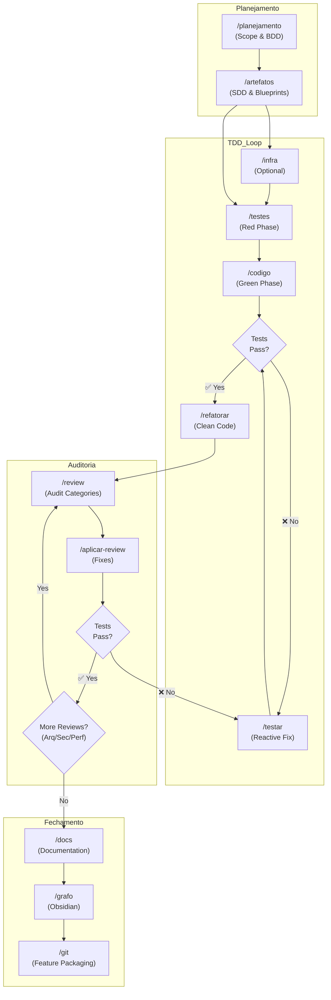

# 🪐 Antigravity Agentic Workflows

<p align="center">
  <em>Um ecossistema de Engenharia de Software orientado a Agentes de IA baseado em Máquina de Estados, "Second Brain" (Obsidian) e Separação de Responsabilidades.</em>
</p>

---

## 🎯 O Problema

Trabalhar com LLMs em bases de código grandes frequentemente resulta no problema do "gatilho rápido": a IA tenta refatorar arquivos inteiros ou cuspir código antes de entender completamente o escopo, as regras de negócio ou a arquitetura. Isso gera regressões, perda de contexto e frustração.

## 🚀 A Solução: Antigravity IDE Ecosystem

Este repositório contém a configuração e os *prompts* de um ecossistema completo de agentes para o **Antigravity IDE** (ou IDEs similares baseadas no Claude/Gemini). 

A arquitetura resolve o problema do "gatilho rápido" impondo uma **Máquina de Estados Estrita**. Cada agente possui uma "Persona" focada, restrições de permissão (Read-Only vs. Write) e depende de **Approval Gates** (aprovação humana) para avançar no ciclo de desenvolvimento.

O coração do sistema é o **"Second Brain"** (Vault do Obsidian via MCP), que atua como a única fonte da verdade para regras de negócio, ADRs (Architecture Decision Records) e histórico de bugs.

---

## ⚙️ Arquitetura dos Agentes (Máquina de Estados)

O ciclo de vida do software é dividido em comandos `/slash` estritos. Um agente nunca executa o trabalho de outro.

### 🔗 Cadeia de Comando (Fluxo Completo)



### 🕵️‍♂️ Consulta & Contexto
* **`/ask` (O Oráculo):** Modo *estritamente Read-Only*. Consulta o Obsidian Vault e a base de código para debater arquitetura ou explicar fluxos, com a garantia absoluta de que não tentará modificar arquivos.

### 📐 Engenharia de Requisitos (BDD & SDD)
* **`/planejamento` (O Analista de Negócios):** Entrevista o usuário para definir o escopo da feature, critérios de aceite (BDD) e atualiza o backlog no Vault. Só avança com `/planejamento ok`.
* **`/artefatos` (O Arquiteto de Software):** Pega os requisitos aprovados e gera o *Software Design Document* (SDD), incluindo diagramas Mermaid (Sequência, Classes) e contratos de API. Zero código de produção é escrito aqui.

### 🧪 Desenvolvimento Orientado a Testes (TDD)
* **`/testes` (O Engenheiro de QA - Fase Red):** Escreve *apenas* a suíte de testes (caminhos felizes e edge cases) com base nos artefatos aprovados. 
* **`/codigo` (O Desenvolvedor - Fase Green):** Escreve o código mínimo e necessário de produção para fazer os testes passarem.
* **`/testar` (O Bombeiro):** Agente reativo acionado exclusivamente quando os testes falham. Analisa o traceback e ajusta a lógica.

### 🔍 Auditoria & Refatoração
* **`/review` (O Auditor):** Executa checklists rigorosos (Segurança, Performance, Arquitetura) baseados em regras documentadas no Vault. Gera um relatório de auditoria (`analysis_results.md`).
* **`/aplicar-review` (O Executor):** Lê o relatório do auditor e aplica as correções cirurgicamente.

### 📦 Release Management
* **`/changelog` (O Engenheiro de Release):** Analisa os commits no padrão *Conventional Commits*, calcula o Semantic Versioning (Major, Minor, Patch), gera o `release_notes.md` e prepara os comandos do Git para as tags. Só executa os comandos após um `/release ok`.

---

## 🧠 O "Second Brain" (Integração com Obsidian)

O ecossistema não depende da memória volátil da janela de contexto da IA. Ele utiliza um Servidor MCP (Model Context Protocol) para se conectar a um Vault do Obsidian no repositório:

```text
vault/
├── 01-adrs/               # Decisões arquiteturais documentadas
├── 02-conventions/        # Padrões de código e linting
├── 03-pivots-and-bugs/    # Histórico forense de bugs resolvidos
├── 04-domain-rules/       # Regras de negócio core
├── 05-architecture-map/   # Mapas de componentes e integrações
├── 06-roadmap-and-state/  # Débito técnico, WIP e roadmap
├── 07-environment-setup/  # Build, deploy e configuração de ambiente
├── 08-templates/          # Templates obrigatórios dos agentes
└── 09-scopes-and-features/# Requisitos e BDDs
```
> *Antes de qualquer ação, os agentes são instruídos a ler estas pastas autonomamente para se contextualizarem.*

---

## 🛠️ Como Instalar e Utilizar

1. Copie a pasta `workflows/` e `agent_commands/` para o diretório de configurações do seu IDE (ex: `~/.gemini/config/`).
2. Configure o seu Vault do Obsidian para o repositório atual e ative a conexão MCP.
3. Inicie seu fluxo de trabalho com `/planejamento` ou consulte o projeto com `/ask`.

---

## 💡 Princípios de Design

* **Think First, Code Later:** O planejamento e os testes precedem o código de produção.
* **No Hallucinations:** Respostas e decisões técnicas devem ser atreladas a arquivos e notas do Vault.
* **Human-in-the-Loop:** A IA sugere, o humano orquestra e aprova.

---
*Construído como uma experimentação de ponta sobre como times de engenharia trabalharão em colaboração com IAs no futuro.*