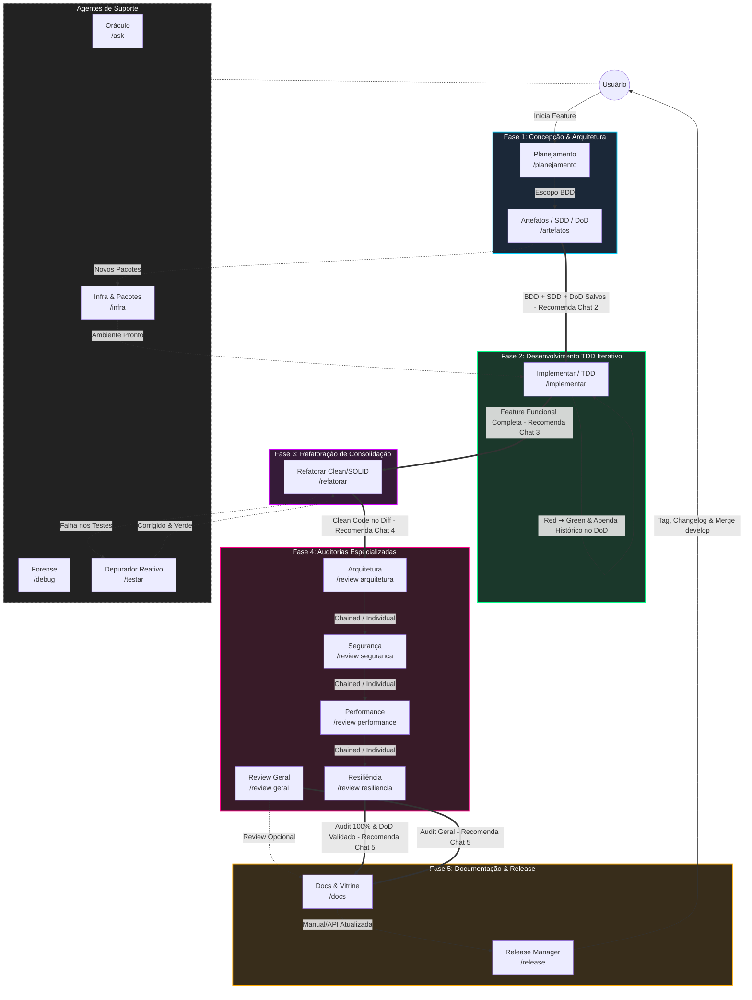

# 🪐 Antigravity Agentic Workflows

<p align="center">
  <em>An AI Agent-driven Software Engineering ecosystem based on State Machines, "Second Brain" (Obsidian Vault), and Separation of Concerns.</em>
</p>

<p align="center">
  
  
  
</p>

---

## 🎯 The Pitch (Why Antigravity?)

Working with LLMs on large codebases frequently results in the "trigger-happy" problem: the AI tries to refactor entire files before understanding the context, causing regressions and knowledge loss.

The **Antigravity IDE Ecosystem** solves this by enforcing a **Strict State Machine Architecture**, **Ephemeral Chat Windows**, and deep integration with a **"Second Brain"** (Obsidian Vault via MCP).

Each AI agent has restricted permissions and an isolated scope — from requirements engineering (BDD/SDD) and living DoD logs, through iterative TDD pipelines and diff-scoped Refactoring, down to OWASP-aligned Code Review, atomic documentation, and release management.

**The principle is absolute: AI suggests, human orchestrates and approves.**

---

## 🚀 Getting Started (5-Minute Quick Setup)

### 1. Prerequisites
* An IDE compatible with the Antigravity ecosystem (e.g., local Gemini/Claude setup).
* The **Obsidian** app installed locally (for project Knowledge Graph).

### 2. Installation

```bash
# Clone the repository
git clone https://github.com/MarcosVeniciu/antigravity-agentic-workflows.git
cd antigravity-agentic-workflows
```

### 3. Engaging the "Second Brain"
1. Open Obsidian.
2. Open your project's vault folder.
3. Enable the MCP (Model Context Protocol) server to connect the knowledge base to the AI.

### 4. First Run
Start your workflow by consulting project context or planning a new feature:

```bash
# Consult the Oracle (Read-Only Context)
/ask Explain how the current microservices architecture is designed.

# Start the Development Cycle (BDD & Requisitos)
/planejamento
```

---

## 🏗️ Arquitetura de Agentes & Skills

O ecossistema adota uma arquitetura **modular desacoplada em duas camadas**:

1. **Roteadores de Estado (`workflows/`)**: Arquivos leves que definem a persona do agente, restrições estritas, evidências de sucesso e os portões de transição (**[NEXT STEP]**).
2. **Skills Modulares (`skills/`)**: Instruções operacionais, scripts de automação, templates estáticos e manuais de referência injetados dinamicamente no contexto da IA.
3. **Registro Vivo de Execução & DoD (`01-concepcao/dod-[slug].md`)**: Documento dinâmico que centraliza o histórico do desenvolvimento (diário de bordo) e valida critérios de aceite funcional, não-funcional, auditorias e release.

> [!NOTE]
> **Repositório Matriz/Fonte**: Os diretórios `workflows/` e `skills/` neste repositório representam a **matriz de desenvolvimento** do ecossistema. Quando implantados para consumo global no ambiente do desenvolvedor, são instalados em `~/.gemini/config/skills/` e `~/.gemini/config/workflows/` (ou `.agents/` no workspace).

### 📂 Estrutura de Diretórios do Repositório

```text
antigravity-agentic-workflows/
├── workflows/                    # Roteadores de Estado (Slash Commands)
│   ├── planejamento.md           # /planejamento - Fase 1: Concepção & BDD
│   ├── artefatos.md              # /artefatos    - Fase 1: SDD & Artefatos de Arquitetura (Gera DoD Log)
│   ├── implementar.md            # /implementar  - Fase 2: Desenvolvimento TDD Iterativo (Red ➔ Green com Auto-Fix)
│   ├── refatorar.md              # /refatorar    - Fase 3: Refatoração de Consolidação (Clean Code no Diff)
│   ├── review.md                 # /review       - Fase 4: Auditorias Especializadas (Qualidade & OWASP v2.0)
│   ├── docs.md                   # /docs         - Fase 5: Documentação Técnica & Showcase
│   ├── release.md                # /release      - Fase 5: Versionamento, Changelog & DoD Check
│   ├── testar.md                 # /testar       - Suporte: Depurador Reativo / Fix (Suporte em Refatoração)
│   ├── ask.md                    # /ask          - Suporte: Oráculo (Read-Only)
│   ├── debug.md                  # /debug        - Suporte: Investigação Forense (5 Whys)
│   └── infra.md                  # /infra        - Suporte: Pacotes & Ambiente
├── skills/                       # Skills modulares (Recursos, Scripts e Referências)
│   ├── planejamento/             # SKILL.md, resources/ (BDD template), references/
│   ├── artefatos/                # SKILL.md, resources/ (SDD/Diagram templates), references/
│   ├── implementar-code/         # SKILL.md (Execução TDD Red+Green, micro-checkpoints)
│   ├── implementar-plan/         # SKILL.md (Decomposição arquitetural e plano em lotes)
│   ├── testar/                   # SKILL.md, references/ (Fix protocols)
│   ├── refatorar/                # SKILL.md, references/ (SOLID refactoring escopado ao diff)
│   ├── review/                   # SKILL.md, references/ (Checklists de auditoria unificados & OWASP v2.0)
│   ├── docs/                     # SKILL.md, resources/ (Doc templates)
│   ├── release/                  # SKILL.md, resources/ (Changelog templates)
│   ├── ask/                      # SKILL.md, references/ (Query guidelines)
│   ├── debug/                    # SKILL.md, references/ (Root cause analysis)
│   ├── git/                      # SKILL.md, scripts/ (Git Flow & Micro-checkpoints)
│   └── grafo/                    # SKILL.md, references/ (Obsidian Knowledge Vault ops)
├── docs/                         # Visão geral da arquitetura do ecossistema
│   └── README.md                 # Mapeamento detalhado dos agentes e fluxo em 5 Fases
├── docs-antigravity/             # Manuais técnicos e guias de governança
│   ├── guia-fluxo-desenvolvimento.md # Manual do Ciclo de Vida Multi-Chat e Phase Gates
│   ├── guia-skills.md            # Especificação técnica e criação de Skills
│   ├── guia-base-conhecimento.md # Integração MCP e estrutura do Obsidian Vault
│   ├── guia-artefatos.md         # Padrões de planos e artefatos de saída
│   └── boas-praticas-agentes.md  # Diretrizes de design e construção de Agentes
└── prompts/                      # System prompts e governança global
```

---

## 🗺️ O Ecossistema em 5 Fases (Pipeline Multi-Chat SDLC)

Para evitar degradação do modelo por acúmulo de contexto (*token exhaustion*), a execução de uma *feature* é dividida em **5 Janelas de Chat Efêmeras**:



---

## ⚡ Otimizações do Fluxo & Justificativas Técnicas

1. **Refatoração Eficiente Escopada ao Diff (Fase 3)**:
   - A refatoração ocorre em uma fase consolidadora própria (Fase 3), realizada sobre uma suíte de testes 100% verde (*Make it Right*).
   - O escopo de análise e refatoração é **restrito exclusivamente aos arquivos alterados na branch atual** (`git diff --name-only`), eliminando desperdício de tokens e o risco de regressões em código legado não alterado.

2. **Autonomia da Fase 2 (`/implementar`) e Micro-Checkpoints**:
   - A Fase 2 (`/implementar`) conduz todo o ciclo TDD (Red ➔ Green) e realiza internamente o auto-ajuste/correção do código que implementou antes de consolidar os testes.
   - A cada teste verde concluído, um micro-checkpoint (`git commit`) é gerado e o diário de bordo no `dod-[slug].md` é atualizado.

3. **Artefato Vivo de Acompanhamento (`01-concepcao/dod-[slug].md`)**:
   - Centraliza a linha do tempo do desenvolvimento (diário de bordo) e a Definition of Done (DoD) com checklists funcionais, não-funcionais, de auditoria e de release.
   - Atua como a única fonte da verdade (SSOT) para validação objetiva antes de autorizar o versionamento e merge.

4. **Auditoria de Segurança Alinhada ao OWASP (Fase 4)**:
   - O ecossistema `/review` foi expandido e alinhado com os pilares do **OWASP Code Review Guide v2.0**.
   - Cobre verificações estritas de controle de acesso, criptografia, sanitização de dados, gestão de segredos e resiliência de infraestrutura.

5. **Depurador Reativo de Suporte (`/testar`)**:
   - O agente `/testar` atua como suporte especializado, sendo acionado cirurgicamente caso testes venham a falhar durante a fase de refatoração (`/refatorar`) ou para correções pontuais fora do fluxo principal.

---

## 🤖 Catálogo de Agentes & Slash Commands

| Comando | Workflow / Agente | Fase / Papel | Descrição / Responsabilidade Principal |
| :--- | :--- | :--- | :--- |
| `/planejamento` | [planejamento.md](workflows/planejamento.md) | **Fase 1** | Conduz a especificação de requisitos orientada a BDD (Gherkin). |
| `/artefatos` | [artefatos.md](workflows/artefatos.md) | **Fase 1** | Elabora a arquitetura técnica (SDD) e gera o documento vivo de aceite e histórico (`dod-[slug].md`). |
| `/implementar` | [implementar.md](workflows/implementar.md) | **Fase 2** | Desenvolvedor TDD: Ciclo iterativo Red ➔ Green com correções internas e micro-checkpoints no Git. |
| `/refatorar` | [refatorar.md](workflows/refatorar.md) | **Fase 3** | Clean Code & SOLID: Refatora o código verde limitando a análise exclusivamente aos arquivos alterados no diff (`git diff --name-only`). |
| `/review` | [review.md](workflows/review.md) | **Fase 4** | Auditorias Especializadas: Avalia Qualidade, Arquitetura, Segurança (OWASP Code Review Guide v2.0), Performance e Resiliência. |
| `/docs` | [docs.md](workflows/docs.md) | **Fase 5** | Atualiza documentação técnica interna e a vitrine (`README.md`). |
| `/release` | [release.md](workflows/release.md) | **Fase 5** | Valida 100% dos critérios do `dod-[slug].md`, calcula SemVer e gera nota de versão (Changelog). |
| `/testar` | [testar.md](workflows/testar.md) | **Suporte** | Depurador Reativo: Suporte à refatoração para analisar tracebacks e aplicar correções cirúrgicas se houver quebra de testes. |
| `/ask` | [ask.md](workflows/ask.md) | **Suporte** | Oráculo Read-Only: Responde dúvidas sem alterar nenhum arquivo do sistema. |
| `/debug` | [debug.md](workflows/debug.md) | **Suporte** | Investigador Forense: Investiga runtime crashes e erros complexos de ambiente (5 Whys). |
| `/infra` | [infra.md](workflows/infra.md) | **Suporte** | DevOps/SysAdmin: Gerencia manifestos de dependências e configurações de contêiner. |

---

## 📚 Deep Delegation (Manuais Técnicos)

Para aprofundar no funcionamento da arquitetura e nos padrões adotados no projeto, consulte a documentação detalhada:

* 📖 **[Arquitetura do Ecossistema](docs/README.md)**: Visão completa do modelo Router vs. Skill e fluxo de agentes.
* 🔄 **[Guia do Fluxo de Desenvolvimento](docs-antigravity/guia-fluxo-desenvolvimento.md)**: Especificação técnica do ciclo Multi-Chat em 5 Fases e Phase Gates.
* 🛠️ **[Guia de Skills](docs-antigravity/guia-skills.md)**: Manual de criação, anatomia e uso de Skills modulares.
* 🧠 **[Guia da Base de Conhecimento](docs-antigravity/guia-base-conhecimento.md)**: Protocolo de integração MCP e estrutura do "Second Brain" no Obsidian.
* 📑 **[Guia de Artefatos](docs-antigravity/guia-artefatos.md)**: Padrões de relatórios, planos de implementação e diagramas.
* 📐 **[Boas Práticas para Agentes](docs-antigravity/boas-praticas-agentes.md)**: Diretrizes de concisão, extensibilidade e roteamento para agentes LLM.

---

<p align="center">
  <em>Built as a cutting-edge experiment on how engineering teams will work in collaboration with AIs in the future.</em>
</p>
