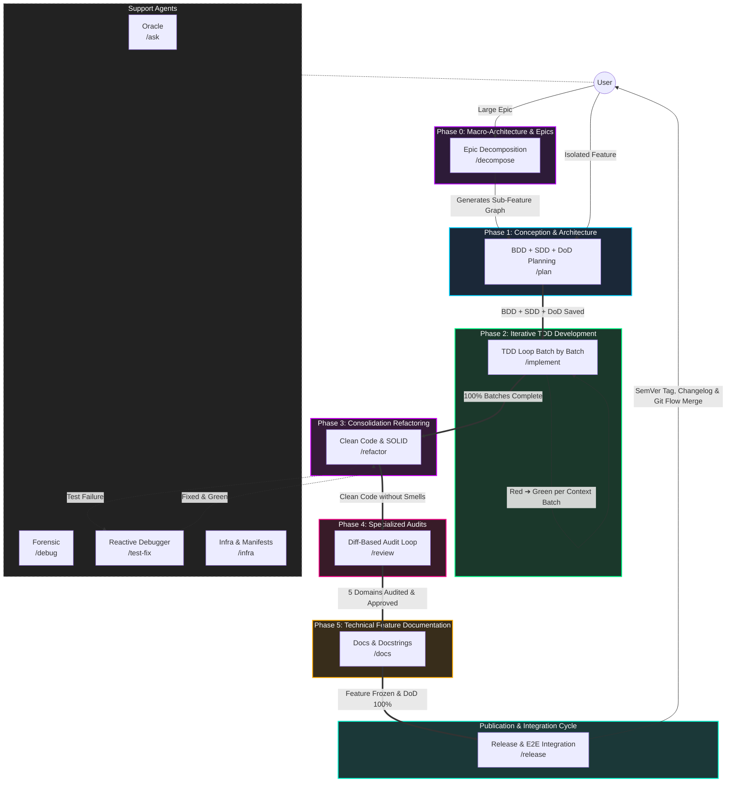

# 🪐 Antigravity Agentic Workflows

<p align="center">
  <em>An AI Agent-driven Software Engineering ecosystem based on State Machines, "Second Brain" (Obsidian Vault), and Separation of Concerns.</em>
</p>

<p align="center">
  
  
  
</p>

---

## 🎯 The Pitch (Why Antigravity?)

Working with LLMs on large codebases frequently results in the "trigger-happy" problem: the AI tries to refactor entire files before understanding the context, causing regressions and knowledge loss.

The **Antigravity IDE Ecosystem** solves this by enforcing a **Strict State Machine Architecture**, **Ephemeral Chat Windows**, and deep integration with a **"Second Brain"** (Obsidian Vault via MCP).

Each AI agent has restricted permissions and an isolated scope — from requirements engineering (BDD/SDD) and living DoD logs, through iterative TDD pipelines and diff-scoped Refactoring, down to OWASP-aligned Code Review, atomic documentation, and release management.

**The principle is absolute: AI suggests, human orchestrates and approves.**

---

## 🚀 Getting Started (5-Minute Quick Setup)

### 1. Prerequisites
* An IDE compatible with the Antigravity ecosystem (e.g., local Gemini/Claude setup).
* The **Obsidian** app installed locally (for project Knowledge Graph).

### 2. Installation (Automated Setup)

Clone the repository (or download and extract the ZIP file):

```bash
git clone https://github.com/MarcosVeniciu/antigravity-agentic-workflows.git
cd antigravity-agentic-workflows
```

Run the automated installer for your operating system:

#### 🪟 Windows
* **1-Click**: Double-click `install.bat` in File Explorer.
* **PowerShell (Interactive Menu)**:
  ```powershell
  .\install.ps1
  ```
  *(Options: `[1] Global`, `[2] Project`, `[3] Restore Backup`, `[4] Uninstall`, `[5] Exit`)*
* **PowerShell (Direct CLI)**:
  ```powershell
  # Global install (~/.gemini)
  .\install.ps1 -Global

  # Specific project install (.agents/)
  .\install.ps1 -Project "C:\Path\To\YourProject"

  # Restore / Rollback to a previous snapshot
  .\install.ps1 -Restore

  # Uninstall workflows, skills and rules cleanly
  .\install.ps1 -Uninstall
  ```

#### 🐧 Linux & 🍎 macOS
```bash
# Make executable and run interactive menu:
chmod +x install.sh
./install.sh

# Or direct CLI flags:
./install.sh --global
./install.sh --project "/path/to/your/project"
./install.sh --restore
./install.sh --uninstall
```

> [!TIP]
> **Safety, Backups, Rollback & Uninstall**:
> * **Transaction Manifest (`manifest.json`)**: Every installation records both modified and newly added files. When rolling back a fresh install, all newly added files are deleted cleanly, restoring the environment to a 100% clean state.
> * **Rollback**: Access previous snapshots via menu option `[3] Restore Backup` or `.\install.ps1 -Restore` / `./install.sh --restore`.
> * **Uninstall**: Cleanly remove installed resources via option `[4] Uninstall` or `.\install.ps1 -Uninstall` / `./install.sh --uninstall`. A safety backup is always created automatically prior to removal.
> * **Dry-Run**: Append `--dry-run` (or `-DryRun`) to any command to preview operations without modifying files on disk.

### 3. Engaging the "Second Brain"
1. Open Obsidian.
2. Open your project's vault folder.
3. Enable the MCP (Model Context Protocol) server to connect the knowledge base to the AI.

### 4. First Run
Start your workflow by consulting project context or planning a new feature:

```bash
# Consult the Oracle (Read-Only Context)
/ask Explain how the current microservices architecture is designed.

# Start the Development Cycle (BDD & Requirements)
/plan
```

---

## 🏗️ Agent & Skill Architecture

The ecosystem adopts a **modular two-layer decoupled architecture**:

1. **State Routers (`workflows/`)**: Lightweight playbooks defining agent persona, strict constraints, success evidence, and transition gates (**[NEXT STEP]**).
2. **Modular Skills (`skills/`)**: Operational procedures, automation scripts, templates, and reference manuals injected on-demand into AI context via Progressive Disclosure.
3. **Living Execution Log & DoD (`01-concepcao/dod-[slug].md`)**: Dynamic document centralizing development timeline history and gating functional acceptance criteria, non-functional rules, audits, and releases.

> [!NOTE]
> **Source / Matrix Repository**: The `workflows/`, `skills/`, and `prompts/` directories in this repository represent the **development matrix** of the ecosystem. When deployed globally to the developer's environment, they are installed in `~/.gemini/GEMINI.md`, `~/.gemini/config/global_workflows/`, and `~/.gemini/config/skills/` (or `<project>/.agents/` and `<project>/GEMINI.md` inside workspaces).

### 📂 Repository Directory Structure

```text
antigravity-agentic-workflows/
├── install.bat                   # 1-Click Windows installer launcher (File Explorer)
├── install.ps1                   # Native PowerShell installer (Windows 10/11 & Core)
├── install.sh                    # Native POSIX Bash installer (Linux / macOS / WSL)
├── workflows/                    # State Routers (Slash Commands)
│   ├── decompose.md              # /decompose    - Phase 0: Macro-Architecture & Epic Slicing
│   ├── plan.md                   # /plan         - Phase 1: Conception, BDD, SDD & Living DoD
│   ├── implement.md              # /implement    - Phase 2: Iterative TDD Development (Red -> Green by Batches)
│   ├── refactor.md               # /refactor     - Phase 3: Consolidation Refactoring (Clean Code on Diff)
│   ├── review.md                 # /review       - Phase 4: Specialized Audits (Arch, Sec, Quality, Perf, Resilience)
│   ├── docs.md                   # /docs         - Phase 5: Technical Feature Documentation & Docstrings
│   ├── release.md                # /release      - Publication: E2E Integration Tests, SemVer & Git Flow
│   ├── test-fix.md               # /test-fix     - Support: Reactive Debugger & Surgical Fixes
│   ├── ask.md                    # /ask          - Support: Read-Only Oracle (Code & Obsidian)
│   ├── debug.md                  # /debug        - Support: Forensic Crash Investigator (5 Whys)
│   └── infra.md                  # /infra        - Support: Manifests, Docker & Dependencies
├── skills/                       # Modular Skills (Resources, Scripts & References)
│   ├── plan-decompose/           # Evolutionary vertical slicing & monotonic breakdown
│   ├── plan-debate/              # Outcome-Based Prompting & Socratic inquiry (3-5 questions)
│   ├── plan-bdd/                 # Behavioral scenarios in pure Gherkin syntax
│   ├── plan-sdd/                 # Architectural blueprint, Mermaid diagrams & typed contracts
│   ├── dod/                      # Living DoD governance & execution log (dod-[slug].md)
│   ├── tdd-plan/                 # Context batch decomposition & execution checklists
│   ├── tdd-tests/                # AAA unit test suites & mock matrices
│   ├── tdd-code/                 # Minimal SOLID production code ("Make It Work") & pivot records
│   ├── test-fix/                 # Traceback diagnosis & surgical production hotfixes
│   ├── refactor/                 # Code smells elimination & Clean Code scoped to git diff
│   ├── review-architecture/      # Layer boundaries, coupling & Dependency Inversion audit
│   ├── review-security/          # OWASP Top 10, secret detection, injection & privacy audit
│   ├── review-quality/           # AST cyclomatic complexity (V(G) <= 10) & style audit
│   ├── review-performance/       # N+1 query elimination, memory leaks & I/O audit
│   ├── review-resilience/        # Timeouts, retry backoff, circuit breakers & fallbacks
│   ├── docs/                     # Living module/root READMEs & traceable docstrings
│   ├── test-integration/         # Staged E2E suite on release branch with console banners
│   ├── release/                  # SemVer 2.0.0 calculation & cumulative changelog generation
│   ├── git/                      # Central Git Flow (5 Modes: Branch, Checkpoint, Squash, Rollback, Release)
│   ├── obsidian/                 # SSOT Vault governance, metadata search & surgical patching
│   ├── notebooklm/               # User-governed external paper & documentation research
│   ├── ask/                      # Strictly read-only investigation guidelines & citations
│   ├── debug/                    # 5 Whys framework & root cause analysis
│   └── infra/                    # Manifest management, Docker & safe environment variables
├── docs/                         # Comprehensive technical documentation & guides
│   ├── README.md                 # Architectural overview & 5-Phase lifecycle
│   ├── agentes/                  # Deep-dive manuals for each workflow & orchestrator
│   │   ├── README.md             # Agents catalog & quality gates map
│   │   ├── core-gemini.md        # Core engine protocol & pair programming rules
│   │   └── [workflow].md         # Step-by-step orchestrator guides (/plan, /implement, etc.)
│   ├── skills/                   # Technical manuals for all 24 atomic skills
│   │   ├── README.md             # Modular skills catalog & category map
│   │   └── [skill-name].md       # Specific SRP manuals (git, dod, obsidian, etc.)
│   ├── references/               # Authoritative security & architecture standards
│   │   └── OWASP_Code_Review_Guide_v2.pdf
│   └── change_history/           # Architecture evolution & adjustments history
│       └── planejamento_de_ajustes_fluxo.md
└── prompts/                      # System prompts & global governance (gemini.md)
```

---

## 🗺️ Ecosystem Lifecycle (Multi-Chat SDLC Pipeline)

To avoid model degradation caused by accumulated context (*token exhaustion*), execution is partitioned into **Ephemeral Chat Windows**:



---

## ⚡ Workflow Optimizations & Technical Rationale

1. **Diff-Scoped Efficient Refactoring (Phase 3)**:
   - Refactoring takes place in its own dedicated consolidation phase (Phase 3), executed strictly on a 100% green test suite (*Make it Right*).
   - Analysis and refactoring scope is **strictly limited to files modified on the active branch** (`git diff develop...HEAD --name-only`), eliminating token waste and the risk of regressions in untouched legacy code.

2. **Phase 2 (`/implement`) Autonomy & Micro-Checkpoints**:
   - Phase 2 (`/implement`) manages the entire TDD cycle (Red ➔ Green) divided into dependent context batches (`skills/tdd-plan`, `skills/tdd-tests`, `skills/tdd-code`).
   - For every completed green batch, a local micro-checkpoint (`git commit`) is recorded and the timeline in `dod-[slug].md` is updated.

3. **Living Tracking Artifact (`01-concepcao/dod-[slug].md`)**:
   - Centralizes development timeline history and the Definition of Done (DoD) with functional, non-functional, audit, and release checklists.
   - Acts as the Single Source of Truth (SSOT) for objective gating before authorizing versioning and merges.

4. **Domain-Specialized Audits (Phase 4)**:
   - `/review` decomposes analysis into 5 atomic audits executed directly on the git diff: Architecture, Security (OWASP Top 10/ASVS), Quality (AST $V(G) \le 10$), Performance, and Resilience.

5. **Reactive Debugger Support (`/test-fix`)**:
   - `/test-fix` provides surgical debugging support if tests fail during implementation (`/implement`) or refactoring (`/refactor`), isolating root cause in 1 sentence and applying minimal fixes to production code.

---

## 🤖 Agents & Slash Commands Catalog

| Command | Workflow File | Detailed Manual | Phase / Role | Description / Main Responsibility |
| :--- | :--- | :--- | :--- | :--- |
| `/decompose` | [`decompose.md`](workflows/decompose.md) | [`agentes/decompose.md`](docs/agentes/decompose.md) | **Phase 0** | Decomposes complex epics and large demands into evolutionary, monotonic vertical slices. |
| `/plan` | [`plan.md`](workflows/plan.md) | [`agentes/plan.md`](docs/agentes/plan.md) | **Phase 1** | Outcome-Based debate, Git Flow branch setup, BDD scenarios, SDD blueprints, and Living DoD. |
| `/implement` | [`implement.md`](workflows/implement.md) | [`agentes/implement.md`](docs/agentes/implement.md) | **Phase 2** | TDD Developer: Batch planning, AAA unit tests (Red), minimal SOLID code (Green), and checkpoints. |
| `/refactor` | [`refactor.md`](workflows/refactor.md) | [`agentes/refactor.md`](docs/agentes/refactor.md) | **Phase 3** | Clean Code & SOLID: Refactors green code strictly scoped to files modified in the diff. |
| `/review` | [`review.md`](workflows/review.md) | [`agentes/review.md`](docs/agentes/review.md) | **Phase 4** | Iterative audit loop: Architecture, Security (OWASP), AST Quality, Performance, and Resilience. |
| `/docs` | [`docs.md`](workflows/docs.md) | [`agentes/docs.md`](docs/agentes/docs.md) | **Phase 5** | Updates living technical documentation (module/root READMEs) and docstrings traceable to Obsidian. |
| `/release` | [`release.md`](workflows/release.md) | [`agentes/release.md`](docs/agentes/release.md) | **Publication** | Verifies 100% DoD, runs staged E2E integration test suite, computes SemVer, generates Changelog, and finishes Git Flow. |
| `/test-fix` | [`test-fix.md`](workflows/test-fix.md) | [`agentes/test-fix.md`](docs/agentes/test-fix.md) | **Support** | Reactive Debugger: Analyzes terminal tracebacks and applies minimal surgical fixes to production code. |
| `/ask` | [`ask.md`](workflows/ask.md) | [`agentes/ask.md`](docs/agentes/ask.md) | **Support** | Read-Only Oracle: Answers conceptual and technical questions without modifying any files. |
| `/debug` | [`debug.md`](workflows/debug.md) | [`agentes/debug.md`](docs/agentes/debug.md) | **Support** | Forensic Investigator: Diagnoses runtime crashes and complex systemic failures using 5 Whys. |
| `/infra` | [`infra.md`](workflows/infra.md) | [`agentes/infra.md`](docs/agentes/infra.md) | **Support** | DevOps/SysAdmin: Safely manages dependency manifests, container configurations, and environment variables. |

> [!NOTE]
> **Foundational Core Protocol**: The global engine directives (*Think First, Code Later*, Double-Strike Rule, initial status banner, and SSOT memory governance) are specified in [`prompts/gemini.md`](prompts/gemini.md) and documented in [`docs/agentes/core-gemini.md`](docs/agentes/core-gemini.md).

---

## 🧰 Modular Skills Catalog (24 Atomic Skills)

All 24 skills strictly adhere to the Single Responsibility Principle (SRP) and are loaded on-demand via Progressive Disclosure. For full technical instructions and usage guides, see the [Skills Catalog](docs/skills/README.md):

| Category | Skills & Documentation | Primary SRP Responsibility |
| :--- | :--- | :--- |
| **1. Foundation & Cross-Cutting** | [`git`](docs/skills/git.md), [`dod`](docs/skills/dod.md), [`obsidian`](docs/skills/obsidian.md), [`notebooklm`](docs/skills/notebooklm.md) | Git Flow branch/checkpoint/rollback governance, Living DoD tracking, SSOT Vault integrity, and user-governed research. |
| **2. Macro & Conception** | [`plan-decompose`](docs/skills/plan-decompose.md), [`plan-debate`](docs/skills/plan-debate.md), [`plan-bdd`](docs/skills/plan-bdd.md), [`plan-sdd`](docs/skills/plan-sdd.md) | Monotonic vertical slicing, Outcome-Based debate, Gherkin BDD specifications, and SDD typed boundary contracts. |
| **3. TDD Construction** | [`tdd-plan`](docs/skills/tdd-plan.md), [`tdd-tests`](docs/skills/tdd-tests.md), [`tdd-code`](docs/skills/tdd-code.md), [`test-fix`](docs/skills/test-fix.md) | Context batching, AAA unit test suites with mocks, minimal SOLID code, and surgical traceback root cause fixes. |
| **4. Refactoring & Design** | [`refactor`](docs/skills/refactor.md) | Clean Code & SOLID refactoring strictly scoped to branch diff (`git diff develop...HEAD`) preserving 100% green tests. |
| **5. Specialized Audits** | [`review-architecture`](docs/skills/review-architecture.md), [`review-security`](docs/skills/review-security.md), [`review-quality`](docs/skills/review-quality.md), [`review-performance`](docs/skills/review-performance.md), [`review-resilience`](docs/skills/review-resilience.md) | Script-First audits: layer isolation, OWASP v2 code crawling & Taint Analysis, AST $V(G) \le 10$, N+1 queries, and timeouts/retries. |
| **6. Documentation & Delivery** | [`docs`](docs/skills/docs.md), [`test-integration`](docs/skills/test-integration.md), [`release`](docs/skills/release.md) | Manifest-validated READMEs/docstrings, staged 9-step E2E integration runner, and SemVer 2.0.0 cumulative releases. |
| **7. Support & Diagnostics** | [`ask`](docs/skills/ask.md), [`debug`](docs/skills/debug.md), [`infra`](docs/skills/infra.md) | Strictly read-only vault navigation, 5 Whys forensic RCA, and leak-safe manifest/container management. |

---

## 📚 Deep Delegation (Technical Manuals)

To explore architecture details, execution runbooks, and project standards, consult the detailed documentation in [`docs/`](docs/):

* 📖 **[Ecosystem Architecture](docs/README.md)**: Comprehensive architectural view of the Router vs. Skill execution model and agent lifecycle.
* 🤖 **[Agents & Workflows Catalog](docs/agentes/README.md)**: Complete guide to orchestrator workflows, quality gates, and multi-chat phase transitions.
* 🛡️ **[Core Engine Protocol](docs/agentes/core-gemini.md)**: Foundational pair-programming rules (*Think First, Code Later*, Double-Strike Rule, status banners, SSOT memory).
* 🧰 **[Modular Skills Catalog](docs/skills/README.md)**: Detailed specification for all 24 atomic skills categorized across 7 domains.
* 🧠 **[Second Brain & Obsidian SSOT](docs/skills/obsidian.md)**: Obsidian Vault governance, metadata search, surgical patching, and ADR management.
* 📋 **[Living DoD & Execution Log](docs/skills/dod.md)**: Definition of Done governance, timeline tracking (`dod-[slug].md`), and mathematical release gates.
* 🔒 **[OWASP Security Code Review Reference](docs/references/OWASP_Code_Review_Guide_v2.pdf)**: Authoritative OWASP Code Review Guide v2 used by the Phase 4 review agent.
* 📜 **[Architecture Evolution History](docs/change_history/planejamento_de_ajustes_fluxo.md)**: Historical planning and structural evolution log of workflows and skills.

---

<p align="center">
  <em>Built as a cutting-edge experiment on how engineering teams will work in collaboration with AIs in the future.</em>
</p>