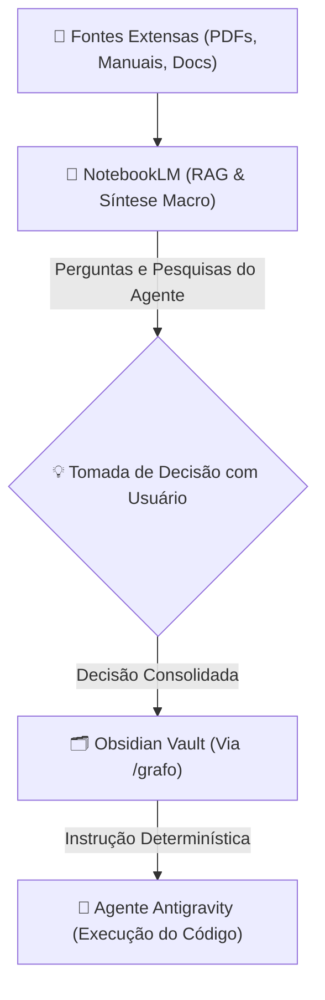
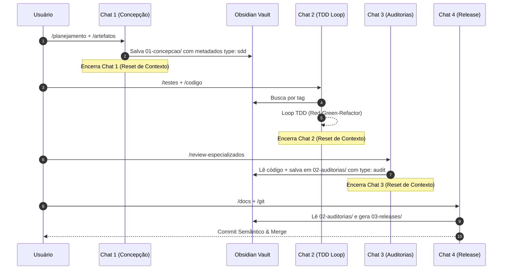

# Guia de Referência: Gestão e Arquitetura da Base de Conhecimento (Obsidian vs. NotebookLM)

Este documento detalha o ecossistema de conhecimento do projeto **Antigravity**, estabelecendo a divisão clara de responsabilidades entre o **Obsidian** (`obsidian_knowledge_graph`) e o **NotebookLM** (`notebooklm`), além da **arquitetura de pastas orientada ao ciclo de vida da feature** e o **padrão de indexação baseada em metadados (Frontmatter/Tags)**.

---

## 1. Visão Geral e Filosofia de Conhecimento

Para evitar dois dos maiores gargalos em arquiteturas baseadas em LLM — **a diluição do limite de atenção do modelo** e a **escala exponencial do custo de tokens por acúmulo de histórico** —, o projeto adota uma abordagem de **Memória Descentralizada e Ciclos de Chat Curtos (Multi-Chat)**.

Neste paradigma:
* Os **Chats de Conversa** atuam como memória de trabalho (RAM temporária), sendo descartados ao final de cada fase.
* A **Base de Conhecimento** atua como o disco rígido (Segunda Mente / "Second Brain"), persistindo o estado, decisões e pesquisas entre uma fase e outra.

---

## 2. Divisão de Responsabilidades: Obsidian vs. NotebookLM

O ecossistema é dividido entre conhecimento **determinístico/operacional** e conhecimento **exploratório/macro**.

| Característica | 🗂️ Obsidian (`obsidian_knowledge_graph`) | 🧠 NotebookLM (`notebooklm`) |
| :--- | :--- | :--- |
| **Papel Principal** | Segunda Mente Operacional e Fonte da Verdade | Motor de Pesquisa, RAG e Síntese Macro |
| **Natureza da Informação** | Determinística, atômica, estruturada e versionada | Probabilística, sintetizada, multi-documento |
| **Tipo de Conteúdo** | ADRs, convenções de código, regras de negócio, checklists de auditoria, planos por feature | Manuais densos de terceiros, especificações de produtos, pesquisas de mercado, e-books |
| **Escopo de Busca** | Busca cirúrgica por chave, tags e grafos de links | Busca semântica e respostas elaboradas em linguagem natural |
| **Local de Armazenamento** | Arquivos Markdown no repositório (`.obsidian` / vault) | Nuvem (Notebooks organizados por domínio) |
| **Integração no Agente** | Leitura e escrita via ferramentas do MCP Vault | Consulta de alto nível via ferramentas do MCP NotebookLM |

---

## 3. O Fluxo de Integração (Pesquisa ➔ Decisão ➔ Registro)

O fluxo de informação entre as duas ferramentas segue um ciclo estruturado de refinamento:



1. **Pesquisa & Ingestão (NotebookLM):** Ingestão de materiais brutos e extensos no NotebookLM para análise semântica.
2. **Exploração Conceitual:** O agente consulta o NotebookLM para responder dúvidas de arquitetura de alto nível ou entender integrações complexas.
3. **Persistência de Decisão (Obsidian):** Uma vez definida a abordagem para o projeto, o resultado é resumido e gravado no Obsidian via workflow `/grafo` como nota atômica (ADR, regra de negócio ou convenção).
4. **Execução Precisa:** Durante o desenvolvimento do código, o agente consulta exclusivamente o Obsidian, garantindo 100% de precisão e zero alucinação sobre regras do projeto.

---

## 4. Nova Arquitetura de Pastas do Obsidian (Orientada a Fases)

Para permitir que a IA realize buscas ultra velozes e economize tokens a cada requisição, as pastas do Obsidian deixam de ser divididas apenas por "tema" e passam a espelhar **o ciclo de vida da feature**.

### 📁 Estrutura do Vault

```text
obsidian-vault/
│
├── 🗂️ 00-core-rules/            # O Cérebro Global (Estático)
│   ├── 📄 conventions.md        # Diretrizes universais de código, TDD e boas práticas
│   ├── 📄 domain-glossary.md    # Regras de negócio universais / Linguagem Ubíqua
│   └── 📁 adrs/                 # Architectural Decision Records globais e definitivas
│
├── 🗂️ 01-concepcao/             # Fase 1: Especificação & Contratos (Entrada do Chat 1 / Saída para Chat 2)
│   ├── 📄 bdd-[feature-slug].md  # Casos de uso e comportamentos esperados (BDD)
│   └── 📄 sdd-[feature-slug].md  # Plano de Implementação / Diagramas / Mocks / Contratos
│
├── 🗂️ 02-auditorias/            # Fase 3: Garantia & Qualidade (Entrada/Saída do Chat 3)
│   ├── 📄 audit-[feature-slug].md # Checklist unificado (Arquitetura, Segurança e Performance)
│   └── 📄 pivots-[feature-slug].md# Bugs de percurso resolvidos e decisões locais de refatoração
│
├── 🗂️ 03-releases/              # Fase 4: Entrega (Saída do Chat 4)
│   └── 📄 changelog-vX.X.md     # Release notes, guias de migração e docs de API atualizadas
│
└── 🗂️ 04-templates/             # Máquinas de Estado e Routers
    ├── 📁 agent-routers/        # Prompts pesados e roteadores de estado dos agentes
    └── 📁 checklists/           # Checklists brutas para auditoria de segurança, performance e arquitetura
```

---

## 5. Padrão de Metadados e Tags (Metadata-Driven Indexing)

Para evitar dependência de nomes rígidos de arquivos e garantir descobertas semânticas precisas, todas as notas criadas no Obsidian devem incluir obrigatoriamente um bloco de **YAML Frontmatter** no topo do arquivo.

### 📋 Estrutura do Cabeçalho (YAML Frontmatter)

```markdown
---
type: sdd                  # Categoria da nota: sdd, bdd, audit, pivot, adr, convention
feature: oauth2-login      # Slug exato da feature / branch git ativa
project: antigravity       # Nome do repositório / projeto
date: 2026-07-17           # Data de criação da nota (YYYY-MM-DD)
description: "Plano de implementação da autenticação OAuth2 integrando provedores Google e GitHub"
tags:
  - plan_implement
  - feature/oauth2-login
  - phase/concepcao
---

# Título da Nota (Pode ser livre e descritivo)
...
```

### 🏷️ Dicionário de Campos de Metadados

* **`type`:** Identificador atômico do tipo de documento (`sdd`, `bdd`, `audit`, `pivot`, `adr`, `convention`).
* **`feature`:** Slug da funcionalidade, devendo coincidir com o nome da branch Git.
* **`project`:** Nome do projeto para evitar ambiguidades em ambientes multi-repositório.
* **`date`:** Data de criação para ordenação e histórico.
* **`description`:** Resumo em uma frase para que a busca do MCP identifique o propósito do arquivo sem necessidade de carregar o corpo completo.
* **`tags`:** Array de tags hierárquicas usadas para filtros rápidos no Obsidian (`#plan_implement`, `#feature/oauth2-login`, `#phase/concepcao`).

---

## 6. Arquitetura Multi-Chat, Portões de Fase (Phase Gates) e Regras de Busca

Ao dividir o processo em **4 Chats/Fases Estritas**, o Obsidian atua como a ponte de dados que conecta um chat ao outro:



### 🚪 Portões de Transição (Phase Gates)
A transição entre chats é bloqueada a menos que o artefato correspondente esteja validado no Obsidian:
* **Portão 1 ➔ 2:** O Chat 2 só inicia se existir uma nota com `type: sdd` e `feature: [slug]` em `01-concepcao/`.
* **Portão 3 ➔ 4:** O Chat 4 só inicia se a nota com `type: audit` e `feature: [slug]` em `02-auditorias/` tiver 100% dos itens validados (`[x]`).

### 🏷️ Mapeamento e Busca Dinâmica por Tags
Em vez de depender exclusivamente do caminho ou nome do arquivo:
* O agente executa `git branch --show-current` para capturar a branch ativa (ex: `feature/oauth2-login`).
* O agente executa a busca via MCP por metadados: `type: sdd` e `feature: oauth2-login` ou tags `#plan_implement #feature/oauth2-login`.
* O resultado devolve diretamente o documento correto, dando flexibilidade aos nomes dos arquivos.

### 🔄 Promoção de Regras (`Promote-on-Impact`)
Caso durante a resolução de um bug em uma nota `type: pivot` seja descoberta uma diretriz que altera o padrão global do projeto, o agente deve **promover** essa decisão criando uma nota em `00-core-rules/adrs/` com `type: adr`, atualizando a base estática universal.
