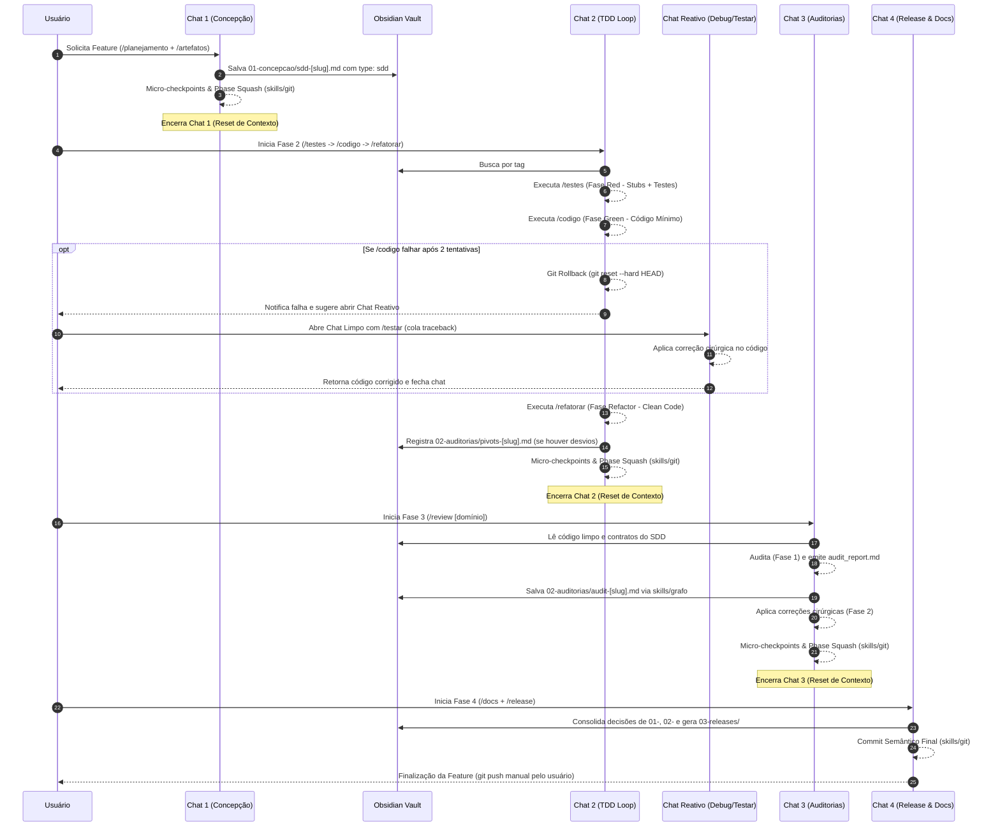

# Guia de Referência: Fluxo Base de Desenvolvimento Multi-Chat (Fases & Phase Gates)

Este documento estabelece o fluxo oficial de desenvolvimento do projeto **Antigravity**, definindo o ciclo de vida de uma *feature* dividido em **4 fases rígidas com janelas de chat efêmeras** e comunicação assíncrona orientada pela base de conhecimento no **Obsidian**.

---

## 1. Visão Geral e Filosofia do Fluxo

Para manter o desempenho ideal do modelo de IA e garantir controle absoluto sobre o código e a arquitetura, o desenvolvimento é dividido em estantes fechadas de execução.


```

┌──────────────────────────────────────────────────────────────────────────┐
│                             CICLO DE VIDA DA FEATURE                     │
├───────────────┬───────────────────┬───────────────────┬──────────────────┤
│    FASE 1     │      FASE 2       │      FASE 3       │      FASE 4      │
│  Concepção &  │  Implementação    │    Auditorias     │  Encerramento &  │
│   Contratos   │     TDD Loop      │   Especializadas  │    Publicação    │
│   (O Quê)     │     (O Como)      │    (A Garantia)   │   (A Entrega)    │
└───────┬───────┴─────────┬─────────┴─────────┬─────────┴────────┬─────────┘
│                 │                   │                  │
▼                 ▼                   ▼                  ▼
[01-concepcao/]   [02-auditorias/]    [02-auditorias/]   [03-releases/]
(bdd / sdd)        (pivots)            (audit)          (changelog)

```

### Princípios Universais:
* **Memória Efêmera no Chat:** Cada fase ocorre em uma nova janela de chat. Quando a fase conclui, a janela de chat é encerrada para eliminar a poluição do contexto (*token exhaustion*).
* **Duplo Canal de Saída (IDE vs. Obsidian Vault):**
  * **Artefatos Interativos da IDE:** Durante a conversa, a IA emite planos e relatórios de acompanhamento em tempo real (`implementation_plan.md`, `audit_report.md`) usando `ArtifactMetadata` com `RequestFeedback: true` (pausando a execução para validação do usuário via botão "Proceed").
  * **Persistência Determinística no Obsidian:** Os contratos finais (`bdd`, `sdd`), resoluções (`pivots`) e checklists auditadas (`audit`) são salvos permanentemente no Obsidian Vault via `skills/grafo` ou pelas skills de fase.
* **Phase Gates (Portões de Validação):** A transição de uma fase para outra é bloqueada até que o artefato correspondente esteja devidamente preenchido e gravado no repositório/vault.

---

## 2. Detalhamento das 4 Fases

### 🎯 Fase 1: Concepção & Contratos (O Quê)
* **Objetivo:** Definir o escopo, comportamentos esperados, arquitetura e contratos técnicos antes de escrever qualquer código.
* **Agentes / Workflows:** `/planejamento` e `/artefatos`.
* **Entrada:** Ideia inicial ou solicitação de feature enviada pelo usuário.
* **Saída e Snapshots:** * **IDE:** Artefato `implementation_plan.md` exibido para aprovação do usuário (`RequestFeedback: true`).
  * **Obsidian Vault:** Casos de uso `01-concepcao/bdd-[feature-slug].md` e plano técnico `01-concepcao/sdd-[feature-slug].md`.
* **Ação de Corte:** Confirmar a geração dos artefatos, realizar commit de handover via `skills/git` (Modo 2) e fechar o chat.

---

### 🧪 Fase 2: Ciclo TDD Linear (O Como)
* **Objetivo:** Seguir o ciclo rigoroso de TDD (Red $\rightarrow$ Green $\rightarrow$ Refactor) para entregar código limpo, funcional e 100% coberto por testes.
* **Agentes / Workflows Principais (Sequência Nominal):**
  1. `/testes` **(Red Phase / SDET):** Lê os contratos no Obsidian e cria os stubs (com `pass`) e a suíte de testes que falha intencionalmente.
  2. `/codigo` **(Green Phase / Dev):** Escreve o código de produção mínimo e estritamente necessário para fazer a suíte passar 100% verde.
  3. `/refatorar` **(Refactor Phase / Clean Code):** Aplica padrões de projeto, SOLID e elimina *code smells* mantendo os testes verdes.
* **Agentes Reativos & Auxiliares (Acionados Sob Demanda em Chat Limpo):**
  * `/testar` **(Reactive Debugger):** Recebe o log/traceback de um teste falho no terminal e aplica a correção mínima no código de produção (sem alterar a suíte de testes). É invocado quando:
    * O `/codigo` falha por 2 vezes seguidas e executa *rollback* (`git reset --hard HEAD`).
    * O desenvolvedor roda testes locais e encontra um erro pontual.
    * O `/review` (Fase 3) aponta um teste quebrado ou incoerência de código.
  * `/debug` **(Forensic Investigator):** Investigador profundo de causa raiz (RCA / 5 Whys) para resolver *crashes* obscuros e comportamentos imprevisíveis.
* **Entrada:** Leitura automatizada das especificações de contrato (`sdd-[feature-slug].md` e `bdd-[feature-slug].md`) salvas no Obsidian na Fase 1.
* **Saída e Snapshots:** * Código funcional e refatorado passando em 100% dos testes unitários e de integração.
  * **Obsidian Vault:** Registro de decisões locais ou desvios em `02-auditorias/pivots-[feature-slug].md` (se houver adaptações técnicas durante o TDD).
* **Ação de Corte:** Concluir a refatoração, consolidar checkpoints via `skills/git` (Modo 2: Phase Closure & Squash) e fechar o chat.

---

### 🛡️ Fase 3: Ciclo de Auditorias Especializadas (A Garantia)
* **Objetivo:** Auditar rigorosamente o código produzido na Fase 2 sob as óticas de Qualidade Geral, Arquitetura, Segurança, Performance e Resiliência, aplicando correções de forma cirúrgica.
* **Agente Unificado & Domínios:** * `/review` (Agente unificado em `agents/review.md` com a skill `skills/review`).
  * **Domínios de Auditoria (Fase 1 do Review):**
    * `/review` (Qualidade geral, legibilidade, docstrings e testes).
    * `/review arquitetura` (Desacoplamento, Inversão de Dependência, SOLID e alinhamento com ADRs).
    * `/review seguranca` (OWASP Top 10, sanitização, vazamentos de segredos e injeções).
    * `/review performance` (Complexidade ciclomática, Big-O, gargalos de memória e queries N+1).
    * `/review resiliencia` (Timeouts, idempotência, transações e retries).
  * **Aplicação Cirúrgica de Correções (Fase 2 do Review):**
    * Modo de aplicação de correções (`/aplicar-review` ou Fase 2 do `/review`), que processa os itens apontados sem alterar regras de negócio.
    * *Nota:* Caso a correção da auditoria exija ajustes em testes quebrados, o desenvolvedor aciona o `/testar` em um chat limpo.
* **Entrada:** Código limpo e verde gerado na Fase 2.
* **Saída e Snapshots:** * **IDE:** Relatório de auditoria interativo `audit_report_[tipo].md` exibido com `RequestFeedback: true`.
  * **Obsidian Vault:** Checklist de auditoria unificada em `02-auditorias/audit-[feature-slug].md` com 100% das resoluções validadas (`[x]`).
* **Ação de Corte:** Fechar o chat após todas as verificações estarem validadas e o commit de handover consolidado via `skills/git`.

---

### 🚀 Fase 4: Encerramento, Documentação & Publicação (A Entrega)
* **Objetivo:** Atualizar a documentação do repositório, gerar changelog de release e consolidar o trabalho no versionamento de código.
* **Agentes / Workflows:** `/docs` e `/release` (usando a skill `skills/git` para versionamento local).
* **Entrada:** Leitura do histórico de decisões no Obsidian (`01-concepcao/`, `02-auditorias/`) e código auditado final.
* **Saída:** * Documentação de API/sistema atualizada e release notes gravadas em `03-releases/changelog-vX.X.md`.
  * Commit semântico estruturado de encerramento da fase (Phase Handover via `skills/git`). O envio remoto (`git push`) é feito manualmente pelo usuário.

---

## 3. Diagrama de Sequência End-to-End



---

## 4. Portões de Validação (Phase Gates) & Bootstrapping

Para impedir inconsistências, a transição entre chats segue regras de bloqueio estritas:

| Transição | Requisito Obrigatório no Obsidian | Comando de Inicialização do Novo Chat |
| --- | --- | --- |
| **Fase 1 ➔ Fase 2** | Arquivo `01-concepcao/sdd-[slug].md` existindo com `type: sdd` e `feature: [slug]`. | *"Inicie a Fase 2 para a branch atual lendo o SDD no Obsidian."* |
| **Fase 2 ➔ Fase 3** | Suíte de testes unitários rodando 100% verde e notas `pivots-[slug].md` salvas se houve alteração local. | *"Inicie a Fase 3 de Auditorias Especializadas na branch atual (/review)."* |
| **Fase 3 ➔ Fase 4** | Arquivo `02-auditorias/audit-[slug].md` com 100% dos checkboxes validados (`[x]`). | *"Inicie a Fase 4 de Documentação e Release para a branch atual."* |

### 🔄 Bootstrapping de Contexto em Novos Chats

Ao abrir um novo chat nas Fases 2, 3 ou 4, a IA executa o seguinte protocolo de inicialização:

1. Executa `git branch --show-current` para obter o slug da funcionalidade ativa.
2. Consulta o MCP do Obsidian buscando por `type: sdd` (ou `type: audit`) e `feature: [slug]`.
3. Carrega estritamente o contrato da fase anterior sem poluição de contexto histórico.

---

## 5. Promoção de Regras (`Promote-on-Impact`)

Se durante a resolução de bugs na **Fase 2** (`pivots`), o uso reativo do `/testar` ou a correção de auditorias na **Fase 3** (`audit`) for identificada uma solução que altera o padrão global do repositório:

* A IA deve **promover** essa decisão para a pasta `00-core-rules/adrs/` criando uma nota com `type: adr` acionando a skill `grafo`.
* A decisão passa a compor a memória estática universal do projeto, afetando todas as futuras especificações de Fase 1.