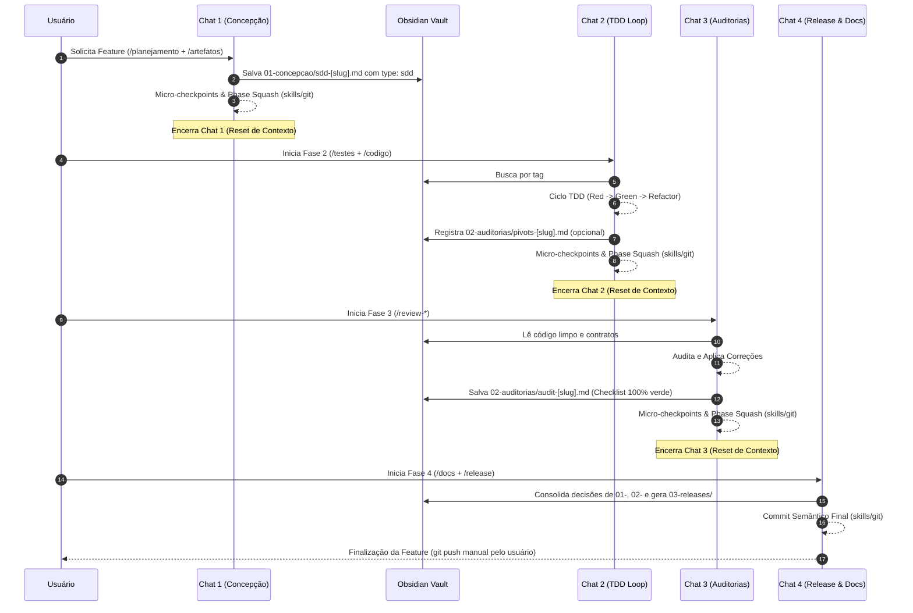

# Guia de Referência: Fluxo Base de Desenvolvimento Multi-Chat (Fases & Phase Gates)

Este documento estabelece o fluxo oficial de desenvolvimento do projeto **Antigravity**, definindo o ciclo de vida de uma *feature* dividido em **4 fases rígidas com janelas de chat efêmeras** e comunicação assíncrona orientada pela base de conhecimento no **Obsidian**.

---

## 1. Visão Geral e Filosofia do Fluxo

Para manter o desempenho ideal do modelo de IA e garantir controle absoluto sobre o código e a arquitetura, o desenvolvimento é dividido em estantes fechadas de execução.

```
┌──────────────────────────────────────────────────────────────────────────┐
│                             CICLO DE VIDA DA FEATURE                     │
├───────────────┬───────────────────┬───────────────────┬──────────────────┤
│    FASE 1     │      FASE 2       │      FASE 3       │      FASE 4      │
│  Concepção &  │  Implementação    │    Auditorias     │  Encerramento &  │
│   Contratos   │     TDD Loop      │   Especializadas  │    Publicação    │
│   (O Quê)     │     (O Como)      │    (A Garantia)   │   (A Entrega)    │
└───────┬───────┴─────────┬─────────┴─────────┬─────────┴────────┬─────────┘
        │                 │                   │                  │
        ▼                 ▼                   ▼                  ▼
 [01-concepcao/]   [02-auditorias/]    [02-auditorias/]   [03-releases/]
   (bdd / sdd)        (pivots)            (audit)          (changelog)
```

### Princípios Universais:
* **Memória Efêmera no Chat:** Cada fase ocorre em uma nova janela de chat. Quando a fase conclui, a janela de chat é encerrada para eliminar a poluição do contexto (*token exhaustion*).
* **Persistência Determinística no Obsidian:** Os contratos (BDD/SDD), decisões locais e checklists de auditoria são salvos no vault do Obsidian e reutilizados como entrada no chat da fase seguinte.
* **Phase Gates (Portões de Validação):** A transição de uma fase para outra é bloqueada até que o artefato correspondente esteja devidamente preenchido e gravado no repositório.

---

## 2. Detalhamento das 4 Fases

### 🎯 Fase 1: Concepção & Contratos (O Quê)
* **Objetivo:** Definir o escopo, comportamentos esperados, arquitetura e contratos técnicos antes de escrever qualquer código.
* **Agentes / Workflows:** `/planejamento` e `/artefatos`.
* **Entrada:** Ideia inicial ou solicitação de feature enviada pelo usuário.
* **Saída e Snapshot:** 
  * Casos de uso e comportamentos esperados (BDD) salvos em `01-concepcao/bdd-[feature-slug].md`.
  * Plano de Implementação e diagramas de arquitetura (SDD) salvos em `01-concepcao/sdd-[feature-slug].md`.
* **Ação de Corte:** Confirmar a geração dos artefatos e fechar o chat.

---

### 🧪 Fase 2: Implementação TDD Loop (O Como)
* **Objetivo:** Escrever testes (Red Phase), desenvolver o código mínimo necessário para fazê-los passar (Green Phase) e aplicar Clean Code (Refactor Phase).
* **Agentes / Workflows:** `/testes`, `/codigo`, `/testar` e `/refatorar`.
* **Entrada:** Leitura automatizada das especificações de contrato (`sdd-[feature-slug].md` e `bdd-[feature-slug].md`) salvas no Obsidian na Fase 1.
* **Saída e Snapshot:** 
  * Código funcional verde (passando em 100% dos testes unitários e de integração).
  * Registro de decisões locais ou desvios em `02-auditorias/pivots-[feature-slug].md` (se houver adaptações técnicas durante o TDD).
* **Ação de Corte:** Concluir a refatoração inicial e fechar o chat.

---

### 🛡️ Fase 3: Ciclo de Auditorias Especializadas (A Garantia)
* **Objetivo:** Auditar rigorosamente o código produzido na Fase 2 sob as óticas de Arquitetura, Segurança e Performance, aplicando correções de forma cirúrgica.
* **Agentes Unificados / Workflows:** 
  * `/review-arquitetura` (Audita desacoplamento, DIP, SOLID e alinhamento com a ADR).
  * `/review-seguranca` (Audita OWASP Top 10, sanitização, vazamentos de segredos e injeções).
  * `/review-performance` (Audita complexidade Big-O, gargalos de memória e queries N+1).
  * `/aplicar-review` (Aplica cirurgicamente as correções apontadas).
* **Entrada:** Código limpo e verde gerado na Fase 2.
* **Saída e Snapshot:** Checklist de auditoria unificada validada (`[x]`) em `02-auditorias/audit-[feature-slug].md`.
* **Ação de Corte:** Fechar o chat após todas as verificações estarem validadas e verdes.

---

### 🚀 Fase 4: Encerramento, Documentação & Publicação (A Entrega)
* **Objetivo:** Atualizar a documentação do repositório, gerar changelog de release e consolidar o trabalho no versionamento de código.
* **Agentes / Workflows:** `/docs` e `/release` (usando a skill `skills/git` para versionamento local).
* **Entrada:** Leitura do histórico de decisões no Obsidian (`01-concepcao/`, `02-auditorias/`) e código auditado final.
* **Saída:** 
  * Documentação de API/sistema atualizada e release notes gravadas em `03-releases/changelog-vX.X.md`.
  * Commit semântico estruturado de encerramento da fase (Phase Handover via `skills/git`). O envio remoto (`git push`) é feito manualmente pelo usuário.

---

## 3. Diagrama de Sequência End-to-End



---

## 4. Portões de Validação (Phase Gates) & Bootstrapping

Para impedir inconsistências, a transição entre chats segue regras de bloqueio estritas:

| Transição | Requisito Obrigatório no Obsidian | Comando de Inicialização do Novo Chat |
| :--- | :--- | :--- |
| **Fase 1 ➔ Fase 2** | Arquivo `01-concepcao/sdd-[slug].md` existindo com `type: sdd` e `feature: [slug]`. | *"Inicie a Fase 2 para a branch atual lendo o SDD no Obsidian."* |
| **Fase 2 ➔ Fase 3** | Suíte de testes unitários rodando 100% verde e notas `pivots-[slug].md` salvas se houve alteração local. | *"Inicie a Fase 3 de Auditorias Especializadas na branch atual."* |
| **Fase 3 ➔ Fase 4** | Arquivo `02-auditorias/audit-[slug].md` com 100% dos checkboxes validados (`[x]`). | *"Inicie a Fase 4 de Documentação e Release para a branch atual."* |

### 🔄 Bootstrapping de Contexto em Novos Chats
Ao abrir um novo chat nas Fases 2, 3 ou 4, a IA executa o seguinte protocolo de incialização:
1. Executa `git branch --show-current` para obter o slug da funcionalidade ativa.
2. Consulta o MCP do Obsidian buscando por `type: sdd` (ou `type: audit`) e `feature: [slug]`.
3. Carrega estritamente o contrato da fase anterior sem poluição de contexto histórico.

---

## 5. Promoção de Regras (`Promote-on-Impact`)

Se durante a resolução de bugs na **Fase 2** (`pivots`) ou a correção de auditorias na **Fase 3** (`audit`) for identificada uma solução que altera o padrão global do repositório:
* A IA deve **promover** essa decisão para a pasta `00-core-rules/adrs/` criando uma nota com `type: adr`.
* A decisão passa a compor a memória estática universal do projeto, afetando todas as futuras especificações de Fase 1.
