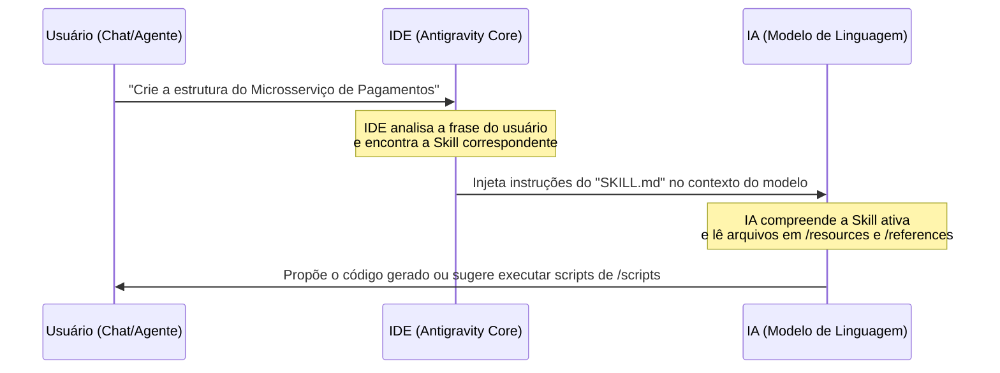

# Guia de Referência: Entendendo e Criando Skills (Habilidades)

Este documento serve como guia completo sobre o que são as **Skills**, como utilizá-las no fluxo de desenvolvimento, como elas são estruturadas e como você pode criá-las ou ensiná-las para a inteligência artificial (IA).

---

## 1. O que é uma Skill?
Uma **Skill** (Habilidade) é uma extensão modular e dinâmica das capacidades da IA. Ela permite estender o comportamento do assistente de código injetando instruções específicas do projeto, fornecendo scripts homologados, oferecendo templates padronizados e indicando manuais de referência.

Diferente de uma base de conhecimento passiva (onde a IA precisa procurar por informações usando busca ou ferramentas de arquivo), as Skills são **integradas de forma ativa pela IDE** no contexto do modelo com base no que o usuário está solicitando.

---

## 2. Onde as Skills ficam localizadas?
As Skills são descobertas e carregadas automaticamente a partir de duas raízes de customização do sistema:

1. **Global (Para todas as conversas e projetos):**
   * Caminho: `C:\Users\marco\.gemini\config\skills\<nome-da-skill>\`
2. **Local (Apenas para o workspace/projeto atual):**
   * Caminho: `.agents\skills\<nome-da-skill>\` (relativo à raiz do projeto).

*Nota: Qualquer alteração ou nova pasta criada nestes caminhos é detectada automaticamente pela IDE, não sendo necessária nenhuma etapa manual de registro ou compilação.*

---

## 3. Estrutura de uma Skill
Cada Skill é organizada de maneira modular dentro do seu próprio subdiretório:

```text
skills/nome-da-skill/
├── SKILL.md                 # [OBRIGATÓRIO] Instruções de ativação e comportamento
├── scripts/                 # Scripts executáveis de automação (Python, JS, PowerShell, Bash)
├── examples/                # Casos de uso reais (exemplos de código de entrada/saída)
├── resources/               # Arquivos estáticos (templates com placeholders, bases JSON/YAML)
└── references/              # Documentações densas e manuais de arquitetura
```

### Detalhes de Funcionamento de cada Diretório:

#### 📁 `SKILL.md` (O Painel de Controle)
* **Como funciona:** É o único arquivo lido automaticamente pela IDE e injetado no prompt de sistema da IA quando a Skill é ativada.
* **Propósito:** Definir o nome, a descrição para ativação da skill e orientar a IA sobre como utilizar os outros recursos contidos na pasta (como scripts e templates).
* **Exemplo de conteúdo:**
  ```markdown
  ---
  name: "gerador-servicos"
  description: "Cria e configura a estrutura base de novos microsserviços do projeto"
  ---
  
  # Gerador de Microsserviços
  Quando esta skill estiver ativa:
  1. Use o arquivo de template em `resources/boilerplate.py` para gerar o arquivo base.
  2. Apresente ao usuário o comando para rodar o script `scripts/install-deps.ps1`.
  ```

#### 📁 `scripts/` (A Caixa de Ferramentas)
* **Como funciona:** Contém scripts prontos (Python, PowerShell, Bash, etc.) criados para executar tarefas complexas ou repetitivas no ambiente.
* **Propósito:** Em vez de fazer a IA tentar programar um roteiro de automação do zero (o que pode gerar erros de sintaxe ou comandos errados para o sistema operacional), a IA apenas propõe a execução desses scripts homologados do diretório usando ferramentas de terminal.

#### 📁 `examples/` (Aprendizado Few-Shot)
* **Como funciona:** Armazena exemplos estáticos de sucesso (ex: arquivos de configuração XML complexos ou classes bem-estruturadas).
* **Propósito:** Como LLMs aprendem muito por imitação de padrões (técnica chamada de *Few-Shot Prompting*), se a IA precisa realizar uma refatoração ou gerar código no padrão do projeto, ela consulta esses exemplos primeiro para garantir que a saída gerada corresponda exatamente ao que o desenvolvedor espera.

#### 📁 `resources/` (Templates e Ativos Estáticos)
* **Como funciona:** Pasta destinada a templates de código (com ou sem placeholders) e dados que servem de apoio.
* **Propósito:** Guardar estruturas que a IA pode ler, preencher (substituir tags como `{{CLASS_NAME}}`) e salvar no projeto.

#### 📁 `references/` (O Manual de Consulta Rápida)
* **Como funciona:** Contém arquivos pesados ou manuais de texto completos sobre frameworks, arquiteturas ou APIs internas.
* **Propósito:** Manter o prompt principal da IA leve e rápido. Em vez de enviar milhares de linhas de manuais na inicialização (o que consumiria muitos tokens), o `SKILL.md` apenas avisa que a documentação existe em `references/`. A IA só abre estes arquivos em momentos específicos da tarefa, sob demanda.

---

## 4. Como uma Skill é Usada (Fluxo de Execução)
A interação ocorre em quatro etapas integradas:



1. **Detecção e Ativação:** O usuário faz uma requisição no chat (ou um agente especializado como `/codigo` é acionado). A IDE analisa a descrição da Skill cadastrada no frontmatter do `SKILL.md` e a ativa caso seja relevante.
2. **Carregamento Automático:** A IDE lê o conteúdo do `SKILL.md` e injeta-o silenciosamente no contexto de sistema da IA, antes da mensagem do usuário ser entregue.
3. **Consumo de Recursos:** A IA atua baseando-se nas regras da Skill, acessando `examples/`, `resources/` ou `references/` caso precise de mais detalhes.
4. **Proposta de Ação:** A IA gera a resposta ou monta e propõe o comando para executar os scripts presentes na pasta `scripts/` da skill.

---

## 5. Como Criar ou Ensinar novas Skills
Existem duas formas principais de criar novas Habilidades:

### Método A: Criação Manual
1. Navegue até `.agents/skills/` (no projeto) ou `C:\Users\marco\.gemini\config\skills/` (global).
2. Crie uma subpasta com um nome identificável (ex: `docker-deploy`).
3. Crie um arquivo `SKILL.md`. **Importante:** certifique-se de adicionar o cabeçalho em YAML Frontmatter (`name` e `description`).
4. Adicione suas regras e os subdiretórios que forem úteis (`scripts`, `resources`, etc.).

### Método B: Usando a instrução `/learn` (Ensino em Conversa)
Se você e a IA acabaram de passar por um processo complexo no chat (ex: resolver a configuração de um bundler complexo ou criar um fluxo de testes específico) e você quer que a IA memorize esse fluxo para sempre:
1. Digite `/learn` no chat do IDE.
2. A IA iniciará um fluxo guiado para extrair o aprendizado da conversa, gerando o diretório, o arquivo `SKILL.md` e os arquivos de apoio automaticamente na sua pasta de customizações.
