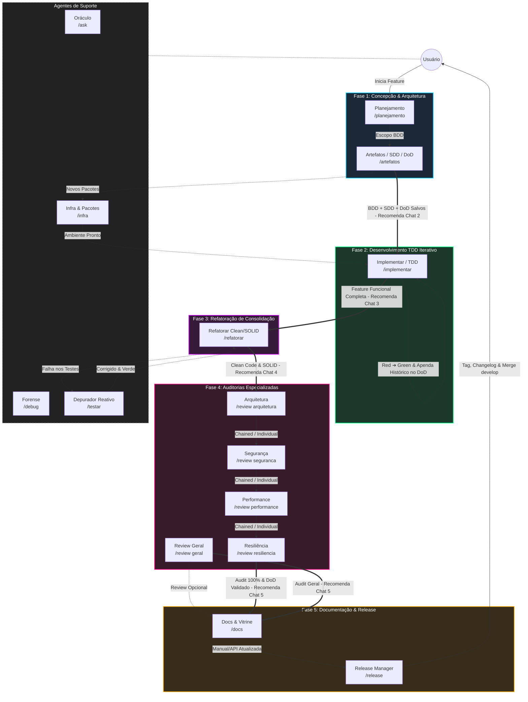

# Arquitetura de Agentes e Skills: Antigravity IDE

A inteligência operacional do **Antigravity IDE** é fundamentada na fragmentação de responsabilidades. Em vez de utilizar um prompt monolítico vulnerável a alucinações de contexto (*token exhaustion*), a arquitetura distribui as etapas do ciclo de vida de desenvolvimento de software em **5 Fases rígidas executadas em Janelas de Chat Efêmeras**.

---

## 🔀 Arquitetura Router vs. Skill Execution

Para manter o contexto da IA limpo e focado, o ecossistema divide as responsabilidades em duas camadas estritas:

1. **Roteadores de Estado em `workflows/` e `agents/`**: Arquivos leves que definem o papel do agente, restrições rígidas, evidências de sucesso e a regra padronizada de transição **[NEXT STEP]**.
2. **Execução Dinâmica em `skills/`**: Conjunto modular de instruções operacionais, templates de artefatos e checklists carregados sob demanda durante o atendimento da fase.
3. **Registro Vivo de Execução & DoD (`01-concepcao/dod-[slug].md`)**: Documento dinamico que centraliza a linha do tempo do desenvolvimento (seção de histórico) e a Definition of Done (DoD) com checklists de aceite funcional, não-funcional, auditoria e release.

---

## 🗺️ O Ecossistema em 5 Fases (Multi-Chat SDLC)

---

## 🎯 Detalhamento das Fases e Agentes

### 1. Fase 1: Concepção & Arquitetura (Chat 1)
Especializada em Requisitos BDD, Arquitetura Técnica (SDD) e Definition of Done (DoD). Nenhuma linha de código de produção é gerada nesta etapa. Executada integralmente no mesmo Chat.
* **[planejamento.md](file:///e:/Codigos/antigravity-agentic-workflows/workflows/planejamento.md) (`/planejamento`)**: Conduz o alinhamento de escopo via `/grill-me` em formato Gherkin (BDD) e salva em `01-concepcao/bdd-[slug].md`.
* **[artefatos.md](file:///e:/Codigos/antigravity-agentic-workflows/workflows/artefatos.md) (`/artefatos`)**: Traduz o BDD em arquitetura (SDD), gerando `01-concepcao/sdd-[slug].md` e o documento vivo de histórico e aceite `01-concepcao/dod-[slug].md`.

### 2. Fase 2: Desenvolvimento TDD Iterativo (Chat 2)
Ciclo de desenvolvimento orientado por testes e contratos técnicos (*Make it Work*). Pode ser reutilizado *N* vezes durante a evolução da feature.
* **[implementar.md](file:///e:/Codigos/antigravity-agentic-workflows/workflows/implementar.md) (`/implementar`)**: Escreve a suíte de testes (Red) e a implementação mínima de produção (Green) com correções internas de forma autônoma. Agrupa por lotes de contexto e adiciona entradas no diário de bordo de `01-concepcao/dod-[slug].md`.

### 3. Fase 3: Refatoração de Consolidação (Chat 3)
Executada **uma única vez** ao final do ciclo de desenvolvimento da feature (*Make it Right*).
* **[refatorar.md](file:///e:/Codigos/antigravity-agentic-workflows/workflows/refatorar.md) (`/refatorar`)**: Aplica princípios SOLID e Clean Code nos arquivos alterados (`git diff --name-only`) mantendo a suíte 100% verde. Marca a caixa de refatoração no `dod-[slug].md`.

### 4. Fase 4: Auditorias Especializadas (Chat 4)
Auditoria rigorosa e correção cirúrgica sobre a versão final e refatorada da aplicação.
* **[review.md](file:///e:/Codigos/antigravity-agentic-workflows/workflows/review.md) (`/review`)**: Unifica as auditorias de **Qualidade Geral**, **Arquitetura**, **Segurança (OWASP Code Review Guide v2.0)**, **Performance** e **Resiliência**. Marca os checklists de auditoria no `dod-[slug].md`.

### 5. Fase 5: Documentação & Release (Chat 5)
Finalização da entrega, validação do DoD e versionamento semântico.
* **[docs.md](file:///e:/Codigos/antigravity-agentic-workflows/workflows/docs.md) (`/docs`)**: Atualiza as documentações locais e a vitrine principal (`README.md` raiz).
* **[release.md](file:///e:/Codigos/antigravity-agentic-workflows/workflows/release.md) (`/release`)**: Valida o atendimento de 100% dos itens do `dod-[slug].md`, calcula o SemVer, gera o changelog em `03-releases/` e orienta o merge em `develop`.

---

## 🚑 Agentes de Suporte

* **[testar.md](file:///e:/Codigos/antigravity-agentic-workflows/workflows/testar.md) (`/testar`)**: Depurador reativo que analisa tracebacks do terminal e aplica correções cirúrgicas quando ocorrem quebras de testes (suporte para `/refatorar` ou testes isolados).
* **[ask.md](file:///e:/Codigos/antigravity-agentic-workflows/workflows/ask.md) (`/ask`)**: Oráculo read-only para dúvidas sobre a codebase e a base de conhecimento.
* **[debug.md](file:///e:/Codigos/antigravity-agentic-workflows/workflows/debug.md) (`/debug`)**: Investigador forense para runtime crashes e erros de ambiente utilizando a técnica dos *5 Whys*.
* **[infra.md](file:///e:/Codigos/antigravity-agentic-workflows/workflows/infra.md) (`/infra`)**: Gerenciador de dependências, manifestos (`package.json`, `pyproject.toml`, etc.) e configurações de contêineres/ambiente.
