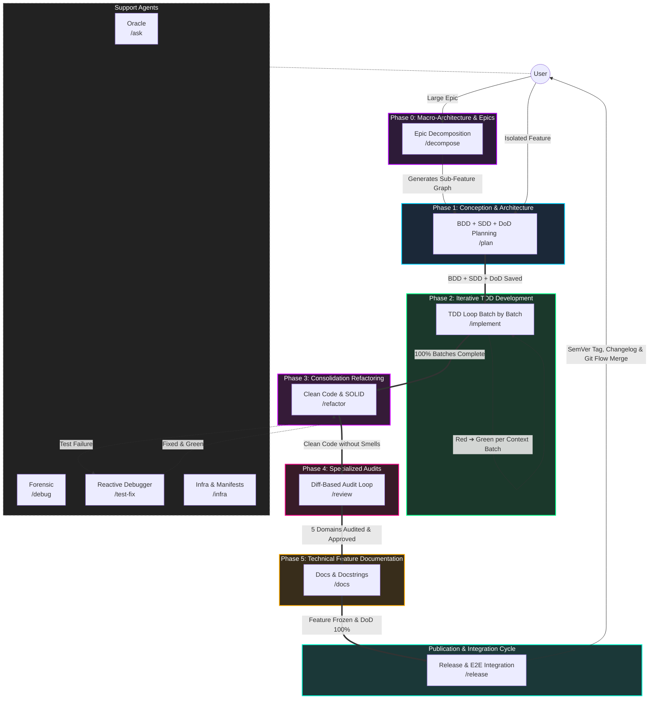

# Agent & Skill Architecture: Antigravity IDE

The operational intelligence of the **Antigravity IDE** is grounded in strict separation of concerns (*Single Responsibility Principle - SRP*) and *Outcome-Based Prompting*. Instead of monolithic prompts vulnerable to hallucinations and context exhaustion, the architecture organizes the software engineering lifecycle into:

1. **Phase 0 (Macro-Architecture):** Evolutionary decomposition of epics into monotonic sub-features via `/decompose`.
2. **Feature Lifecycle (5 Phases in Ephemeral Chats):** Conception $\rightarrow$ TDD $\rightarrow$ Refactoring $\rightarrow$ Audits $\rightarrow$ Documentation.
3. **Publication Cycle (Release Pipeline):** E2E integration tests, SemVer calculation, Changelog generation, and Git Flow via `/release`.
4. **Cross-Cutting Skills:** Git Flow & checkpoint governance (`@git`), Living DoD tracking (`@dod`), SSOT Vault governance (`@obsidian`), and user-governed external research (`@notebooklm`).

---

## 🔀 Router vs. Skill Execution Architecture

To keep AI context clean and focused, the ecosystem divides responsibilities into two distinct layers:

1. **State Routers in `workflows/`**: Lightweight playbooks defining phase pipelines, strict constraints, success evidence, and standardized phase transition gates (**[NEXT STEP]**).
2. **Specialized Execution in `skills/`**: Atomic operational procedures, automated validation scripts (`ast_complexity.py`, `validate_branch.sh`, `validate_sdd_contracts.py`), and templates loaded on-demand via Progressive Disclosure.
3. **Living Execution Log & DoD (`01-concepcao/dod-[slug].md`)**: Dynamic document centralizing development timeline history and Definition of Done (DoD) criteria for functional, non-functional, audit, and release validation.

---

## 🗺️ Complete Antigravity Ecosystem Map

---

## 🎯 Phase & Workflow Deep Dive

### 1. Phase 0: Macro-Architecture & Epics (`/decompose`)
When an architectural epic is too complex to fit safely into a single feature branch, `/decompose` aligns the core problem (*Outcome-Based*) and breaks scope down into an ordered roadmap of monotonic vertical sub-features (contracts first, zero destructive rework). Persists `01-concepcao/epic-[slug].md`.
* **Skills Used:** `skills/plan-debate`, `skills/plan-decompose`, `skills/obsidian`.

### 2. Phase 1: Conception & Architecture (`/plan` - Chat 1)
Surgical scope discovery via Socratic interviewing (2-4 questions), Git Flow branch validation, pure Gherkin BDD behavioral specification, SDD architectural blueprint with typed contracts/mocks, and Living DoD initialization.
* **Skills Used:** `skills/plan-debate`, `skills/git`, `skills/plan-bdd`, `skills/plan-sdd`, `skills/dod`.

### 3. Phase 2: Iterative TDD Development (`/implement` - Chat 2)
Executes the TDD pipeline batch by batch. Each batch decomposes AAA unit tests (Red) and minimal SOLID production code (Green), running tests in the terminal with reactive debugging support, recording local checkpoints, and continuously appending history to the DoD timeline.
* **Skills Used:** `skills/tdd-plan`, `skills/tdd-tests`, `skills/tdd-code`, `skills/test-fix`, `skills/dod`, `skills/git`.

### 4. Phase 3: Consolidation Refactoring (`/refactor` - Chat 3)
Optimizes internal software design (*Make it Right*). Strictly restricted to files modified on the active branch (`git diff develop...HEAD`), eliminating cyclomatic complexity, long methods, and deep nesting through Guard Clauses and SOLID principles, keeping tests 100% green.
* **Skills Used:** `skills/refactor`, `skills/git`, `skills/dod`, `skills/test-fix`.

### 5. Phase 4: Specialized Audits (`/review` - Chat 4)
Iterative domain-specialized loop executed directly over the feature's `git diff`:
1. **Architecture & Coupling** (`skills/review-architecture`)
2. **Security & OWASP** (`skills/review-security`)
3. **Quality & AST Complexity** (`skills/review-quality`)
4. **Performance & Volumetrics** (`skills/review-performance`)
5. **Resilience & Fault Tolerance** (`skills/review-resilience`)
Each reviewed domain generates a local micro-checkpoint and updates the Living DoD via `skills/dod`.

### 6. Phase 5: Technical Feature Documentation (`/docs` - Chat 5)
Focuses strictly on technical documentation: updating module/root READMEs, adding docstrings with bidirectional links to the Obsidian Vault, marking the DoD, and committing semantically. The feature branch remains frozen and intact without premature merges.
* **Skills Used:** `skills/docs`, `skills/dod`, `skills/git`.

### 7. Publication Cycle: Integration & Release (`/release`)
Orchestrates publication of a release on `release/vX.Y.Z` branched from `develop`. Audits 100% DoD completion across all candidate features, runs staged E2E integration test suites with formatted console banners (`skills/test-integration`), computes SemVer, generates `CHANGELOG.md`, and completes Git Flow with annotated tags and merges into `main` and `develop`.
* **Skills Used:** `skills/test-integration`, `skills/release`, `skills/dod`, `skills/git`.

---

## 🧰 Modular Skills Catalog

| Category | Skills |
| :--- | :--- |
| **Foundation & Cross-Cutting** | `skills/git`, `skills/dod`, `skills/obsidian`, `skills/notebooklm` |
| **Macro & Conception** | `skills/plan-decompose`, `skills/plan-debate`, `skills/plan-bdd`, `skills/plan-sdd` |
| **TDD Construction** | `skills/tdd-plan`, `skills/tdd-tests`, `skills/tdd-code`, `skills/test-fix` |
| **Refactoring & Design** | `skills/refactor` |
| **Specialized Audits** | `skills/review-architecture`, `skills/review-security`, `skills/review-quality`, `skills/review-performance`, `skills/review-resilience` |
| **Documentation & Delivery** | `skills/docs`, `skills/test-integration`, `skills/release` |
| **Support & Diagnostics** | `skills/ask`, `skills/debug`, `skills/infra` |
