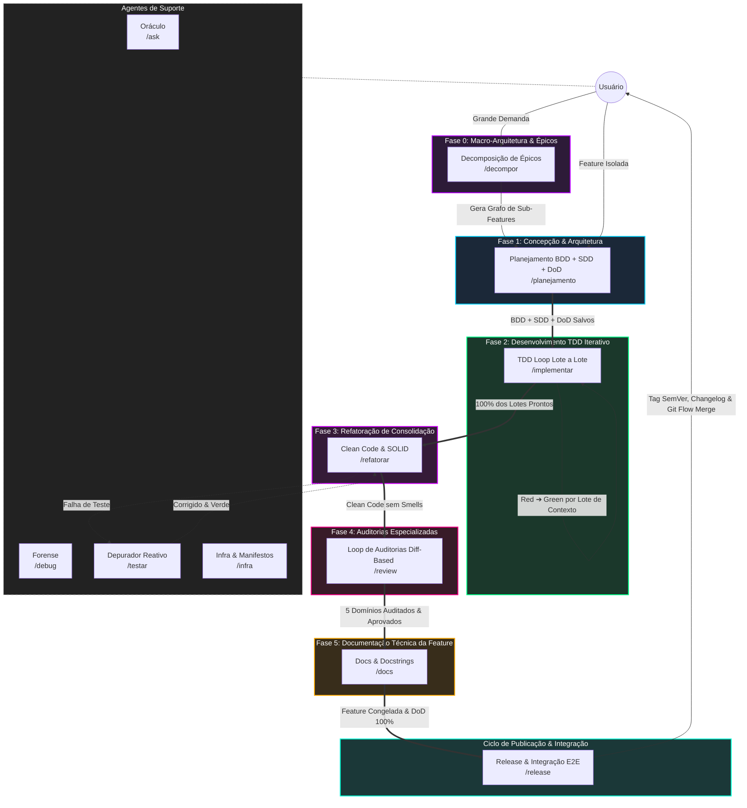

# Arquitetura de Agentes e Skills: Antigravity IDE

A inteligência operacional do **Antigravity IDE** é fundamentada no desacoplamento estrito de responsabilidades (*Single Responsibility Principle - SRP*) e no princípio de *Outcome-Based Prompting*. Em vez de prompts monolíticos vulneráveis a alucinações e exaustão de contexto, a arquitetura organiza o ciclo de vida de software em:

1. **Fase 0 (Macro-Arquitetura):** Decomposição evolutiva de épicos em sub-features via `/decompor`.
2. **Ciclo da Feature (5 Fases em Chats Efêmeros):** Concepção $\rightarrow$ TDD $\rightarrow$ Refatoração $\rightarrow$ Auditorias $\rightarrow$ Documentação.
3. **Ciclo de Publicação (Esteira de Release):** Testes de integração E2E, cálculo de SemVer, Changelog e Git Flow via `/release`.
4. **Skills Transversais:** Governança de Git Flow/checkpoints (`@git`), Living DoD (`@dod`), SSOT do Vault (`@obsidian`) e conhecimento externo governado (`@notebooklm`).

---

## 🔀 Arquitetura Router vs. Skill Execution

Para manter o contexto da IA limpo e focado, o ecossistema divide as responsabilidades em duas camadas estritas:

1. **Roteadores de Estado em `workflows/`**: Arquivos leves que definem a esteira da fase, restrições rígidas, evidências de sucesso e a regra padronizada de transição **[NEXT STEP]**.
2. **Execução Especializada em `skills/`**: Conjunto atômico de instruções operacionais, scripts de validação (`ast_complexity.py`, `validate_branch.sh`, `validate_sdd_contracts.py`) e templates carregados sob demanda via Progressive Disclosure.
3. **Registro Vivo de Execução & DoD (`01-concepcao/dod-[slug].md`)**: Documento dinâmico que centraliza a linha do tempo do desenvolvimento e a Definition of Done (DoD) com critérios de aceite funcional, não-funcional, auditoria e release.

---

## 🗺️ Mapa Completo do Ecossistema Antigravity

---

## 🎯 Detalhamento das Fases e Workflows

### 1. Fase 0: Macro-Arquitetura e Épicos (`/decompor`)
Quando uma demanda é complexa demais para caber em uma única branch, o `/decompor` alinha o macro-problema (*Outcome-Based*) e quebra o escopo em uma sequência ordenada de sub-features monotônicas (contratos primeiro, sem retrabalho cíclico). Salva `01-concepcao/epic-[slug].md`.
* **Skills Utilizadas:** `skills/debate`, `skills/decompor`, `skills/obsidian`.

### 2. Fase 1: Concepção & Arquitetura (`/planejamento` - Chat 1)
Alinhamento cirúrgico de escopo via inquirição socrática (2 a 4 perguntas), validação de branch Git Flow, especificação comportamental BDD em Gherkin puro, blueprint arquitetural SDD com contratos/mocks tipados e criação do Living DoD.
* **Skills Utilizadas:** `skills/debate`, `skills/git`, `skills/bdd`, `skills/sdd`, `skills/dod`.

### 3. Fase 2: Desenvolvimento TDD Iterativo (`/implementar` - Chat 2)
Executa a esteira TDD lote a lote. Cada lote decompõe testes unitários AAA (Red) e código mínimo SOLID (Green), executando testes no terminal com suporte de depuração cirúrgica, registro de checkpoints locais e atualização contínua do histórico no DoD.
* **Skills Utilizadas:** `skills/tdd-plan`, `skills/testes`, `skills/codigo`, `skills/testar`, `skills/dod`, `skills/git`.

### 4. Fase 3: Refatoração de Consolidação (`/refatorar` - Chat 3)
Otimiza o design interno da feature (*Make it Right*). Foca estritamente em arquivos alterados (`git diff develop...HEAD`), eliminando complexidade ciclomática, métodos longos e aninhamentos através de Guard Clauses e princípios SOLID, mantendo os testes 100% verdes.
* **Skills Utilizadas:** `skills/refatorar`, `skills/git`, `skills/dod`, `skills/testar`.

### 5. Fase 4: Auditorias Especializadas (`/review` - Chat 4)
Loop iterativo especializado por domínio executado diretamente sobre o `git diff` da feature:
1. **Arquitetura & Acoplamento** (`skills/review-arquitetura`)
2. **Segurança & OWASP** (`skills/review-seguranca`)
3. **Qualidade & Complexidade AST** (`skills/review-qualidade`)
4. **Performance & Volumetria** (`skills/review-performance`)
5. **Resiliência & Tolerância a Falhas** (`skills/review-resiliencia`)
Cada domínio corrigido gera micro-checkpoint local e atualiza o Living DoD via `skills/dod`.

### 6. Fase 5: Documentação Técnica da Feature (`/docs` - Chat 5)
Focada na documentação técnica pura: atualização de READMEs, inserção de docstrings com links bidirecionais para o Obsidian Vault, marcação do DoD e commit semântico. A branch da feature permanece intacta e congelada, sem merges prematuros.
* **Skills Utilizadas:** `skills/docs`, `skills/dod`, `skills/git`.

### 7. Ciclo de Publicação: Integração & Release (`/release`)
Orquestra a publicação da versão na branch `release/vX.Y.Z` a partir da `develop`. Valida 100% de atendimento do DoD de todas as features candidatas, executa suíte de testes de integração e E2E por etapas com banners de log (`skills/integracao`), calcula o SemVer, gera o `CHANGELOG.md` e fecha o Git Flow com tags anotadas e merges em `main` e `develop`.
* **Skills Utilizadas:** `skills/integracao`, `skills/release`, `skills/dod`, `skills/git`.

---

## 🧰 Catálogo de Skills Modulares

| Categoria | Skills |
| :--- | :--- |
| **Fundação & Transversais** | `skills/git`, `skills/dod`, `skills/obsidian`, `skills/notebooklm` |
| **Macro & Concepção** | `skills/decompor`, `skills/debate`, `skills/bdd`, `skills/sdd` |
| **Construção TDD** | `skills/tdd-plan`, `skills/testes`, `skills/codigo`, `skills/testar` |
| **Refatoração & Design** | `skills/refatorar` |
| **Auditorias Especializadas** | `skills/review-arquitetura`, `skills/review-seguranca`, `skills/review-qualidade`, `skills/review-performance`, `skills/review-resiliencia` |
| **Documentação & Publicação** | `skills/docs`, `skills/integracao`, `skills/release` |
| **Suporte & Diagnóstico** | `skills/ask`, `skills/debug`, `skills/infra` |
