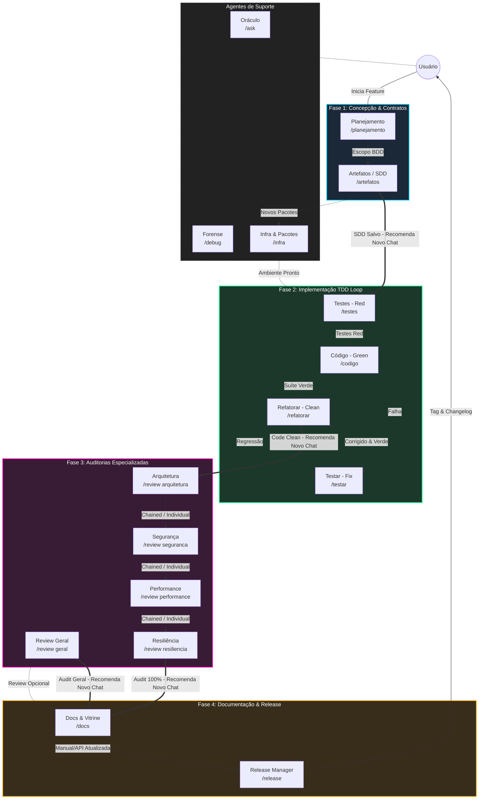

# Arquitetura de Agentes e Skills: Antigravity IDE

A inteligência operacional do **Antigravity IDE** é fundamentada na fragmentação de responsabilidades. Em vez de utilizar um prompt monolítico vulnerável a alucinações de contexto (*token exhaustion*), a arquitetura distribui as etapas do ciclo de vida de desenvolvimento de software em **4 Fases rígidas executadas em Janelas de Chat Efêmeras**.

---

## 🔀 Arquitetura Router vs. Skill Execution

Para manter o contexto da IA limpo e focado, o ecossistema divide as responsabilidades em duas camadas estritas:

1. **Roteadores de Estado em `agents/`**: Arquivos leves que definem o papel do agente, restrições rígidas, evidências de sucesso e a regra padronizada de transição **[NEXT STEP]**.
2. **Execução Dinâmica em `skills/`**: Conjunto modular de instruções operacionais, templates de artefatos e checklists carregados sob demanda durante o atendimento da fase.

---

## 🗺️ O Ecossistema em 4 Fases (Multi-Chat)

---

## 🎯 Detalhamento das Fases e Agentes

### 1. Fase 1: Concepção & Contratos (Chat 1)
Especializada em Requisitos BDD e Arquitetura Técnica (SDD). Nenhuma linha de código de produção é gerada nesta etapa.
* **[planejamento.md](file:///d:/Codigos/antigravity-agentic-workflows/docs/agentes/planejamento.md) (`/planejamento`)**: Conduz o alinhamento de escopo em formato Gherkin (BDD) e salva em `01-concepcao/bdd-[slug].md`.
* **[artefatos.md](file:///d:/Codigos/antigravity-agentic-workflows/docs/agentes/artefatos.md) (`/artefatos`)**: Traduz o BDD no plano de implementação (SDD), gerando `implementation_plan.md` e persistindo em `01-concepcao/sdd-[slug].md`.

### 2. Fase 2: Implementação TDD Loop (Chat 2)
Ciclo de desenvolvimento orientado por contratos técnicos.
* **[testes.md](file:///d:/Codigos/antigravity-agentic-workflows/docs/agentes/testes.md) (`/testes`)**: Constrói a suíte de testes em vermelho (Red Phase: Happy path, Edge cases, Exceções e Profiling).
* **[codigo.md](file:///d:/Codigos/antigravity-agentic-workflows/docs/agentes/codigo.md) (`/codigo`)**: Escreve a implementação mínima de produção necessária para tornar os testes verdes.
* **[testar.md](file:///d:/Codigos/antigravity-agentic-workflows/docs/agentes/testar.md) (`/testar`)**: Depurador reativo que resolve quebras de testes cirurgicamente a partir do traceback do terminal.
* **[refatorar.md](file:///d:/Codigos/antigravity-agentic-workflows/docs/agentes/refatorar.md) (`/refatorar`)**: Aplica princípios SOLID e Clean Code no código verde sem modificar a suíte de testes.

### 3. Fase 3: Auditorias Especializadas (Chat 3)
Auditoria rigorosa e correção cirúrgica por domínios.
* **[review.md](file:///d:/Codigos/antigravity-agentic-workflows/docs/agentes/review.md) (`/review`)**: Unifica as auditorias de **Qualidade Geral**, **Arquitetura**, **Segurança**, **Performance** e **Resiliência**. Suporta ativação por esteira encadeada ou chamadas individuais por domínio (`/review [domínio]`).

### 4. Fase 4: Encerramento, Documentação & Publicação (Chat 4)
Finalização da entrega e versionamento semântico.
* **[docs.md](file:///d:/Codigos/antigravity-agentic-workflows/docs/agentes/docs.md) (`/docs`, `/readme-projeto`)**: Atualiza as documentações locais e a vitrine principal (`README.md` raiz).
* **[release.md](file:///d:/Codigos/antigravity-agentic-workflows/docs/agentes/release.md) (`/release`)**: Consolida o histórico, calcula o SemVer, atualiza o changelog em `03-releases/` e orienta a criação de tags.

---

## 🚑 Agentes de Suporte

* **[ask.md](file:///d:/Codigos/antigravity-agentic-workflows/docs/agentes/ask.md) (`/ask`)**: Oráculo read-only para dúvidas sobre a codebase e a base de conhecimento.
* **[debug.md](file:///d:/Codigos/antigravity-agentic-workflows/docs/agentes/debug.md) (`/debug`)**: Investigador forense para runtime crashes e erros de ambiente utilizando a técnica dos *5 Whys*.
* **[infra.md](file:///d:/Codigos/antigravity-agentic-workflows/docs/agentes/infra.md) (`/infra`)**: Gerenciador de dependências, manifestos (`package.json`, `pyproject.toml`, etc.) e configurações de contêineres/ambiente.
