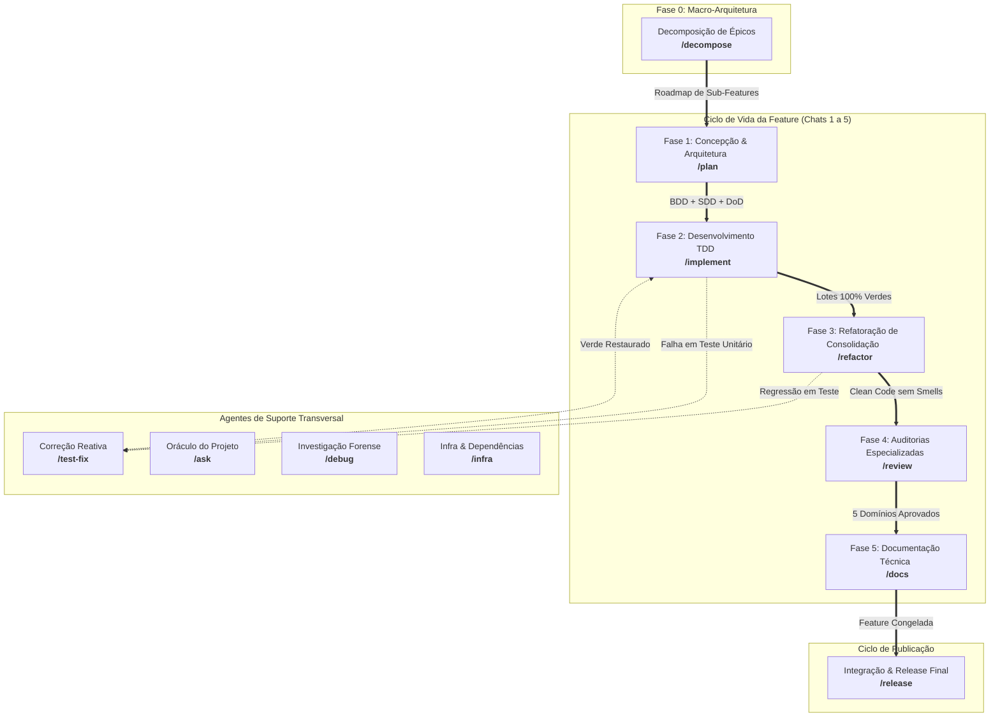

# Catálogo de Agentes e Workflows (`docs/agentes`)

Os **Agentes Orquestradores (Workflows)** atuam como os maestros do ciclo de desenvolvimento no **Antigravity IDE**. Cada agente é acionado por um slash command (ou evento de ciclo de vida) e desempenha o papel de roteador de estado: define o pipeline de execução da fase, valida os portões de entrada e saída (*Quality Gates*) e delega a execução técnica especializada para as **Skills** atômicas correspondentes.

---

## 🗺️ Mapa de Fases e Workflows

---

## 📋 Inventário Geral de Agentes

### 1. Protocolo Foundational
* [`core-gemini.md`](file:///e:/Codigos/antigravity-agentic-workflows/docs/agentes/core-gemini.md): Protocolo da Antigravity Engine, Pair-Programming ativo, Status Banner inicial, Double-Strike Rule e governança de memória SSOT.

### 2. Ciclo de Vida da Feature (Fases 0 a 5)
* [`decompose.md`](file:///e:/Codigos/antigravity-agentic-workflows/docs/agentes/decompose.md) — **`/decompose` (Fase 0):** Decomposição de macro-demandas em fatias verticais monotônicas com contratos e mocks primeiro.
* [`plan.md`](file:///e:/Codigos/antigravity-agentic-workflows/docs/agentes/plan.md) — **`/plan` (Fase 1):** Concepção e arquitetura com debate Outcome-Based, Git Flow branch, especificação BDD, contratos SDD e inicialização do Living DoD.
* [`implement.md`](file:///e:/Codigos/antigravity-agentic-workflows/docs/agentes/implement.md) — **`/implement` (Fase 2):** Desenvolvimento orientado a testes (TDD) em lotes de contexto dependentes, loop Red-Green AAA, micro-checkpoints e linha do tempo no DoD.
* [`refactor.md`](file:///e:/Codigos/antigravity-agentic-workflows/docs/agentes/refactor.md) — **`/refactor` (Fase 3):** Refatoração de consolidação com Clean Code e SOLID, restrita ao `git diff`, com tolerância a falhas e rollback imediato.
* [`review.md`](file:///e:/Codigos/antigravity-agentic-workflows/docs/agentes/review.md) — **`/review` (Fase 4):** Auditoria multidomínio Script-First em 5 óticas (Arquitetura, Segurança OWASP v2, Qualidade, Performance, Resiliência) com Taint Analysis.
* [`docs.md`](file:///e:/Codigos/antigravity-agentic-workflows/docs/agentes/docs.md) — **`/docs` (Fase 5):** Atualização de READMEs validados contra manifests, docstrings com rastreabilidade Obsidian e congelamento seguro da branch da feature.

### 3. Pipeline de Liberação
* [`release.md`](file:///e:/Codigos/antigravity-agentic-workflows/docs/agentes/release.md) — **`/release`:** Portão de 100% DoD, suíte de integração e E2E em 9 estágios estruturados, bump de SemVer cumulativo, consolidação de `CHANGELOG.md` e merges de Git Flow em `main` e `develop`.

### 4. Suporte e Diagnósticos
* [`test-fix.md`](file:///e:/Codigos/antigravity-agentic-workflows/docs/agentes/test-fix.md) — **`/test-fix`:** Depuração reativa para falhas de testes unitários ou integração, isolando causa raiz em 1 frase e aplicando correções cirúrgicas no código de produção.
* [`ask.md`](file:///e:/Codigos/antigravity-agentic-workflows/docs/agentes/ask.md) — **`/ask`:** Oráculo técnico do projeto para consultas arquiteturais e conceituais em modo estritamente Read-Only, navegando no Obsidian Vault e citando referências concretas.
* [`debug.md`](file:///e:/Codigos/antigravity-agentic-workflows/docs/agentes/debug.md) — **`/debug`:** Investigação forense de bugs em produção, crashes e falhas de infraestrutura via metodologia dos 5 Whys e artefato interativo de causa raiz.
* [`infra.md`](file:///e:/Codigos/antigravity-agentic-workflows/docs/agentes/infra.md) — **`/infra`:** Gerenciamento seguro de manifestos (`package.json`, `pyproject.toml`), contêineres Docker e variáveis `.env.example`, protegendo contra vazamento de segredos.

---

## 🔗 Relação com as Skills
Os agentes orquestradores apenas conduzem as etapas e os portões; a execução técnica pontual de cada ação é realizada pelas habilidades modulares documentadas no catálogo [`docs/skills/README.md`](file:///e:/Codigos/antigravity-agentic-workflows/docs/skills/README.md).
