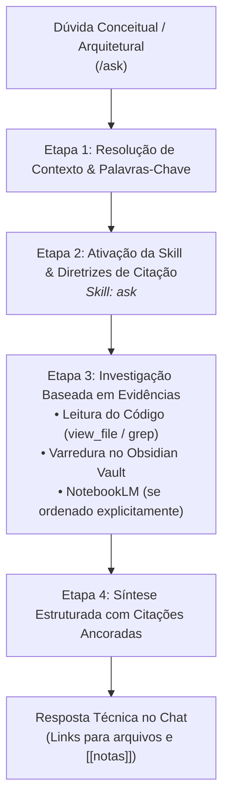

# Agente Oráculo do Projeto (`/ask`) - Consultas Estritamente Read-Only

O agente **Oráculo do Projeto** atua como o consultor técnico de suporte no Antigravity IDE. Sua função é responder a perguntas conceituais, investigações arquiteturais, mapeamento de regras de negócio e dúvidas de implementação, operando sob uma restrição estrita de **Somente Leitura (Read-Only)**.

---

## ⛔ Restrição Universal de Somente Leitura

* **Zero Modificações:** É terminantemente proibido criar, alterar ou excluir qualquer arquivo na base de código ou no Obsidian Vault durante a execução do `/ask`.
* **Zero Comandos Mutativos:** Não é permitido executar comandos no terminal que alterem o estado do repositório, instalem dependências ou façam commits.
* **Proibido Suposições:** Toda afirmação técnica deve estar ancorada em evidências reais extraídas do código ou do Obsidian Vault.

---

## 🚀 Pipeline de Execução em 4 Passos

---

### Etapa 1: Resolução de Contexto e Termos-Chave
Analisa a pergunta do desenvolvedor e extrai entidades, fluxos de negócio, classes, serviços ou interfaces mencionadas.

---

### Etapa 2: Ativação da Skill & Mapa de Investigação
Carrega as diretrizes da skill e navega estruturadamente no Obsidian Vault:
* `00-core-rules/`: Convenções de código e ADRs globais.
* `01-concepcao/`: Especificações de negócio BDD e diagramas técnicos SDD.
* `02-auditorias/`: Relatórios de auditoria e registros de pivôs técnicos.
* `03-releases/`: Histórico consolidado de versões.
* 💡 **Skill Utilizada:** [`skills/ask`](file:///e:/Codigos/antigravity-agentic-workflows/docs/skills/ask.md)

---

### Etapa 3: Investigação Baseada em Evidências (Código + Vault)
1. Inspeciona os arquivos de código-fonte relevantes via `view_file` ou `grep_search`.
2. Utiliza ferramentas de leitura do Obsidian MCP (`search_simple`, `vault_read`).
3. Se o desenvolvedor requisitar explicitamente buscas em papers ou documentos externos no Google NotebookLM, aciona o protocolo de [`@notebooklm`](file:///e:/Codigos/antigravity-agentic-workflows/docs/skills/notebooklm.md).

---

### Etapa 4: Síntese Estruturada & Citações Formais
1. Elabora uma resposta clara, objetiva e formatada diretamente no chat.
2. Ancara cada explicação em referências concretas:
   * Arquivos de código com links clicáveis: `[nome_arquivo](file:///caminho/...)`.
   * Notas do Vault com sintaxe de wikilink: `[[nome-da-nota]]`.
   * Destaca com transparência qualquer lacuna onde não exista documentação formal.

---

## 🔀 Arquitetura Router & Skills

* **Workflow Roteador:** [`workflows/ask.md`](file:///e:/Codigos/antigravity-agentic-workflows/workflows/ask.md)
* **Skills Associadas:**
  * [`skills/ask/`](file:///e:/Codigos/antigravity-agentic-workflows/docs/skills/ask.md)
  * [`skills/obsidian/`](file:///e:/Codigos/antigravity-agentic-workflows/docs/skills/obsidian.md)
  * [`skills/notebooklm/`](file:///e:/Codigos/antigravity-agentic-workflows/docs/skills/notebooklm.md) *(apenas sob comando explícito)*
