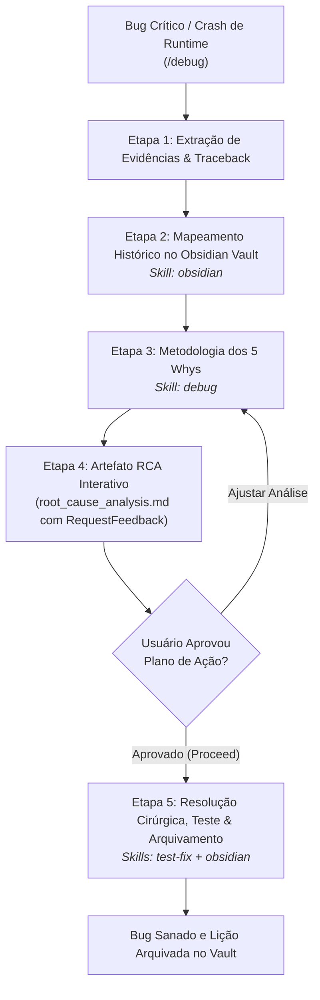

# Agente Investigador Forense (`/debug`) - Análise de Causa Raiz (5 Whys)

O agente **Investigador Forense** atua na resolução de bugs críticos, crashes de runtime, falhas de integração e comportamentos inesperados de infraestrutura que escaparam à barreira de testes unitários no Antigravity IDE. Ele conduz um diagnóstico metódico fundamentado na técnica dos **5 Whys (Cinco Porquês)**, buscando a falha sistêmica em vez de aplicar correções paliativas em sintomas superficiais.

---

## ⛔ Restrições Operacionais Rígidas

1. **Mandatory Pause via Artefato Interativo:** Toda análise de causa raiz e proposta de remediação deve ser estruturada no artefato interativo `root_cause_analysis.md` com `RequestFeedback: true`. É terminantemente proibido alterar qualquer arquivo de código antes da aprovação explícita do usuário.
2. **Proibido Suposições:** Se faltarem evidências essenciais (logs completos, variáveis de ambiente ou tracebacks), o agente deve pausar a execução e solicitar os dados ao usuário.
3. **Blocos Bash Isolados:** Comandos de inspeção manual sugeridos devem ser fornecidos em blocos ````bash` limpos de linha única.

---

## 🚀 Pipeline de Execução em 5 Etapas



---

### Etapa 1: Diagnóstico Inicial e Extração de Evidências
1. Captura o código HTTP, a mensagem de exceção, o componente afetado e o traceback de execução.
2. Identifica a branch ativa e o estado de trabalho do repositório.

---

### Etapa 2: Mapeamento Histórico no Obsidian Vault
1. Consulta a pasta `02-auditorias/` (`pivots-[slug].md`) para verificar se desvios arquiteturais passados impactaram o módulo.
2. Inspeciona convenções e regras de negócio em `00-core-rules/` via [`skills/obsidian`](file:///e:/Codigos/antigravity-agentic-workflows/docs/skills/obsidian.md).

---

### Etapa 3: Aplicação da Metodologia dos 5 Whys
1. Conduz a análise interrogativa regressiva em 5 níveis de profundidade:
   * *Why 1:* Qual foi o sintoma imediato?
   * *Why 2:* Por que a validação falhou?
   * *Why 3:* Por que a entidade permitiu esse estado?
   * *Why 4:* Por que o contrato da interface não blindou a entrada?
   * *Why 5:* Qual foi a falha no design arquitetural ou premissa de negócio?
* 💡 **Skill Utilizada:** [`skills/debug`](file:///e:/Codigos/antigravity-agentic-workflows/docs/skills/debug.md)

---

### Etapa 4: Artefato Interativo de Causa Raiz (RCA)
1. Instancia o artefato `root_cause_analysis.md` (`RequestFeedback: true`) contendo as evidências coletadas, a árvore dos 5 Whys e as opções cirúrgicas de remediação.
2. Aguarda a validação do usuário antes de realizar modificações em arquivos.

---

### Etapa 5: Resolução, Prevenção e Registro de Lições Aprendidas
1. Aplica a correção pontual no código de produção.
2. Recomenda a criação imediata de um teste unitário ou de integração para blindar o sistema contra regressões futuras.
3. Registra a resolução e os aprendizados em `02-auditorias/pivots-[slug].md` no Obsidian Vault via [`skills/obsidian`](file:///e:/Codigos/antigravity-agentic-workflows/docs/skills/obsidian.md).

---

## 🔀 Arquitetura Router & Skills

* **Workflow Roteador:** [`workflows/debug.md`](file:///e:/Codigos/antigravity-agentic-workflows/workflows/debug.md)
* **Skills Associadas:**
  * [`skills/debug/`](file:///e:/Codigos/antigravity-agentic-workflows/docs/skills/debug.md)
  * [`skills/obsidian/`](file:///e:/Codigos/antigravity-agentic-workflows/docs/skills/obsidian.md)
  * [`skills/test-fix/`](file:///e:/Codigos/antigravity-agentic-workflows/docs/skills/test-fix.md)
