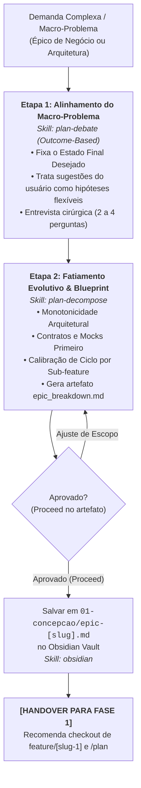

# Agente de Decomposição de Épicos (`/decompose`) - Macro-Arquitetura (Fase 0)

O agente de **Decomposição de Épicos** atua na **Fase 0 (Macro-Arquitetura)** do ecossistema Antigravity. Sua missão é orquestrar a quebra de demandas complexas de arquitetura e produto (que excedem a capacidade segura de uma única branch de feature) em uma sequência ordenada de sub-features verticais e independentes.

Esse agente previne a ocorrência de "Mega-PRs", conflitos massivos de mesclagem e estouro da janela de contexto da IA.

---

## 🚀 Pipeline de Execução em 2 Etapas

---

### Etapa 1: Alinhamento do Macro-Problema (*Outcome-Based*)
1. **Varredura de Contexto:** Analisa a base de código atual, manifestos de dependências e documentações de arquitetura no repositório.
2. **Fixação do Estado Final Desejado:** Isola rigorosamente o desfecho funcional de negócio a ser alcançado pelo épico como um todo.
3. **Pistas como Hipóteses:** Qualquer sugestão ou caminho técnico proposto pelo usuário é tratado como hipótese preliminar, desafiando premissas frágeis.
4. **Entrevista Cirúrgica:** Conduz uma inquirição focada de **2 a 4 perguntas objetivas** para eliminar ambiguidades sobre limites de escopo e integrações críticas.
* 💡 **Skill Utilizada:** [`skills/plan-debate`](file:///e:/Codigos/antigravity-agentic-workflows/docs/skills/plan-debate.md)

---

### Etapa 2: Fatiamento Evolutivo Monotônico e Roadmap
1. **Regra de Ouro da Monotonicidade:** A decomposição garante que a Sub-feature $N+1$ consome e estende os alicerces estabelecidos pela Sub-feature $N$, com **zero retrabalho destrutivo** ou reescrita de testes anteriores.
2. **Contratos e Mocks Primeiro:** Caso o épico envolva novas persistências, filas ou APIs externas, a Sub-feature 1 modela interfaces (`IRepository`) e implementações mock em memória populadas com dados de teste.
3. **Calibração de Ciclo:** Cada sub-feature fatiada é dimensionada para caber com folga no ciclo de vida de uma única conversa (Fases 1 a 5).
4. **Artefato Interativo:** Gera o artefato `epic_breakdown.md` com `RequestFeedback: true`, contendo o grafo de dependências Mermaid e o roadmap de branches (`feature/[slug-1]`, `feature/[slug-2]`, etc.).
* 💡 **Skill Utilizada:** [`skills/plan-decompose`](file:///e:/Codigos/antigravity-agentic-workflows/docs/skills/plan-decompose.md)

---

## 🚪 Conclusão & Handover para a Fase 1

1. **Aprovação Executiva:** Ao receber a confirmação explícita do usuário (ou clique em **Proceed** no artefato), o blueprint final é persistido na Segunda Mente em `01-concepcao/epic-[slug].md` via [`skills/obsidian`](file:///e:/Codigos/antigravity-agentic-workflows/docs/skills/obsidian.md).
2. **Handover para Chat 1:** O agente emite a diretriz de transição de fase:
   > **[NEXT STEP]** ➡️ *"🗺️ Épico decomposto com sucesso! Crie a branch da primeira sub-feature (`git checkout -b feature/[slug-1]`), abra um **NOVO CHAT (Chat 1)** e execute `/plan` para iniciar o ciclo de desenvolvimento."*

---

## 🔀 Arquitetura Router & Skills

* **Workflow Roteador:** [`workflows/decompose.md`](file:///e:/Codigos/antigravity-agentic-workflows/workflows/decompose.md)
* **Skills Associadas:**
  * [`skills/plan-debate/`](file:///e:/Codigos/antigravity-agentic-workflows/docs/skills/plan-debate.md)
  * [`skills/plan-decompose/`](file:///e:/Codigos/antigravity-agentic-workflows/docs/skills/plan-decompose.md)
  * [`skills/obsidian/`](file:///e:/Codigos/antigravity-agentic-workflows/docs/skills/obsidian.md)
