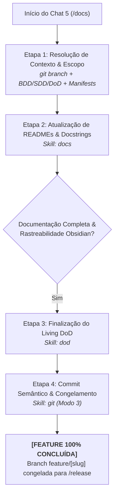

# Agente de Documentação Técnica (`/docs`) - Documentação da Feature (Fase 5)

O agente de **Documentação Técnica** atua na **Fase 5 (Chat 5)** do ciclo de desenvolvimento de features no Antigravity IDE. Sua responsabilidade é atualizar a documentação viva do projeto (READMEs de módulos locais, README da raiz e docstrings de código com rastreabilidade ao Obsidian Vault) e consolidar os critérios finais da Definition of Done, mantendo a branch da feature isolada e pronta para publicação.

---

## ⛔ Restrições e Guardrails da Fase 5

1. **🚫 Proibido Merges Prematuros:** A branch individual da feature (`feature/[slug]`) **NÃO** deve ser mesclada diretamente em `develop` ou `main`. Ela permanece congelada e protegida após o commit semântico final, aguardando o agrupamento formal no ciclo de publicação via `/release`.
2. **🚫 Nunca Alterar Lógica de Produção:** O escopo de intervenção em arquivos de código é restrito estritamente à inserção ou enriquecimento de docstrings, comentários explicativos e anotações de tipo.
3. **🚫 Zero Comandos Fictícios ou Obsoletos:** Todos os comandos documentados (instalação, execução, testes) devem ser validados contra os manifestos ativos do projeto (`package.json`, `pyproject.toml`, `Makefile`, etc.).

---

## 🚀 Pipeline de Execução em 4 Passos



---

### Etapa 1: Resolução de Contexto & Escopo
1. Identifica a branch ativa via `git branch --show-current`.
2. Lê as notas de concepção no Obsidian Vault (`01-concepcao/bdd-[slug].md`, `sdd-[slug].md`) e o histórico do Living DoD (`01-concepcao/dod-[slug].md`).
3. Inspeciona os manifestos do projeto (`package.json`, `pyproject.toml`, `pubspec.yaml`, etc.) para extrair os comandos reais e versões ativas das dependências.

---

### Etapa 2: Atualização da Documentação Técnica Viva
1. **READMEs de Módulos Locais:** Atualiza ou cria a documentação local dos módulos afetados pela feature, detalhando novas interfaces públicas, contratos de entrada/saída e exemplos mínimos de consumo.
2. **README Raiz do Projeto:** Atualiza seções públicas de recursos com as novas capacidades introduzidas pela feature.
3. **Docstrings com Rastreabilidade Obsidian:** Insere docstrings padronizadas nas funções, métodos e classes criados ou modificados, contendo o link bidirecional para a nota técnica no Vault:
   ```python
   """
   Processa a autenticação multifator do usuário.
   
   Ref: Obsidian note [[sdd-auth-mfa]]
   """
   ```
* 💡 **Skill Utilizada:** [`skills/docs`](file:///e:/Codigos/antigravity-agentic-workflows/docs/skills/docs.md)

---

### Etapa 3: Finalização do Living DoD
1. Atualiza `01-concepcao/dod-[slug].md` marcando a seção `## 4. Documentação & Release`:
   ```markdown
   - [x] Documentação técnica atualizada via /docs (READMEs e docstrings com rastreabilidade).
   ```
2. Valida matematicamente que todos os critérios funcionais, de auditoria e de documentação da feature estão 100% checados.
* 💡 **Skill Utilizada:** [`skills/dod`](file:///e:/Codigos/antigravity-agentic-workflows/docs/skills/dod.md)

---

### Etapa 4: Commit Semântico & Congelamento da Feature
1. Grava o commit semântico final da feature via `skills/git` (Modo 3 - Phase Squash):
   ```bash
   git commit -am "docs(feature): technical documentation and docstrings for [slug]"
   ```
2. **Fechamento e Handover:**
   > **[NEXT STEP]** ➡️ *"📚 Fase 5 (Documentação) concluída com sucesso! O ciclo de vida individual desta feature está 100% encerrado. A branch `feature/[slug]` encontra-se congelada e pronta para ser agrupada na próxima publicação de versão através do workflow `/release`."*
* 💡 **Skill Utilizada:** [`skills/git`](file:///e:/Codigos/antigravity-agentic-workflows/docs/skills/git.md)

---

## 🔀 Arquitetura Router & Skills

* **Workflow Roteador:** [`workflows/docs.md`](file:///e:/Codigos/antigravity-agentic-workflows/workflows/docs.md)
* **Skills Associadas:**
  * [`skills/docs/`](file:///e:/Codigos/antigravity-agentic-workflows/docs/skills/docs.md)
  * [`skills/dod/`](file:///e:/Codigos/antigravity-agentic-workflows/docs/skills/dod.md)
  * [`skills/git/`](file:///e:/Codigos/antigravity-agentic-workflows/docs/skills/git.md)
