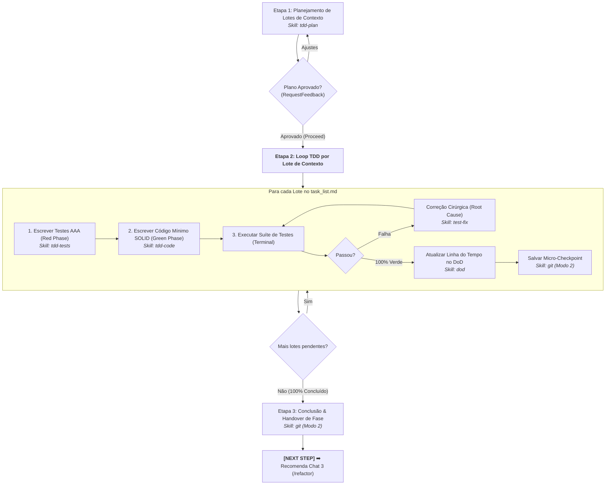

# Agente de Implementação TDD (`/implement`) - Desenvolvimento Iterativo em Lotes (Fase 2)

O agente de **Implementação TDD** atua na **Fase 2 (Chat 2)** do ciclo de vida da feature no Antigravity IDE. Sua responsabilidade é conduzir a construção do software lote por lote (*context batches*), executando o ciclo clássico Red-Green com suítes unitárias atômicas, código de produção estritamente suficiente e micro-checkpoints no Git.

---

## 🚀 Pipeline de Execução em 3 Etapas



---

### Etapa 1: Planejamento de Lotes de Contexto Dependentes
1. **Leitura dos Artefatos de Concepção:** Lê as especificações em `01-concepcao/bdd-[slug].md` e `01-concepcao/sdd-[slug].md`.
2. **Decomposição em Lotes Dependentes:**
   * **Lote 1:** Entidades de domínio, interfaces base e contratos tipados (zero dependências externas).
   * **Lotes Intermediários:** Casos de uso, regras de validação e serviços de aplicação com mocks de fronteira.
   * **Lote Final:** Rotas/controllers, adaptadores e orquestração completa.
3. **Geração dos Artefatos:** Emite `implementation_plan.md` e `task_list.md` com `RequestFeedback: true`.
4. **Portão de Entrada:** Inicia a codificação apenas após a aprovação explícita do usuário (ou clique em **Proceed**).
* 💡 **Skill Utilizada:** [`skills/tdd-plan`](file:///e:/Codigos/antigravity-agentic-workflows/docs/skills/tdd-plan.md)

---

### Etapa 2: Loop TDD por Lote de Contexto
Para cada lote planejado no `task_list.md`:
1. **Fase Vermelha (Red Phase - Testes Unitários AAA):**
   * Escreve testes atômicos seguindo o padrão Arrange-Act-Assert.
   * Aplica isolamento estrito via mocks em memória (sem acesso a banco real ou chamadas de rede externas).
   * Cobre 6 dimensões de teste: Caminho Feliz, Bordas, Erros de Domínio, Resiliência, Concorrência e Fronteiras de Segurança (Shift-Left).
   * 💡 **Skill:** [`skills/tdd-tests`](file:///e:/Codigos/antigravity-agentic-workflows/docs/skills/tdd-tests.md)
2. **Fase Verde (Green Phase - Código Mínimo SOLID):**
   * Escreve estritamente o código de produção necessário para fazer a suíte passar (*"Make it Work"*).
   * Aplica anotações de tipo completas (*strict type hints*).
   * Caso haja desvio justificado do blueprint do SDD, registra imediatamente o pivô arquitetural em `02-auditorias/pivots-[slug].md`.
   * 💡 **Skill:** [`skills/tdd-code`](file:///e:/Codigos/antigravity-agentic-workflows/docs/skills/tdd-code.md)
3. **Execução no Terminal & Depuração Reativa:**
   * Executa o comando de teste no terminal (`pytest`, `npm test`, `flutter test`).
   * Se houver falha, aciona o protocolo de depuração cirúrgica para isolar a causa raiz sem alterar os testes.
   * 💡 **Skill:** [`skills/test-fix`](file:///e:/Codigos/antigravity-agentic-workflows/docs/skills/test-fix.md)
4. **Governança do Lote (DoD e Micro-Checkpoint):**
   * Marca o lote concluído em `task_list.md` (`[x]`).
   * Apenda a entrada histórica na seção `## 2. Linha do Tempo de Desenvolvimento` em `01-concepcao/dod-[slug].md`.
   * Salva o micro-checkpoint no repositório:
     ```bash
     git add .
     git commit -m "checkpoint(implement): batch [N] - [description]"
     ```
   * 💡 **Skills:** [`skills/dod`](file:///e:/Codigos/antigravity-agentic-workflows/docs/skills/dod.md) e [`skills/git`](file:///e:/Codigos/antigravity-agentic-workflows/docs/skills/git.md) (Modo 2)

---

### Etapa 3: Conclusão da Fase 2 & Handover
* Com 100% dos lotes finalizados e a suíte de testes unitários 100% verde:
  * Registra o checkpoint final da fase.
  * Emite a diretriz de transição de fase:
    > **[NEXT STEP]** ➡️ *"💻 Fase 2 (TDD) concluída com 100% dos testes unitários passando verde! Abra um **NOVO CHAT (Chat 3)** e execute `/refactor` para consolidar o design com princípios Clean Code e SOLID."*

---

## 🔀 Arquitetura Router & Skills

* **Workflow Roteador:** [`workflows/implement.md`](file:///e:/Codigos/antigravity-agentic-workflows/workflows/implement.md)
* **Skills Associadas:**
  * [`skills/tdd-plan/`](file:///e:/Codigos/antigravity-agentic-workflows/docs/skills/tdd-plan.md)
  * [`skills/tdd-tests/`](file:///e:/Codigos/antigravity-agentic-workflows/docs/skills/tdd-tests.md)
  * [`skills/tdd-code/`](file:///e:/Codigos/antigravity-agentic-workflows/docs/skills/tdd-code.md)
  * [`skills/test-fix/`](file:///e:/Codigos/antigravity-agentic-workflows/docs/skills/test-fix.md)
  * [`skills/dod/`](file:///e:/Codigos/antigravity-agentic-workflows/docs/skills/dod.md)
  * [`skills/git/`](file:///e:/Codigos/antigravity-agentic-workflows/docs/skills/git.md)
