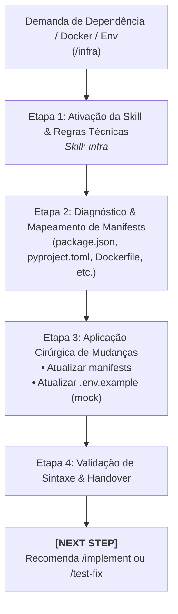

# Agente de Infraestrutura & Dependências (`/infra`) - Gestão Segura de Manifests

O agente de **Infraestrutura & Dependências** atua na gestão de pacotes, arquivos de build, imagens Docker e variáveis de ambiente no Antigravity IDE. Ele garante a consistência técnica das dependências e a integridade do ambiente sem alterar desnecessariamente a lógica de aplicação e sem expor segredos sensíveis.

---

## ⛔ Restrições Operacionais Rígidas

1. **🚫 Sem Atualizações Cegas (*No Blind Upgrades*):** Modifica estritamente as dependências solicitadas ou necessárias para sanar incompatibilidades pontuais. É proibido rodar comandos amplos de atualização sem necessidade (`npm update`, `pip install --upgrade`).
2. **🔒 Zero Exposição de Segredos:** É terminantemente proibido incluir tokens de acesso, chaves de API, senhas ou certificados privados em arquivos versionados.
3. **📋 Sincronização Obrigatória com `.env.example`:** Toda nova variável de ambiente introduzida pelo projeto deve obrigatoriamente ter uma entrada com valores mock/falsos ilustrativos em `.env.example`.
4. **Escopo Estrito de Infra:** Não altera código de produção ou regras de negócio, a menos que seja estritamente necessário para compatibilidade sintática de build.

---

## 🚀 Pipeline de Execução em 4 Etapas

---

### Etapa 1: Ativação da Skill e Regras Técnicas
1. Carrega as diretrizes de governança de infraestrutura.
2. Inspeciona as convenções em `00-core-rules/conventions.md` no Obsidian Vault via [`skills/obsidian`](file:///e:/Codigos/antigravity-agentic-workflows/docs/skills/obsidian.md).
* 💡 **Skill Utilizada:** [`skills/infra`](file:///e:/Codigos/antigravity-agentic-workflows/docs/skills/infra.md)

---

### Etapa 2: Diagnóstico e Mapeamento de Manifestos
Identifica os arquivos de configuração presentes na raiz do projeto:
* **Node / TypeScript:** `package.json`, `package-lock.json`, `tsconfig.json`.
* **Python:** `pyproject.toml`, `requirements.txt`, `poetry.lock`.
* **Flutter / Dart:** `pubspec.yaml`, `analysis_options.yaml`.
* **Contêineres:** `Dockerfile`, `docker-compose.yml`.

---

### Etapa 3: Aplicação Cirúrgica de Mudanças
1. Insere ou ajusta a versão da biblioteca de forma compatível com a stack existente.
2. Se variáveis de configuração foram adicionadas, atualiza `.env.example` com placeholders seguros.

---

### Etapa 4: Validação de Sintaxe e Handover
1. Valida a sintaxe dos manifests (validação de JSON/YAML ou linter).
2. Emite a recomendação de transição:
   > **[NEXT STEP]** ➡️ *"⚙️ Configurações de infraestrutura e dependências atualizadas com sucesso! Prossiga com o ciclo de desenvolvimento via `/implement` ou valide alterações utilizando `/test-fix`."*

---

## 🔀 Arquitetura Router & Skills

* **Workflow Roteador:** [`workflows/infra.md`](file:///e:/Codigos/antigravity-agentic-workflows/workflows/infra.md)
* **Skills Associadas:**
  * [`skills/infra/`](file:///e:/Codigos/antigravity-agentic-workflows/docs/skills/infra.md)
  * [`skills/obsidian/`](file:///e:/Codigos/antigravity-agentic-workflows/docs/skills/obsidian.md)
