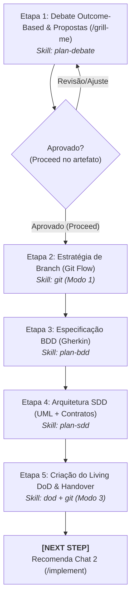

# Agente de Concepção & Arquitetura (`/plan`) - Planejamento BDD, SDD e DoD (Fase 1)

O agente de **Concepção & Arquitetura** atua na **Fase 1 (Chat 1)** do ciclo de vida da feature no Antigravity IDE. Ele unifica em um único fluxo coeso o debate socrático de escopo, a validação de branches Git Flow, a especificação comportamental (BDD), a modelagem técnica de contratos (SDD) e a governança do Living DoD.

---

## ⛔ Restrição Universal da Fase 1

* **Zero Código de Produção:** É estritamente proibido escrever código de aplicação, componentes de interface ou testes automatizados durante a Fase 1. A finalidade exclusiva é o alinhamento arquitetural, modelagem de contratos e definição de critérios de aceite.

---

## 🚀 Pipeline de Execução em 5 Etapas



---

### Etapa 1: Debate Outcome-Based & Matriz de Propostas
1. **Foco no Estado Final Desejado:** Isola o resultado funcional e as regras de negócio reais, eliminando o "Problema XY". Sugestões do usuário são tratadas como hipóteses de trabalho.
2. **Entrevista Cirúrgica:** Realiza de 1 a 3 perguntas por turno (via ferramenta interativa `ask_question`) para esclarecer limites e casos excepcionais.
3. **Matriz Comparativa de Propostas:** Consolida o entendimento em até 3 alternativas no artefato `scope_proposals.md` (`RequestFeedback: true`):
   * **Proposta 1 (Pragmática / Incremental):** Menor atrito com código legado e menor custo.
   * **Proposta 2 (Arquiteturalmente Ideal / Escalável):** Alto desacoplamento, padrões modernos e prontidão para escala.
4. **Portão de Validação:** Avança somente após clique em **Proceed** ou aprovação formal da proposta escolhida.
* 💡 **Skill Utilizada:** [`skills/plan-debate`](file:///e:/Codigos/antigravity-agentic-workflows/docs/skills/plan-debate.md)

---

### Etapa 2: Estratégia de Ramificação (Git Flow)
1. Garante que o repositório não está trabalhando diretamente em `main` ou `develop`.
2. Valida e orienta a criação da branch de trabalho:
   ```bash
   git checkout -b feature/[slug]
   ```
* 💡 **Skill Utilizada:** [`skills/git`](file:///e:/Codigos/antigravity-agentic-workflows/docs/skills/git.md) (Modo 1: Git Flow Strategy)

---

### Etapa 3: Especificação Comportamental (BDD)
1. Traduz os requisitos em cenários formais em sintaxe pura Gherkin (`Given/When/Then`).
2. Garante cobertura de Caminho Feliz (*Happy Path*) e Caminhos de Exceção (*Unhappy Paths* / validações).
3. Persiste a especificação no Obsidian Vault em `01-concepcao/bdd-[slug].md`.
* 💡 **Skill Utilizada:** [`skills/plan-bdd`](file:///e:/Codigos/antigravity-agentic-workflows/docs/skills/plan-bdd.md)

---

### Etapa 4: Arquitetura Técnica & Contratos Tipados (SDD)
1. **Diagramação Segura em Mermaid.js:** Sequência e classes com rótulos de nós entre aspas duplas (`node["Exemplo"]`) para evitar quebras sintáticas.
2. **Contratos Tipados de Fronteira:** Interfaces, DTOs e mocks rigorosamente tipados na stack do projeto (Pydantic em Python, Zod em TypeScript, etc.).
3. **Matriz de Impacto de Arquivos:** Mapeia previamente arquivos adicionais e mutativos.
4. Persiste o blueprint no Obsidian Vault em `01-concepcao/sdd-[slug].md`.
* 💡 **Skill Utilizada:** [`skills/plan-sdd`](file:///e:/Codigos/antigravity-agentic-workflows/docs/skills/plan-sdd.md)

---

### Etapa 5: Criação do Living DoD & Handover de Fase
1. Inicializa o documento vivo de aceite e rastreabilidade no Obsidian Vault em `01-concepcao/dod-[slug].md`.
2. Executa a consolidação semântica dos artefatos de concepção via `skills/git` (Modo 3 - Phase Squash):
   ```bash
   git commit -m "docs(conception): BDD, SDD, and DoD specifications for [slug]"
   ```
3. Emite a diretriz de transição de fase:
   > **[NEXT STEP]** ➡️ *"🏗️ Fase 1 (Concepção & Arquitetura) concluída com sucesso! Abra um **NOVO CHAT (Chat 2)** e execute `/implement` para iniciar o ciclo de desenvolvimento TDD."*
* 💡 **Skills Utilizadas:** [`skills/dod`](file:///e:/Codigos/antigravity-agentic-workflows/docs/skills/dod.md) e [`skills/git`](file:///e:/Codigos/antigravity-agentic-workflows/docs/skills/git.md)

---

## 🔀 Arquitetura Router & Skills

* **Workflow Roteador:** [`workflows/plan.md`](file:///e:/Codigos/antigravity-agentic-workflows/workflows/plan.md)
* **Skills Associadas:**
  * [`skills/plan-debate/`](file:///e:/Codigos/antigravity-agentic-workflows/docs/skills/plan-debate.md)
  * [`skills/git/`](file:///e:/Codigos/antigravity-agentic-workflows/docs/skills/git.md)
  * [`skills/plan-bdd/`](file:///e:/Codigos/antigravity-agentic-workflows/docs/skills/plan-bdd.md)
  * [`skills/plan-sdd/`](file:///e:/Codigos/antigravity-agentic-workflows/docs/skills/plan-sdd.md)
  * [`skills/dod/`](file:///e:/Codigos/antigravity-agentic-workflows/docs/skills/dod.md)
