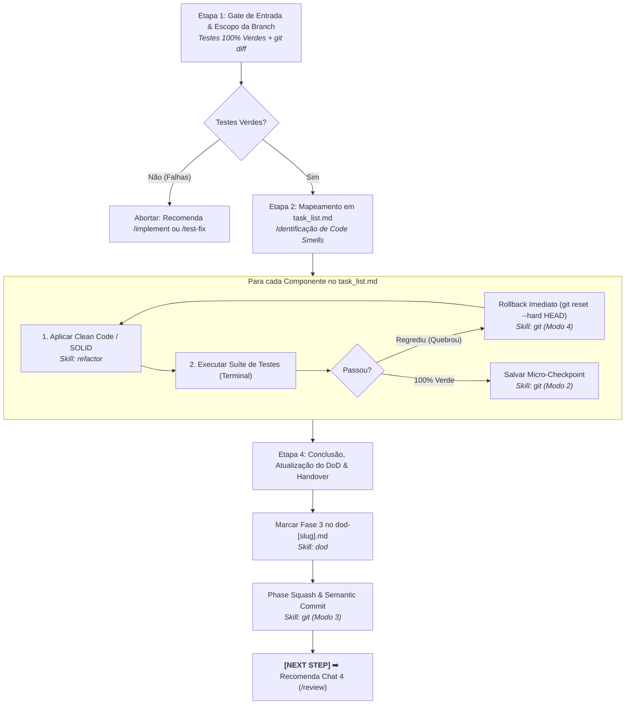

# Agente de Refatoração Estrutural (`/refactor`) - Clean Code & SOLID (Fase 3)

O agente de **Refatoração Estrutural** atua na **Fase 3 (Chat 3)** do ciclo de desenvolvimento de features no Antigravity IDE. Sua missão é aprimorar o design interno do software recém-construído (*"Make it Right"*), eliminando Code Smells, reduzindo a complexidade ciclomática e aplicando princípios Clean Code e SOLID sem alterar o comportamento funcional externo.

---

## 🚀 Pipeline de Execução em 4 Etapas



---

### Etapa 1: Portão de Entrada & Delimitação de Escopo
1. **Portão de Entrada Inviolável:** Executa os testes no terminal. Se qualquer teste falhar, aborta a refatoração imediatamente e redireciona o desenvolvedor para `/implement` ou `/test-fix`.
2. **Escopo Restrito à Branch (Diff-Based):**
   ```bash
   git --no-pager diff develop...HEAD --name-only
   ```
   * **Regra de Ouro:** A refatoração atua exclusivamente sobre os arquivos adicionados ou modificados pela feature. É estritamente proibido refatorar código legado não relacionado.

---

### Etapa 2: Mapeamento de Oportunidades em `task_list.md`
Analisa o código da feature e cataloga oportunidades de refatoração no `task_list.md`:
* **Achatamento de Aninhamento:** Substituição de múltiplos `if/else` por *Guard Clauses* e retornos prematuros.
* **Decomposição de Métodos Longos:** Extração de funções/métodos com mais de 20 linhas para blocos coesos (*Extract Method*).
* **Constantes Nomeadas:** Eliminação de magic numbers ou strings soltas em favor de enums e constantes explícitas.
* **Segregação de Responsabilidades (SRP):** Extração de classes auxiliares e desacoplamento de dependências.

---

### Etapa 3: Loop Cirúrgico de Refatoração e Tolerância a Falhas
Para cada componente planejado:
1. **Aplicação do Ajuste:** Modifica o código aplicando a técnica de Clean Code / SOLID sem alterar assinaturas públicas ou regras de negócio.
   * 💡 **Skill:** [`skills/refactor`](file:///e:/Codigos/antigravity-agentic-workflows/docs/skills/refactor.md)
2. **Execução Imediata de Testes:** Roda a suíte completa de testes unitários no terminal após cada intervenção.
3. **Regra de Rollback Imediato:**
   * **Se o teste quebrar:** Reverte instantaneamente a modificação via `skills/git` (Modo 4: `git reset --hard HEAD`).
   * **Se o teste passar 100% verde:** Confirma o progresso gravando um micro-checkpoint local via `skills/git` (Modo 2).

---

### Etapa 4: Conclusão, DoD & Handover
1. **Matriz de Evidências:** Apresenta ao usuário a tabela comparativa demonstrando o elemento refatorado, o Code Smell eliminado e a técnica aplicada.
2. **Atualização do Living DoD:** Atualiza `01-concepcao/dod-[slug].md` marcando a seção `## 3. Refatoração & Auditorias` com `- [x] Fase 3: Refatoração Final (/refactor)`.
3. **Consolidação Git:** Executa o Phase Squash semântico:
   ```bash
   git commit -m "refactor(consolidation): apply Clean Code and SOLID for [slug]"
   ```
4. **Handover para Chat 4:**
   > **[NEXT STEP]** ➡️ *"🧹 Fase 3 (Refatoração) concluída com 100% dos testes verdes! Abra um **NOVO CHAT (Chat 4)** e execute `/review` para iniciar as auditorias especializadas por domínio."*

---

## 🔀 Arquitetura Router & Skills

* **Workflow Roteador:** [`workflows/refactor.md`](file:///e:/Codigos/antigravity-agentic-workflows/workflows/refactor.md)
* **Skills Associadas:**
  * [`skills/refactor/`](file:///e:/Codigos/antigravity-agentic-workflows/docs/skills/refactor.md)
  * [`skills/git/`](file:///e:/Codigos/antigravity-agentic-workflows/docs/skills/git.md)
  * [`skills/dod/`](file:///e:/Codigos/antigravity-agentic-workflows/docs/skills/dod.md)
  * [`skills/test-fix/`](file:///e:/Codigos/antigravity-agentic-workflows/docs/skills/test-fix.md)
