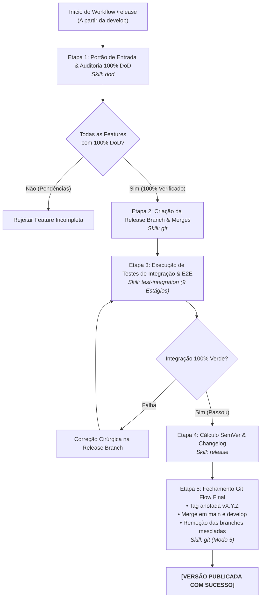

# Agente de Integração & Release (`/release`) - Pipeline de Publicação e Git Flow

O agente de **Integração & Release** orquestra o ciclo formal de publicação de uma nova versão do sistema no Antigravity IDE. Ele atua como o portão de controle de qualidade global, integrando um lote de uma ou mais features finalizadas em uma branch temporária de release, executando a suíte consolidada de testes de integração e E2E, calculando o incremento SemVer e finalizando o ciclo de Git Flow com tags anotadas e mesclagens em `main` e `develop`.

---

## 🏗️ Princípios de Engenharia de Release (Git Flow Real)

1. **Isolamento de Branches:** Nenhuma branch individual de feature (`feature/[slug]`) realiza release individual ou bump de versão global (`v1.2.0` $\rightarrow$ `v1.3.0`).
2. **Portão Inviolável de Entrada:** Nenhuma feature pode ser mesclada na release branch sem que 100% dos critérios do seu respectivo Living DoD (`01-concepcao/dod-[slug].md`) estejam matematicamente marcados como concluídos (`[x]`).
3. **Ambiente Consolidado de Integração:** O teste final de compatibilidade entre múltiplos módulos ocorre estritamente dentro da branch `release/vX.Y.Z`, mantendo as branches `main` e `develop` protegidas contra quebras.

---

## 🚀 Pipeline de Execução em 5 Etapas



---

### Etapa 1: Portão de Entrada & Auditoria 100% DoD
1. O desenvolvedor declara as features candidatas a compor a release (ex: `feature/auth-jwt`, `feature/payment-pix`).
2. Para cada feature candidata, o agente lê `01-concepcao/dod-[slug].md` no Obsidian Vault.
3. Se houver qualquer checkbox pendente (`- [ ]`), a feature é rejeitada imediatamente da release.
* 💡 **Skill Utilizada:** [`skills/dod`](file:///e:/Codigos/antigravity-agentic-workflows/docs/skills/dod.md)

---

### Etapa 2: Criação da Release Branch & Mesclagem de Candidatas
1. Cria a branch de release a partir da `develop`:
   ```bash
   git checkout develop
   git checkout -b release/v[VERSION_PREVIEW]
   ```
2. Mescla cada feature candidata aprovada:
   ```bash
   git merge --no-ff feature/[slug-1]
   git merge --no-ff feature/[slug-2]
   ```
* 💡 **Skill Utilizada:** [`skills/git`](file:///e:/Codigos/antigravity-agentic-workflows/docs/skills/git.md) (Modo 5: Release Strategy)

---

### Etapa 3: Execução de Testes de Integração & E2E
1. Executa a suíte de testes de integração e ponta a ponta com banners estruturados no console em 9 estágios:
   * **Stage 1:** E2E Happy Path Nominal.
   * **Stages 2 a 5:** Unhappy Paths (Autenticação 401, Permissão 403, Conflito 409, Validação 422).
   * **Stage 6:** Resiliência e Degradação Graciosa (Fallback).
   * **Stages 7 e 8:** Segurança Web (Anti-CSRF 403 e Open Redirect neutralizado).
   * **Stage 9:** Estresse Concorrente de Carga e Prevenção de Race Conditions (TOCTOU).
2. Se surgirem incompatibilidades entre as features, correções pontuais são aplicadas diretamente na branch de release.
* 💡 **Skill Utilizada:** [`skills/test-integration`](file:///e:/Codigos/antigravity-agentic-workflows/docs/skills/test-integration.md)

---

### Etapa 4: Cálculo de SemVer & Changelog Consolidado
1. Avalia o acumulado de commits semânticos das features mescladas:
   * Contém `BREAKING CHANGE` ou quebra de contratos públicos? $\rightarrow$ **MAJOR**
   * Contém `feat:` retrocompatível? $\rightarrow$ **MINOR**
   * Contém apenas `fix:`, `perf:` ou `refactor:`? $\rightarrow$ **PATCH**
2. Atualiza cumulativamente o `CHANGELOG.md` na raiz do projeto e salva a cópia permanente em `03-releases/changelog-v[VERSION].md` no Obsidian Vault.
* 💡 **Skill Utilizada:** [`skills/release`](file:///e:/Codigos/antigravity-agentic-workflows/docs/skills/release.md)

---

### Etapa 5: Fechamento de Git Flow & Tagging Anotada
1. Executa o encerramento seguro de Git Flow via Modo 5 da skill `git`:
   ```bash
   git commit -am "chore(release): prepare release v[VERSION]"
   git checkout main
   git merge --no-ff release/v[VERSION]
   git tag -a v[VERSION] -m "Release v[VERSION]"
   git checkout develop
   git merge --no-ff release/v[VERSION]
   git branch -d release/v[VERSION]
   git branch -d feature/[slug-1]
   git branch -d feature/[slug-2]
   ```
2. **Mensagem de Sucesso:**
   > **[RELEASE COMPLETED]** 🚀 *"Versão `v[VERSION]` publicada com sucesso! 100% de DoD verificado, testes de integração aprovados, tag anotada criada e mesclagens concluídas em `main` e `develop`."*
* 💡 **Skill Utilizada:** [`skills/git`](file:///e:/Codigos/antigravity-agentic-workflows/docs/skills/git.md) (Modo 5)

---

## 🔀 Arquitetura Router & Skills

* **Workflow Roteador:** [`workflows/release.md`](file:///e:/Codigos/antigravity-agentic-workflows/workflows/release.md)
* **Skills Associadas:**
  * [`skills/dod/`](file:///e:/Codigos/antigravity-agentic-workflows/docs/skills/dod.md)
  * [`skills/test-integration/`](file:///e:/Codigos/antigravity-agentic-workflows/docs/skills/test-integration.md)
  * [`skills/release/`](file:///e:/Codigos/antigravity-agentic-workflows/docs/skills/release.md)
  * [`skills/git/`](file:///e:/Codigos/antigravity-agentic-workflows/docs/skills/git.md)
