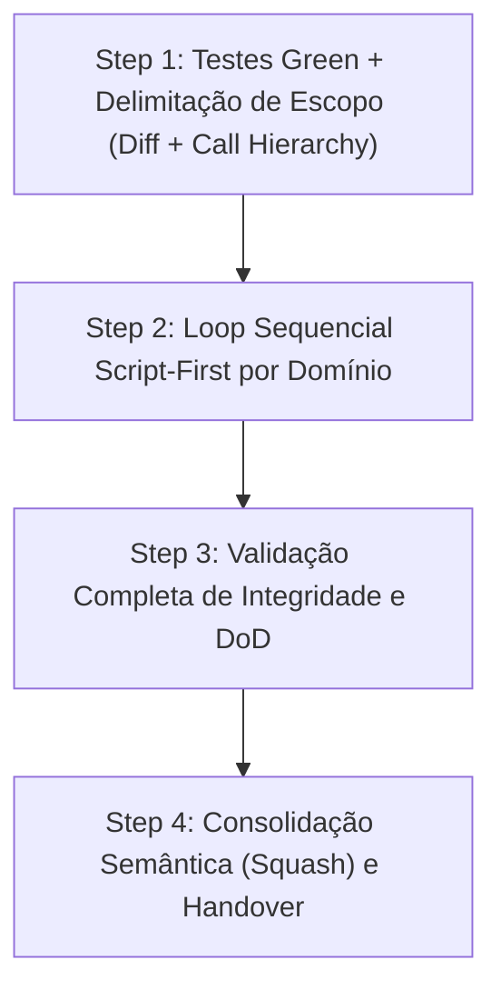
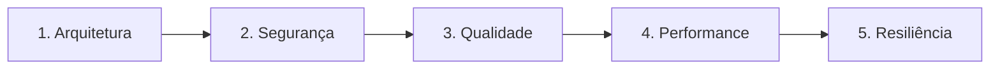

# Agente de Auditoria Especializada (`/review`) - Auditorias Especializadas (Fase 4)

O agente de **Auditoria Especializada** atua na **Fase 4 (Chat 4)** do ciclo de desenvolvimento de features. Sua missão é submeter o código refatorado a um rigoroso escrutínio multidomínio sob 5 óticas especializadas antes da publicação da branch de release.

Alinhado com o [OWASP Code Review Guide v2](file:///e:/Codigos/antigravity-agentic-workflows/docs/references/OWASP_Code_Review_Guide_v2.pdf), o agente opera sob a estratégia **Script-First** e aplica **Taint Analysis** quando dados não confiáveis trafegam entre fronteiras.

---

## 🚀 Pipeline de Execução em 4 Passos



### Step 1: Portão de Entrada e Escopo com Call Hierarchy
- **Portão de Entrada:** A suíte de testes unitários deve estar 100% verde antes de iniciar qualquer auditoria.
- **Escopo Baseado em Diff:**
  ```bash
  git --no-pager diff develop...HEAD --name-only
  git --no-pager diff develop...HEAD --unified=3
  ```
- **Permissão de Call Hierarchy (Taint Analysis):** O agente foca primariamente nas alterações da branch. Caso uma linha modificada receba parâmetros externos (HTTP/gRPC/CLI) ou invoque sumidouros (*sinks*) externos, o agente tem **permissão expressa para navegar 1 nível acima (chamadores) ou 1 nível abaixo (chamados)** para auditar o fluxo completo de dados e sanitização.

---

### Step 2: Loop Iterativo Script-First por Domínio

O agente executa um ciclo completo para cada um dos 5 domínios abaixo, **sempre rodando os scripts automatizados antes** de ler o código:



| Domínio | Script Automatizado Executado Primeiro | Skill Especializada | Foco da Auditoria |
| :--- | :--- | :--- | :--- |
| **1. Arquitetura** | `python skills/review-architecture/scripts/check_arch_boundaries.py <arquivos>` | [`review-architecture`](file:///e:/Codigos/antigravity-agentic-workflows/docs/skills/review-architecture.md) | Isolamento de camadas de domínio, Inversão de Dependência (DIP) e God Classes. |
| **2. Segurança** | `python skills/review-security/scripts/scan_sinks.py <arquivos>` | [`review-security`](file:///e:/Codigos/antigravity-agentic-workflows/docs/skills/review-security.md) | Sinks perigosos (OWASP v2), Race Conditions (TOCTOU), CSRF, CORS, CSPRNG e IDOR. |
| **3. Qualidade** | `python skills/review-quality/scripts/ast_complexity.py <arquivos>` | [`review-quality`](file:///e:/Codigos/antigravity-agentic-workflows/docs/skills/review-quality.md) | Complexidade ciclomática $V(G) \le 10$, aninhamento excessivo e legibilidade. |
| **4. Performance** | Verificação de queries e loops $O(N^2)$ | [`review-performance`](file:///e:/Codigos/antigravity-agentic-workflows/docs/skills/review-performance.md) | Queries N+1, lookups lineares repetitivos em loops e vazamento de sessões/handles. |
| **5. Resiliência** | Inspeção de timeouts e retries | [`review-resilience`](file:///e:/Codigos/antigravity-agentic-workflows/docs/skills/review-resilience.md) | Timeouts explícitos em chamadas externas, backoff exponencial e fallbacks. |

**Para cada domínio:**
1. Roda o script automatizado correspondente.
2. Analisa os alertas gerados e faz a leitura cirúrgica focada nas linhas indicadas.
3. Aplica a correção cirúrgica estritamente no ponto necessário.
4. Roda os testes para manter a suíte 100% verde.
5. Registra o micro-checkpoint via Git (`checkpoint(review): fixes for [domain]`).
6. Atualiza o Living DoD (`01-concepcao/dod-[slug].md`).

---

### Step 3: Validação de Integridade
* Executa a suíte completa de testes.
* Confirma que todos os 5 domínios no DoD estão marcados como concluídos (`[x]`).

---

### Step 4: Conclusão e Handover
* Consolida os micro-checkpoints em commit semântico de auditoria (`audit(review): specialized domain audits completed for [slug]`).
* Emite a mensagem de transição de fase recomendando a abertura do Chat 5 (`/docs`).

---

## 🔀 Arquitetura Router & Skills

* **Workflow Roteador:** [`workflows/review.md`](file:///e:/Codigos/antigravity-agentic-workflows/workflows/review.md)
* **Skills Especializadas (Documentação & Instruções):**
  * [`review-architecture`](file:///e:/Codigos/antigravity-agentic-workflows/docs/skills/review-architecture.md) ([`skills/review-architecture/`](file:///e:/Codigos/antigravity-agentic-workflows/skills/review-architecture/))
  * [`review-security`](file:///e:/Codigos/antigravity-agentic-workflows/docs/skills/review-security.md) ([`skills/review-security/`](file:///e:/Codigos/antigravity-agentic-workflows/skills/review-security/))
  * [`review-quality`](file:///e:/Codigos/antigravity-agentic-workflows/docs/skills/review-quality.md) ([`skills/review-quality/`](file:///e:/Codigos/antigravity-agentic-workflows/skills/review-quality/))
  * [`review-performance`](file:///e:/Codigos/antigravity-agentic-workflows/docs/skills/review-performance.md) ([`skills/review-performance/`](file:///e:/Codigos/antigravity-agentic-workflows/skills/review-performance/))
  * [`review-resilience`](file:///e:/Codigos/antigravity-agentic-workflows/docs/skills/review-resilience.md) ([`skills/review-resilience/`](file:///e:/Codigos/antigravity-agentic-workflows/skills/review-resilience/))
* **Referência de Conformidade:** [`docs/references/OWASP_Code_Review_Guide_v2.pdf`](file:///e:/Codigos/antigravity-agentic-workflows/docs/references/OWASP_Code_Review_Guide_v2.pdf)

