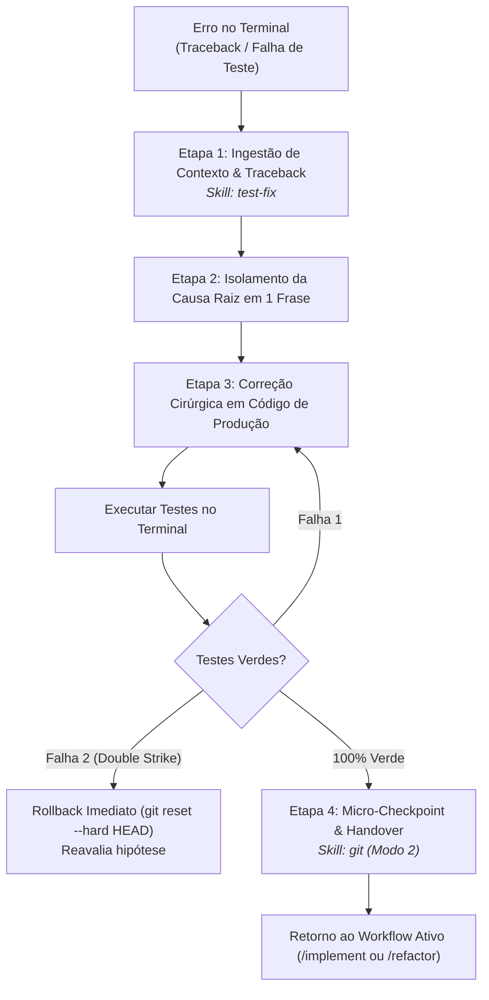

# Agente de Correção Reativa de Testes (`/test-fix`) - Depuração Cirúrgica

O agente de **Correção Reativa de Testes** atua como o depurador cirúrgico de suporte durante a **Fase 2 (Loop TDD)** e a **Fase 3 (Refatoração)** no Antigravity IDE. Sua missão é analisar mensagens de erro e tracebacks emitidos no terminal e aplicar intervenções mínimas no código de produção para restaurar a suíte de testes para 100% verde.

---

## ⛔ Regras Estritas e Tolerância a Falhas

1. **🚫 Proibido Alterar Asserções de Teste:** O teste unitário é a especificação formal do comportamento. É terminantemente proibido enfraquecer asserts, remover expectativas ou alterar mocks para forçar um teste a passar.
2. **🎯 Causa Raiz em 1 Frase:** Antes de tocar em qualquer linha de código, o agente deve isolar a causa fundamental do erro em exatamente uma frase concisa.
3. **🛡️ Regra do Duplo Golpe (*Double-Strike Rule*):** Se uma tentativa de correção falhar 2 vezes consecutivas ou introduzir quebras colaterais, a IA deve parar imediatamente de poluir o contexto, ativar o **Modo 4 da skill `git`** (`git reset --hard HEAD`), restaurar o último checkpoint limpo e formular uma nova hipótese diagnóstica.

---

## 🚀 Pipeline de Execução em 4 Passos



---

### Etapa 1: Ingestão de Contexto e Ativação
1. Identifica a branch ativa (`git branch --show-current`) e consulta os contratos no SDD (`01-concepcao/sdd-[slug].md`).
2. Recebe a mensagem de erro e o traceback completo do terminal fornecidos pelo desenvolvedor.
* 💡 **Skill Utilizada:** [`skills/test-fix`](file:///e:/Codigos/antigravity-agentic-workflows/docs/skills/test-fix.md)

---

### Etapa 2: Isolamento da Causa Raiz
1. Sintetiza a causa raiz do erro em 1 frase objetiva (ex: *"A função de resgate tenta decrementar o saldo antes de verificar a expiração do voucher, gerando desvio negativo"*).
2. Estrutura o checklist de diagnóstico atômico.

---

### Etapa 3: Correção Cirúrgica no Código de Produção
1. Edita estritamente as linhas de código de aplicação necessárias para sanar a falha.
2. Executa a suíte de testes no terminal para verificar a restauração do status verde.

---

### Etapa 4: Micro-Checkpoint e Retorno
1. Com a suíte 100% verde, grava um micro-checkpoint local via `skills/git` (Modo 2):
   ```bash
   git add .
   git commit -m "checkpoint(test-fix): surgical fix for [failure]"
   ```
2. Apresenta o diagnóstico resumido e orienta o desenvolvedor a retomar o fluxo principal (`/implement` ou `/refactor`).
* 💡 **Skill Utilizada:** [`skills/git`](file:///e:/Codigos/antigravity-agentic-workflows/docs/skills/git.md)

---

## 🔀 Arquitetura Router & Skills

* **Workflow Roteador:** [`workflows/test-fix.md`](file:///e:/Codigos/antigravity-agentic-workflows/workflows/test-fix.md)
* **Skills Associadas:**
  * [`skills/test-fix/`](file:///e:/Codigos/antigravity-agentic-workflows/docs/skills/test-fix.md)
  * [`skills/git/`](file:///e:/Codigos/antigravity-agentic-workflows/docs/skills/git.md)
