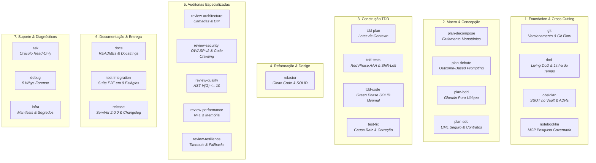

# Catálogo de Habilidades Técnicas (`docs/skills`)

As **Skills** representam a camada de execução técnica especializada do **Antigravity IDE**. Diferente dos workflows (que atuam como orquestradores de alto nível), cada skill segue rigorosamente o **Princípio da Responsabilidade Única (Single Responsibility Principle - SRP)**: resolve um domínio técnico atômico, fornecendo scripts automatizados, templates de artefatos e diretrizes operacionais sob demanda (*Progressive Disclosure*).

---

## 🗺️ Mapa Visual das 24 Skills por Categoria

---

## 📋 Catálogo Completo das 24 Skills

### 1. Foundation & Cross-Cutting (Fundação & Transversais)
| Skill | Documentação | Responsabilidade SRP | Scripts / Recursos Associados |
| :--- | :--- | :--- | :--- |
| **`git`** | [`git.md`](file:///e:/Codigos/antigravity-agentic-workflows/docs/skills/git.md) | Governança unificada de versionamento local em 5 modos (Branch Strategy, Micro-Checkpoints, Phase Squash, Rollback e Release). | `validate_branch.sh`, `template_phase_commit.md` |
| **`dod`** | [`dod.md`](file:///e:/Codigos/antigravity-agentic-workflows/docs/skills/dod.md) | Governança da Definition of Done e do Living Log (`01-concepcao/dod-[slug].md`), atuando como portão matemático de aceite. | `template_dod.md` |
| **`obsidian`** | [`obsidian.md`](file:///e:/Codigos/antigravity-agentic-workflows/docs/skills/obsidian.md) | Governança da SSOT no Obsidian Vault: leitura por metadados, patches cirúrgicos com `vault_patch`, ADRs e integridade de wikilinks. | `template_adr.md`, `template_pivot.md`, `template_domain_rule.md` |
| **`notebooklm`** | [`notebooklm.md`](file:///e:/Codigos/antigravity-agentic-workflows/docs/skills/notebooklm.md) | Integração com o MCP Google NotebookLM para consultas semânticas em papers e cadernos de pesquisa (estritamente governada pelo usuário). | `query_patterns.md` |

---

### 2. Macro & Concepção (Fases 0 e 1)
| Skill | Documentação | Responsabilidade SRP | Scripts / Recursos Associados |
| :--- | :--- | :--- | :--- |
| **`plan-decompose`** | [`plan-decompose.md`](file:///e:/Codigos/antigravity-agentic-workflows/docs/skills/plan-decompose.md) | Decomposição de macro-demandas em fatias verticais monotônicas com contratos e mocks primeiro, evitando Mega-PRs. | `template_epic.md`, `slicing_rules.md` |
| **`plan-debate`** | [`plan-debate.md`](file:///e:/Codigos/antigravity-agentic-workflows/docs/skills/plan-debate.md) | Descoberta socrática guiada por Outcome-Based Prompting: isola o Estado Final Desejado, trata pistas como hipóteses e gera propostas comparativas. | `ask_question`, `debate_rules.md`, `template_proposals.md` |
| **`plan-bdd`** | [`plan-bdd.md`](file:///e:/Codigos/antigravity-agentic-workflows/docs/skills/plan-bdd.md) | Especificação comportamental formal puramente em sintaxe Gherkin (`Given/When/Then`), sem jargão técnico. | `template_bdd.md`, `bdd_checkout_example.md` |
| **`plan-sdd`** | [`plan-sdd.md`](file:///e:/Codigos/antigravity-agentic-workflows/docs/skills/plan-sdd.md) | Modelagem arquitetural técnica: diagramas Mermaid seguros, contratos tipados (Pydantic/Zod/TS) e matriz de impacto de arquivos. | `validate_sdd_contracts.py`, `template_sdd.md` |

---

### 3. Construção TDD (Fase 2 & Suporte)
| Skill | Documentação | Responsabilidade SRP | Scripts / Recursos Associados |
| :--- | :--- | :--- | :--- |
| **`tdd-plan`** | [`tdd-plan.md`](file:///e:/Codigos/antigravity-agentic-workflows/docs/skills/tdd-plan.md) | Decomposição de requisitos em lotes lineares de contexto dependentes, gerando `implementation_plan.md` e `task_list.md`. | `plan_template.md`, `task_template.md` |
| **`tdd-tests`** | [`tdd-tests.md`](file:///e:/Codigos/antigravity-agentic-workflows/docs/skills/tdd-tests.md) | Red Phase: suítes de testes unitários atômicos AAA com mocks de fronteira e Shift-Left de concorrência e segurança. | `aaa_mock_patterns.md` |
| **`tdd-code`** | [`tdd-code.md`](file:///e:/Codigos/antigravity-agentic-workflows/docs/skills/tdd-code.md) | Green Phase: código de produção mínimo suficiente (*"Make it Work"*), tipagem estrita e registro de pivôs de rota em `02-auditorias/`. | `pivot_template.md` |
| **`test-fix`** | [`test-fix.md`](file:///e:/Codigos/antigravity-agentic-workflows/docs/skills/test-fix.md) | Diagnóstico cirúrgico de falhas de testes a partir de tracebacks do terminal, causa raiz em 1 frase e preservação de asserções. | `error_checklist_template.md` |

---

### 4. Refatoração & Design (Fase 3)
| Skill | Documentação | Responsabilidade SRP | Scripts / Recursos Associados |
| :--- | :--- | :--- | :--- |
| **`refactor`** | [`refactor.md`](file:///e:/Codigos/antigravity-agentic-workflows/docs/skills/refactor.md) | Eliminação de Code Smells e otimização de design com Clean Code e SOLID, mantendo os testes 100% verdes e emitindo a Matriz de Evidências. | `refactor_checklist_template.md` |

---

### 5. Auditorias Especializadas (Fase 4)
| Skill | Documentação | Responsabilidade SRP | Scripts / Recursos Associados |
| :--- | :--- | :--- | :--- |
| **`review-architecture`** | [`review-architecture.md`](file:///e:/Codigos/antigravity-agentic-workflows/docs/skills/review-architecture.md) | Auditoria de isolamento de camadas de domínio, Inversão de Dependência (DIP) e decomposição de God Classes. | `check_arch_boundaries.py`, `template_architecture.md` |
| **`review-security`** | [`review-security.md`](file:///e:/Codigos/antigravity-agentic-workflows/docs/skills/review-security.md) | Auditoria alinhada ao OWASP Code Review Guide v2: Code Crawling de sinks perigosos, Taint Analysis e prevenção de TOCTOU/IDOR. | `scan_sinks.py`, `checklist_security.md` |
| **`review-quality`** | [`review-quality.md`](file:///e:/Codigos/antigravity-agentic-workflows/docs/skills/review-quality.md) | Análise estática de complexidade ciclomática via AST ($V(G) \le 10$), aninhamento e legibilidade sintática. | `ast_complexity.py`, `template_quality.md` |
| **`review-performance`** | [`review-performance.md`](file:///e:/Codigos/antigravity-agentic-workflows/docs/skills/review-performance.md) | Auditoria de volumetria de dados, prevenção de queries N+1, gargalos assintóticos $O(N^2)$ e vazamentos de recursos/conexões. | `checklist_performance.md`, `template_performance.md` |
| **`review-resilience`** | [`review-resilience.md`](file:///e:/Codigos/antigravity-agentic-workflows/docs/skills/review-resilience.md) | Auditoria de tolerância a falhas distribuídas, timeouts mandatórios em chamadas externas, backoff exponencial e circuit breakers. | `checklist_resilience.md`, `template_resilience.md` |

---

### 6. Documentação & Entrega (Fase 5 & Publicação)
| Skill | Documentação | Responsabilidade SRP | Scripts / Recursos Associados |
| :--- | :--- | :--- | :--- |
| **`docs`** | [`docs.md`](file:///e:/Codigos/antigravity-agentic-workflows/docs/skills/docs.md) | Redação técnica viva: README raiz e de módulos locais validados contra manifests reais e docstrings com links ao Obsidian. | `template_readme_root.md`, `template_readme_local.md` |
| **`test-integration`** | [`test-integration.md`](file:///e:/Codigos/antigravity-agentic-workflows/docs/skills/test-integration.md) | Orquestração da suíte de integração e E2E na release branch com padrão de console banners estruturados em 9 estágios. | `e2e_runner_pattern.md`, `template_integration_log.md` |
| **`release`** | [`release.md`](file:///e:/Codigos/antigravity-agentic-workflows/docs/skills/release.md) | Cálculo cumulativo de incremento de versão (SemVer 2.0.0) e consolidação do `CHANGELOG.md` na raiz e no Vault. | `semver_rules.md`, `template_changelog.md` |

---

### 7. Suporte & Diagnósticos
| Skill | Documentação | Responsabilidade SRP | Scripts / Recursos Associados |
| :--- | :--- | :--- | :--- |
| **`ask`** | [`ask.md`](file:///e:/Codigos/antigravity-agentic-workflows/docs/skills/ask.md) | Consultas conceituais e arquiteturais em modo estritamente Read-Only, navegando na Segunda Mente com citações ancoradas. | `SKILL.md` |
| **`debug`** | [`debug.md`](file:///e:/Codigos/antigravity-agentic-workflows/docs/skills/debug.md) | Diagnóstico forense de runtime crashes através dos 5 Whys e geração do artefato RCA com `RequestFeedback: true`. | `5_whys_framework.md`, `template_root_cause.md` |
| **`infra`** | [`infra.md`](file:///e:/Codigos/antigravity-agentic-workflows/docs/skills/infra.md) | Gestão segura de pacotes, contêineres Docker e variáveis de ambiente com espelhamento em `.env.example` sem vazamento de segredos. | `SKILL.md` |
