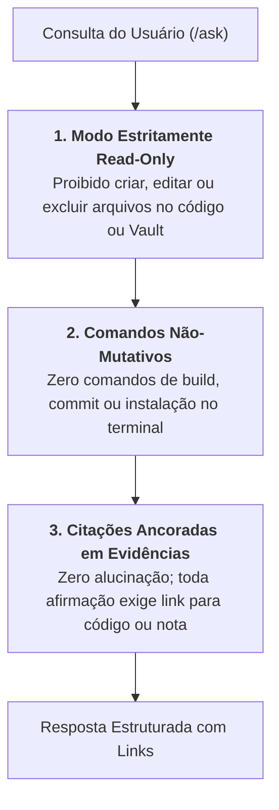

# Skill: Oráculo do Projeto & Consultas Read-Only (`ask`)

A skill **`ask`** atua no workflow de suporte **`/ask`**, fornecendo as regras fundamentais e restrições ético-técnicas para que a IA atue como uma ponte de conhecimento estritamente consultiva, sem capacidade de modificar arquivos ou executar comandos destrutivos.

---

## ⛔ Restrições Universais de Somente Leitura

---

## 🗺️ Mapa de Navegação no Obsidian Vault

Ao investigar regras e arquitetura, a skill orienta a busca pelas pastas canônicas da Segunda Mente:
* **`00-core-rules/`:** Regras universais (`conventions.md`, `domain-glossary.md`) e decisões arquiteturais permanentes (`adrs/`).
* **`01-concepcao/`:** Especificações de negócio (`bdd-[slug].md`) e arquitetura técnica (`sdd-[slug].md`).
* **`02-auditorias/`:** Relatórios de review técnico e registros de pivôs de rota (`pivots-[slug].md`).
* **`03-releases/`:** Histórico consolidado de notas de versão (`changelog-vX.X.md`).

---

## ✅ Padrões de Citação e Rastreabilidade
1. **Notas do Vault:** Sempre citadas utilizando a sintaxe nativa de wikilinks `[[nome-da-nota]]`.
2. **Arquivos do Repositório:** Sempre citados com links Markdown com esquema `file:///` apontando para o arquivo ou linhas exatas (ex: `[auth_service.py](file:///e:/Codigos/.../auth_service.py#L25-L40)`).
3. **Reconhecimento de Incerteza:** Caso determinado comportamento não esteja documentado formalmente nem possa ser inferido com 100% de certeza pelo código, a IA deve declarar explicitamente essa ausência ao usuário.

---

## 📋 Arquivos da Skill
* **Instruções Principais:** [`skills/ask/SKILL.md`](file:///e:/Codigos/antigravity-agentic-workflows/skills/ask/SKILL.md)
