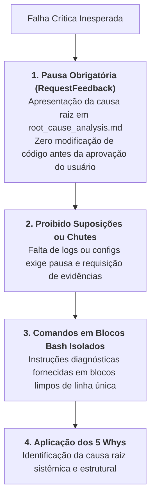

# Skill: Investigação Forense de Bugs & 5 Whys (`debug`)

A skill **`debug`** atua no workflow de suporte **`/debug`**, fornecendo a metodologia de engenharia de software para diagnosticar e erradicar falhas críticas de runtime, exceções não tratadas e inconsistências de infraestrutura através da técnica interrogativa dos **5 Whys (Cinco Porquês)**.

---

## ⛔ Restrições Operacionais Rígidas

---

## 🔬 Metodologia dos 5 Whys (Cinco Porquês)

A análise investiga a cadeia causal regressiva para encontrar o defeito de design, em vez de aplicar correções superficiais que apenas mascaram a exceção:

1. **Por que 1 (Sintoma Direto):** Por que o servidor retornou HTTP 500?
   * *Ex: O worker abortou por `ConnectionResetError`.*
2. **Por que 2 (Mecanismo):** Por que a conexão foi resetada?
   * *Ex: O pool de conexões do banco atingiu o limite máximo de clientes simultâneos.*
3. **Por que 3 (Consumo):** Por que as conexões foram esgotadas?
   * *Ex: Uma query de relatório executada na thread de requisição ficou bloqueada por mais de 60 segundos.*
4. **Por que 4 (Governança de I/O):** Por que a query não foi interrompida?
   * *Ex: Não havia timeout de statement configurado no cliente do banco de dados.*
5. **Por que 5 (Causa Raiz Sistêmica):** Por que essa query pesada de relatório está na mesma conexão das transações OLTP?
   * *Ex: Falta de isolamento entre a réplica de leitura e a conexão de escrita.*

---

## 📋 Arquivos da Skill
* **Instruções Principais:** [`skills/debug/SKILL.md`](file:///e:/Codigos/antigravity-agentic-workflows/skills/debug/SKILL.md)
* **Manual da Metodologia dos 5 Whys:** [`skills/debug/references/5_whys_framework.md`](file:///e:/Codigos/antigravity-agentic-workflows/skills/debug/references/5_whys_framework.md)
* **Template de Causa Raiz (RCA):** [`skills/debug/resources/template_root_cause.md`](file:///e:/Codigos/antigravity-agentic-workflows/skills/debug/resources/template_root_cause.md)
