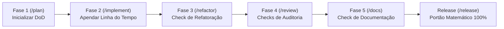

# Skill: Governança do Living DoD & Linha do Tempo (`dod`)

A skill **`dod`** gerencia a **Definition of Done (DoD)** e o **Living Log** do ciclo de vida das features no Antigravity IDE. Ela centraliza a rastreabilidade matemática de entrega através do documento vivo `01-concepcao/dod-[slug].md` no Obsidian Vault, garantindo que requisitos, marcos temporais e critérios de qualidade sejam auditados de forma contínua e imutável.

---

## 🎯 Responsabilidades ao Longo do Ciclo de Vida

A governança do Living DoD atua em todos os estágios do desenvolvimento:



---

### 1. Inicialização na Fase 1 (`/plan`)
* Gera o arquivo `01-concepcao/dod-[slug].md` no Obsidian Vault utilizando o template padrão.
* Estrutura as 5 seções fundamentais:
  1. **Requisitos & Arquitetura:** Links bidirecionais para `[[bdd-[slug]]]`, `[[sdd-[slug]]]` e ADRs relacionadas.
  2. **Linha do Tempo de Desenvolvimento:** Tabela reservada para os registros atômicos de cada lote TDD.
  3. **Refatoração & Auditorias:** Checklists de Clean Code e das 5 óticas especializadas da Fase 4.
  4. **Documentação & Release:** Checklists de READMEs, docstrings e liberação.
  5. **Critérios de Aceite Globais:** Cenários BDD e Requisitos Não-Funcionais (NFRs).

---

### 2. Registro Contínuo na Fase 2 (`/implement`)
* A cada lote de contexto concluído no loop TDD, a skill apenda uma nova linha na tabela da seção `## 2. Linha do Tempo de Desenvolvimento`:
  ```markdown
  | 04/09/2026 14:30 | Lote 1: Entidades de Domínio | `checkpoint(implement): batch 1` | Suíte 100% verde |
  ```

---

### 3. Checklists de Validação (Fases 3, 4 e 5)
* **Fase 3 (`/refactor`):** Marca o checkbox `- [x] Fase 3: Refatoração Final (/refactor)`.
* **Fase 4 (`/review`):** Marca incrementalmente cada domínio aprovado:
  * `- [x] 1. Auditoria Arquitetural (Isolamento de Camadas & DIP)`
  * `- [x] 2. Auditoria de Segurança (OWASP Top 10 & Code Crawling)`
  * `- [x] 3. Auditoria de Qualidade (Complexidade Ciclomática AST)`
  * `- [x] 4. Auditoria de Performance (Gargalos N+1 & Memory Leaks)`
  * `- [x] 5. Auditoria de Resiliência (Timeouts, Circuit Breakers & Retries)`
* **Fase 5 (`/docs`):** Marca `- [x] Documentação técnica atualizada via /docs`.

---

### 4. O Portão Matemático de Liberação (`/release`)
* Durante o pipeline de publicação, a skill atua como o **Gatekeeper Inviolável**:
  * Inspeciona todos os arquivos `dod-[slug].md` das features candidatas à release.
  * Se existir qualquer checkbox desmarcado (`- [ ]`), a feature é matematicamente rejeitada da branch de release.

---

## 📋 Arquivos da Skill
* **Instruções Principais:** [`skills/dod/SKILL.md`](file:///e:/Codigos/antigravity-agentic-workflows/skills/dod/SKILL.md)
* **Template do Living DoD:** [`skills/dod/resources/template_dod.md`](file:///e:/Codigos/antigravity-agentic-workflows/skills/dod/resources/template_dod.md)
