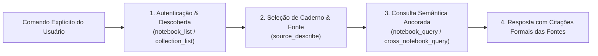

# Skill: Google NotebookLM MCP (`notebooklm`) - Pesquisa Externa Governada

A skill **`notebooklm`** fornece as diretrizes, procedimentos e guardrails rígidos para interação com o servidor Model Context Protocol (MCP) do **Google NotebookLM**. Ela permite que a IA acesse cadernos de pesquisa, documentações de terceiros, whitepapers e coleções de fontes complexas fornecidas pelo usuário.

---

## ⛔ Guardrail Absoluto (*User-Governed Modus Operandi*)

* **🚫 PROIBIDO CONSULTAR DE FORMA AUTÔNOMA:** O agente é **TERMINANTEMENTE PROIBIDO** de disparar ferramentas do MCP NotebookLM por iniciativa própria.
* **🎯 APENAS SOB GATILHO EXPLÍCITO:** As ferramentas do NotebookLM só podem ser acionadas quando o desenvolvedor solicitar expressamente no chat (ex: *"consulte o NotebookLM"*, *"pesquise no caderno X do notebooklm"*, *"pergunte ao NotebookLM sobre Y"*).

---

## 🎯 Procedimentos Operacionais

---

### 1. Autenticação & Ciclo de Vida de Tokens
* O MCP gerencia tokens de sessão via ferramentas dedicadas:
  * `refresh_auth`: Renova credenciais expiradas.
  * `save_auth_tokens`: Persiste os tokens para sessões subsequentes sem interromper o fluxo de trabalho.

---

### 2. Descoberta de Cadernos e Fontes
* `notebook_list`: Mapeia os cadernos disponíveis na conta vinculada.
* `collection_list`: Lista conjuntos temáticos de cadernos.
* `source_describe`: Detalha as fontes (PDFs, URLs, notas) indexadas dentro de um caderno antes da formulação de perguntas complexas.

---

### 3. Consultas Semânticas Direcionadas
* `notebook_query`: Submete uma pergunta ao motor de IA generativa ancorado nas fontes daquele caderno específico.
* `cross_notebook_query`: Executa buscas transversais que cruzam conhecimento contido em múltiplos cadernos simultaneamente.

---

### 4. Resposta com Citação Rigorosa de Fontes
* Toda resposta derivada de uma busca no NotebookLM deve citar o nome da fonte, trecho ou documento original retornado pelo modelo, mantendo a rastreabilidade técnica dos fatos.

---

## 📋 Arquivos da Skill
* **Instruções Principais:** [`skills/notebooklm/SKILL.md`](file:///e:/Codigos/antigravity-agentic-workflows/skills/notebooklm/SKILL.md)
* **Procedimento Técnico:** [`skills/notebooklm/references/EXECUTION.md`](file:///e:/Codigos/antigravity-agentic-workflows/skills/notebooklm/references/EXECUTION.md)
* **Padrões de Consulta e Citação:** [`skills/notebooklm/resources/query_patterns.md`](file:///e:/Codigos/antigravity-agentic-workflows/skills/notebooklm/resources/query_patterns.md)
