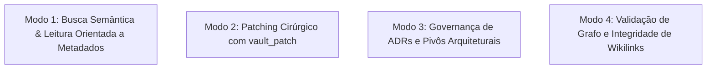

# Skill: Governança do Obsidian Vault & SSOT (`obsidian`)

A skill **`obsidian`** gerencia e governa a **Segunda Mente** do projeto estruturada no Obsidian Vault (via servidor MCP `obsidian_knowledge_graph`). Ela assegura a integridade da Única Fonte da Verdade (*Single Source of Truth - SSOT*), a persistência atômica do conhecimento arquitetural, a aplicação de patches cirúrgicos e a blindagem contra links órfãos no grafo de notas.

---

## 🎯 Os 4 Modos Operacionais

---

### Modo 1: Busca por Metadados e Leitura Estruturada
* Utiliza consultas orientadas a tags e campos YAML Frontmatter (`search_query`):
  * `type: sdd` e `feature: [slug]` para localizar o blueprint técnico.
  * `type: bdd` para especificações de regras de negócio.
  * `type: adr` para decisões de arquitetura globais.
* Realiza leituras cirúrgicas através de `vault_read` ou visualização do mapa de cabeçalhos (`vault_get_document_map`), mitigando consumo desnecessário de tokens.

---

### Modo 2: Patching Cirúrgico com `vault_patch`
* Evita sobrescrever arquivos completos para atualizações incrementais.
* Direciona patches cirúrgicos com precisão milimétrica:
  * `targetType: "heading"` para adicionar seções ou atualizar tabelas sob um cabeçalho específico.
  * `targetType: "frontmatter"` para atualizar campos de metadados (`status`, `date`, `tags`).

---

### Modo 3: Governança de ADRs e Pivôs Técnicos
* **Architecture Decision Records (ADRs):**
  * Local: `00-core-rules/adrs/ADR-[NUMERO]-[slug].md`.
  * Registra contexto, alternativas avaliadas, decisão aprovada e consequências arquiteturais.
* **Pivôs de Rota (Pivots):**
  * Local: `02-auditorias/pivots-[slug].md`.
  * Registra adaptações técnicas e desvios inevitáveis surgidos durante o TDD em relação ao blueprint do SDD, mantendo o histórico honesto e transparente.

---

### Modo 4: Integridade do Grafo & Wikilinks Bidirecionais
* Garante a sintaxe padrão de wikilinks `[[nome-da-nota]]`.
* Previne a existência de links órfãos (links que apontam para notas inexistentes).
* Conecta ativamente o documento vivo à nota de origem (ex: um SDD apontando para o BDD correspondente).

---

## 📋 Arquivos da Skill
* **Instruções Principais:** [`skills/obsidian/SKILL.md`](file:///e:/Codigos/antigravity-agentic-workflows/skills/obsidian/SKILL.md)
* **Procedimento dos Modos:** [`skills/obsidian/references/EXECUTION.md`](file:///e:/Codigos/antigravity-agentic-workflows/skills/obsidian/references/EXECUTION.md)
* **Template de ADR:** [`skills/obsidian/resources/template_adr.md`](file:///e:/Codigos/antigravity-agentic-workflows/skills/obsidian/resources/template_adr.md)
* **Template de Pivô Arquitetural:** [`skills/obsidian/resources/template_pivot.md`](file:///e:/Codigos/antigravity-agentic-workflows/skills/obsidian/resources/template_pivot.md)
* **Template de Regra de Domínio:** [`skills/obsidian/resources/template_domain_rule.md`](file:///e:/Codigos/antigravity-agentic-workflows/skills/obsidian/resources/template_domain_rule.md)
