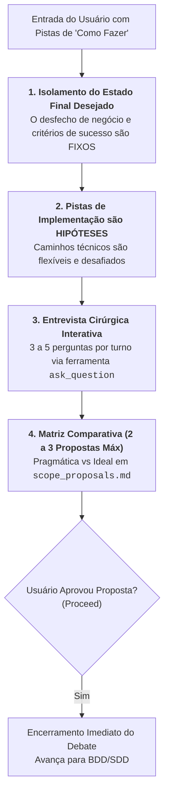

# Skill: Debate de Escopo Outcome-Based (`plan-debate`)

A skill **`plan-debate`** conduz a inquirição socrática e a descoberta técnica durante a **Fase 0 (`/decompose`)** e a **Fase 1 (`/plan`)**. Ela elimina o "Problema XY", isolando estritamente o **Estado Final Desejado** (o desfecho real de negócio) de pistas ou hipóteses preliminares de implementação sugeridas pelo usuário.

---

## 🎯 Diretrizes de Outcome-Based Prompting

---

### 1. Foco no Estado Final Desejado & Critérios de Sucesso (Fixo)
* Identifica: *"Qual é o real resultado funcional e a capacidade de negócio que o sistema precisa entregar?"*
* Extrai critérios mensuráveis de sucesso (limiares de latência, tolerância a falhas, retrocompatibilidade).
* O objetivo de negócio é o destino imutável; os passos técnicos para chegar lá são negociáveis.

---

### 2. Pistas de Implementação como Hipóteses de Trabalho (Flexível)
* Se o desenvolvedor sugerir bibliotecas, tabelas ou passos específicos, o agente acolhe essas pistas como indícios de intenção, **NUNCA como restrições obrigatórias**.
* A IA tem a obrigação profissional de apontar falhas, gargalos ou abordagens arquiteturalmente superiores.

---

### 3. Entrevista Cirúrgica Dinâmica e Adaptativa
* **Lotes Curtos:** Nunca envia questionários longos. Faz de 3 a 5 perguntas objetivas por turno.
* **Canal Primário (`ask_question`):** Sempre que houver opções estruturadas, trade-offs ou limites de escopo, utiliza a ferramenta modal `ask_question`, prefixando a recomendação com `(Recommended)`.
* **Convergência Ativa:** Interrompe a entrevista assim que o escopo e os critérios forem suficientes para popular as propostas.

---

### 4. Matriz de Propostas Arquiteturais (Máximo de 3)
Consolida o entendimento no artefato `scope_proposals.md` (`RequestFeedback: true`):
* **Proposta 1 (Pragmática / Incremental):** Menor esforço, baixo custo e atrito mínimo com o código existente.
* **Proposta 2 (Equilibrada / Híbrida - Opcional):** Equilíbrio entre modernização e reaproveitamento.
* **Proposta 3 (Arquiteturalmente Ideal / Escalável):** Alto desacoplamento, padrões modernos e preparada para alto volume.

---

## 🚪 Critério de Saída
* O debate se encerra imediatamente após o clique em **Proceed** ou aprovação formal da proposta pelo usuário, transferindo a execução para a modelagem BDD/SDD.

---

## 📋 Arquivos da Skill
* **Instruções Principais:** [`skills/plan-debate/SKILL.md`](file:///e:/Codigos/antigravity-agentic-workflows/skills/plan-debate/SKILL.md)
* **Regras de Debate & Problema XY:** [`skills/plan-debate/references/debate_rules.md`](file:///e:/Codigos/antigravity-agentic-workflows/skills/plan-debate/references/debate_rules.md)
* **Protocolo de Inquirição:** [`skills/plan-debate/resources/question_protocol.md`](file:///e:/Codigos/antigravity-agentic-workflows/skills/plan-debate/resources/question_protocol.md)
* **Template de Propostas:** [`skills/plan-debate/resources/template_proposals.md`](file:///e:/Codigos/antigravity-agentic-workflows/skills/plan-debate/resources/template_proposals.md)
