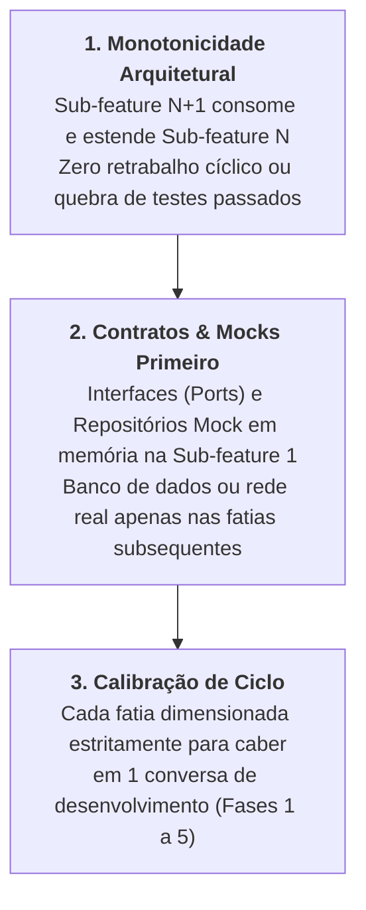

# Skill: Decomposição de Épicos & Fatiamento Evolutivo (`plan-decompose`)

A skill **`plan-decompose`** atua na **Fase 0 (`/decompose`)**, decompondo iniciativas complexas, migrações de infraestrutura e demandas amplas de produto em uma sequência ordenada e independente de sub-features (fatias verticais), prevenindo "Mega-PRs" e saturação da janela de contexto da LLM.

---

## 🎯 As 3 Regras de Ouro do Fatiamento Evolutivo

---

### 1. Monotonicidade Arquitetural (Sem Retrabalho Destrutivo)
* Cada sub-feature fatiada constrói uma camada sólida e utilizável sobre a qual a próxima fatia se apoia.
* **Anti-Pattern Evitado:** Fatiamento horizontal ingênuo (ex: "fazer todo o banco de dados na fatia 1, todas as telas na fatia 2"), onde a fatia 2 frequentemente obriga a reescrever o código da fatia 1.

---

### 2. Contratos e Mocks Primeiro (Isolamento de Fronteiras)
* Quando a iniciativa envolve integração com bancos de dados, mensageria externa ou APIs de terceiros, a **Sub-feature 1** define estritamente:
  * A interface/contrato de abstração (`IRepository` ou `IClient`).
  * A implementação mock em memória com fixtures de dados simulados.
  * Os casos de uso consumindo essa abstração.
* A persistência real (PostgreSQL, Redis, RabbitMQ) é introduzida como uma fatia complementar e intercambiável posteriormente.

---

### 3. Calibração de Ciclo por Sub-Feature
* A fatia vertical é calibrada para que seu ciclo completo de vida (BDD $\rightarrow$ TDD $\rightarrow$ Refatoração $\rightarrow$ Auditorias $\rightarrow$ Documentação) seja executado confortavelmente dentro dos limites de uma sessão atômica de chat.

---

## 📋 Arquivos da Skill
* **Instruções Principais:** [`skills/plan-decompose/SKILL.md`](file:///e:/Codigos/antigravity-agentic-workflows/skills/plan-decompose/SKILL.md)
* **Diretrizes Técnicas de Fatiamento:** [`skills/plan-decompose/references/slicing_rules.md`](file:///e:/Codigos/antigravity-agentic-workflows/skills/plan-decompose/references/slicing_rules.md)
* **Template do Épico:** [`skills/plan-decompose/resources/template_epic.md`](file:///e:/Codigos/antigravity-agentic-workflows/skills/plan-decompose/resources/template_epic.md)
* **Exemplo Prático de Decomposição:** [`skills/plan-decompose/examples/epic_decomposition_example.md`](file:///e:/Codigos/antigravity-agentic-workflows/skills/plan-decompose/examples/epic_decomposition_example.md)
