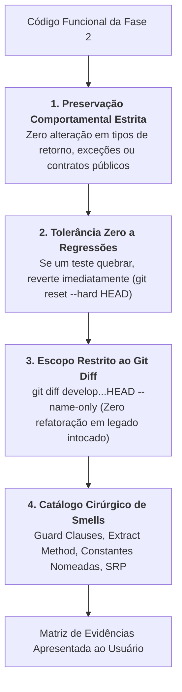

# Skill: Clean Code & Refatoração Estrutural (`refactor`)

A skill **`refactor`** atua na **Fase 3 (`/refactor`)**, orientando o aprimoramento do design de software e da manutenibilidade do código funcional recém-produzido no TDD. Ela cataloga e elimina Code Smells aplicando princípios Clean Code e SOLID sem alterar o comportamento funcional externo e preservando a suíte de testes 100% verde.

---

## ⛔ Regras Estritas de Salvaguarda



---

### 1. Preservação de Comportamento Externo
* Refatorar é reorganizar a estrutura interna sem alterar o comportamento observável.
* Nenhuma modificação pode introduzir novas regras de negócio ou alterar saídas já validadas pelos testes.

---

### 2. Escopo Estrito ao Git Diff da Branch
* A refatoração incide estritamente sobre os arquivos que pertencem à feature ativa:
  ```bash
  git --no-pager diff develop...HEAD --name-only
  ```
* É terminantemente proibido refatorar módulos legados que não foram modificados pela feature, prevenindo dispersão de escopo e quebras em áreas não cobertas.

---

### 3. Catálogo Cirúrgico de Técnicas Clean Code

| Code Smell Identificado | Limiar / Sintoma | Técnica de Engenharia Aplicada |
| :--- | :--- | :--- |
| **Métodos Longos** | Métodos ou funções com mais de 20 linhas | *Extract Method / Function* |
| **Aninhamento Excessivo** | Mais de 2 níveis de `if/else` indentados | *Guard Clauses (Early Return)* |
| **Literais Mágicos** | Strings soltas ou números literais no código | *Constantes Nomeadas / Enums* |
| **Violação de SRP** | Classe fazendo parsing, validação e persistência | *Extract Class / Module* |

---

### 4. Matriz de Evidências de Refatoração
Ao concluir os ajustes de um componente, a skill emite a tabela de comprovação de qualidade:

| Elemento Refatorado | Code Smell / Princípio SOLID | Técnica Aplicada |
| :--- | :--- | :--- |
| `ProcessPaymentUseCase.execute()` | Aninhamento profundo de validações | Guard Clauses com retorno antecipado |
| `calculate_totals()` | Método com 45 linhas e múltiplas contas | Extração de `_apply_discount()` e `_compute_tax()` |
| `STATUS_PENDING = "PENDING"` | String mágica duplicada em múltiplos arquivos | Centralização no enum `OrderStatus` |

---

## 📋 Arquivos da Skill
* **Instruções Principais:** [`skills/refactor/SKILL.md`](file:///e:/Codigos/antigravity-agentic-workflows/skills/refactor/SKILL.md)
* **Manual Detalhado de Refatoração:** [`skills/refactor/references/EXECUTION.md`](file:///e:/Codigos/antigravity-agentic-workflows/skills/refactor/references/EXECUTION.md)
* **Template do Checklist de Refatoração:** [`skills/refactor/resources/refactor_checklist_template.md`](file:///e:/Codigos/antigravity-agentic-workflows/skills/refactor/resources/refactor_checklist_template.md)
