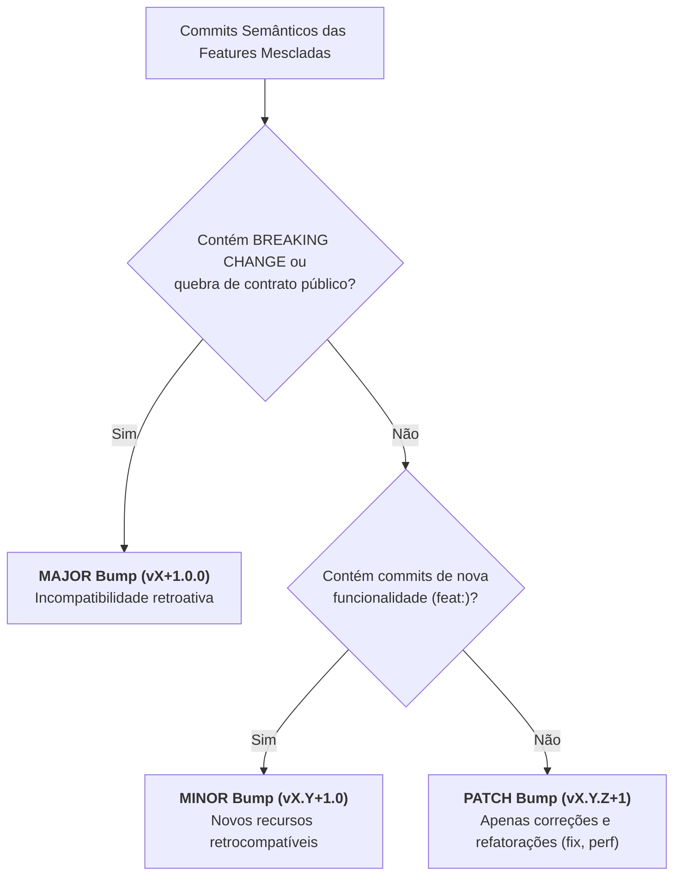

# Skill: Gestão de Release & SemVer Cumulativo (`release`)

A skill **`release`** atua no pipeline de publicação **`/release`**, sendo a autoridade técnica responsável pelo cálculo do incremento de versão de acordo com a especificação **SemVer 2.0.0** e pela consolidação contínua do histórico de alterações no `CHANGELOG.md` e no Obsidian Vault.

---

## 🎯 Cálculo Semântico de Versão (SemVer 2.0.0)

A skill inspeciona o acumulado de commits semânticos presentes no lote de features mescladas na branch de release:

---

## 📝 Consolidação do Changelog

1. **Agrupamento Padronizado por Seção:**
   * 🚀 **Novas Funcionalidades (Features):** Commits com prefixo `feat:`.
   * 🐛 **Correções de Bugs (Bug Fixes):** Commits com prefixo `fix:`.
   * ⚡ **Performance & Refatoração:** Commits com prefixos `perf:` e `refactor:`.
   * ⚠️ **Alterações Quebrantes (Breaking Changes):** Detalhes da quebra e instrução de migração.
2. **Atualização Cumulativa na Raiz:**
   * Adiciona o novo bloco de versão no topo do arquivo [`CHANGELOG.md`](file:///e:/Codigos/antigravity-agentic-workflows/CHANGELOG.md) do repositório, preservando integralmente o histórico das releases passadas.
3. **Persistência na Segunda Mente:**
   * Salva uma cópia imutável em `03-releases/changelog-v[VERSION].md` no Obsidian Vault com tags `#phase/release` e metadados de auditoria.

---

## 📋 Arquivos da Skill
* **Instruções Principais:** [`skills/release/SKILL.md`](file:///e:/Codigos/antigravity-agentic-workflows/skills/release/SKILL.md)
* **Matriz de Regras SemVer:** [`skills/release/references/semver_rules.md`](file:///e:/Codigos/antigravity-agentic-workflows/skills/release/references/semver_rules.md)
* **Template do Changelog:** [`skills/release/resources/template_changelog.md`](file:///e:/Codigos/antigravity-agentic-workflows/skills/release/resources/template_changelog.md)
