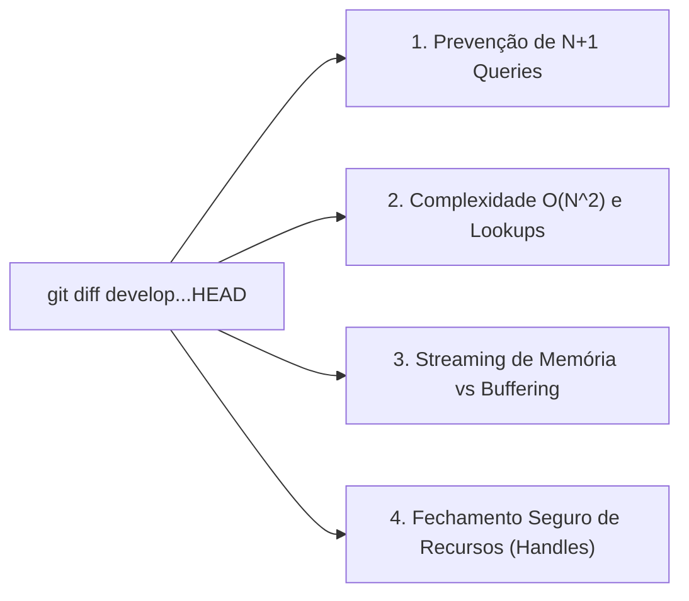

# Skill: Auditoria de Performance & Volumetria (`review-performance`)

A skill **`review-performance`** atua no loop de auditorias especializadas da **Fase 4 (`/review`)**. Ela analisa cirurgicamente as alterações da branch sob a ótica de volumetria de dados, consumo eficiente de CPU e memória, prevenção de gargalos assintóticos e gestão segura de recursos computacionais.

---

## 🎯 Pilares da Revisão de Performance (Diff-Based)

---

### 1. Padrão de Consulta N+1
* **Problema:** Execução de queries SQL individuais ou chamadas HTTP repetitivas dentro de um laço `for` iterando sobre uma coleção.
* **Remediação Cirúrgica:**
  * Uso de joins explícitos ou buscas em lote (*batch loading* via `WHERE id IN (...)`).
  * Utilização de DataLoader ou agregação em memória com mapas/dicionários indexados por chave hash.

---

### 2. Gargalos Assintóticos e Algoritmos Quadráticos ($O(N^2)$)
* **Buscas Lineares em Laços:** Substituição de verificações lineares repetidas (`if item in lista`) por conjuntos hash (`set` ou `Map`), convertendo complexidade $O(N \times M)$ em $O(N + M)$.
* **Laços Aninhados Desnecessários:** Identificação de iterações cruzadas que podem ser substituídas por algoritmos de ponteiro duplo, ordenação prévia ou agrupamentos lineares.

---

### 3. Gestão de Memória e Streaming
* **Eliminação de Buffering Monolítico:** Impede carregar arquivos gigantes, exports de banco ou payloads extensos inteiramente em memória RAM.
* **Uso de Geradores e Streams:** Exige o uso de iteradores/geradores (`yield` em Python, `Stream` em Dart, streams em Node.js) para processamento em lotes (*chunked processing*).

---

### 4. Prevenção de Vazamento de Recursos (Leaks)
* Garante o fechamento seguro de cursores de banco de dados, handles de arquivos abertos e sessões HTTP/gRPC.
* Exige blocos de contexto seguro (`with` em Python, `try/finally` ou gerenciadores de escopo descartáveis).

---

## 📋 Arquivos da Skill
* **Instruções Principais:** [`skills/review-performance/SKILL.md`](file:///e:/Codigos/antigravity-agentic-workflows/skills/review-performance/SKILL.md)
* **Checklist de Performance:** [`skills/review-performance/references/checklist_performance.md`](file:///e:/Codigos/antigravity-agentic-workflows/skills/review-performance/references/checklist_performance.md)
* **Template de Relatório:** [`skills/review-performance/resources/template_performance.md`](file:///e:/Codigos/antigravity-agentic-workflows/skills/review-performance/resources/template_performance.md)
