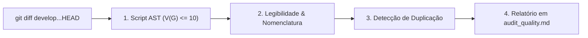

# Skill: Auditoria de Qualidade & Complexidade Ciclomática (`review-quality`)

A skill **`review-quality`** atua no loop de auditorias especializadas da **Fase 4 (`/review`)**. Ela avalia as alterações do `git diff` sob a ótica de complexidade ciclomática estrita, legibilidade sintática, duplicação e adesão aos padrões de estilo de código da linguagem, operando sob a abordagem **Script-First**.

---

## ⚡ Estratégia Script-First com `ast_complexity.py`

A auditoria de qualidade inicia obrigatoriamente pela execução do analisador estático baseado em Abstract Syntax Tree (AST):

```bash
python skills/review-quality/scripts/ast_complexity.py <arquivos_alterados>
```

### O que o Script Valida:
* **Complexidade Ciclomática $V(G) \le 10$:** Mede os caminhos de execução independentes de cada método ou função modificada. Qualquer função com $V(G) > 10$ é sinalizada como violação que exige refatoração imediata.
* **Profundidade de Aninhamento:** Sinaliza métodos com blocos de decisão aninhados profundamente (nível de indentação > 3).
* **Detecção de Código Morto:** Variáveis declaradas e nunca lidas, imports órfãos ou branches inalcançáveis pós-return.

---

## 🎯 Pilares da Revisão Orientada a Qualidade



---

### 1. Limiar Estrito de Complexidade Ciclomática
* **$V(G) \le 5$:** Código simples e de manutenção trivial.
* **$6 \le V(G) \le 10$:** Código aceitável, com lógica moderada.
* **$V(G) > 10$:** Código com alto risco de bugs e difícil de testar exaustivamente. Deve ser decomposto em sub-funções especializadas antes da aprovação do domínio no DoD.

---

### 2. Nomenclatura Expressiva e Ausência de Ambiguidade
* Valida se os nomes de variáveis, argumentos e funções revelam intenção real sem abreviações crípticas (`usr_dt` $\rightarrow$ `user_data`).
* Garante a convenção canônica da linguagem: `snake_case` em Python, `camelCase` em TypeScript/Dart, `PascalCase` para classes e interfaces.

---

### 3. Heurísticas de Duplicação e Coesão
* Mapeia trechos de código idênticos ou fortemente semelhantes introduzidos no diff, orientando a criação de funções utilitárias compartilhadas.

---

## 📋 Arquivos da Skill
* **Instruções Principais:** [`skills/review-quality/SKILL.md`](file:///e:/Codigos/antigravity-agentic-workflows/skills/review-quality/SKILL.md)
* **Script de Análise AST:** [`skills/review-quality/scripts/ast_complexity.py`](file:///e:/Codigos/antigravity-agentic-workflows/skills/review-quality/scripts/ast_complexity.py)
* **Checklist de Qualidade:** [`skills/review-quality/references/checklist_quality.md`](file:///e:/Codigos/antigravity-agentic-workflows/skills/review-quality/references/checklist_quality.md)
* **Template de Relatório:** [`skills/review-quality/resources/template_quality.md`](file:///e:/Codigos/antigravity-agentic-workflows/skills/review-quality/resources/template_quality.md)
