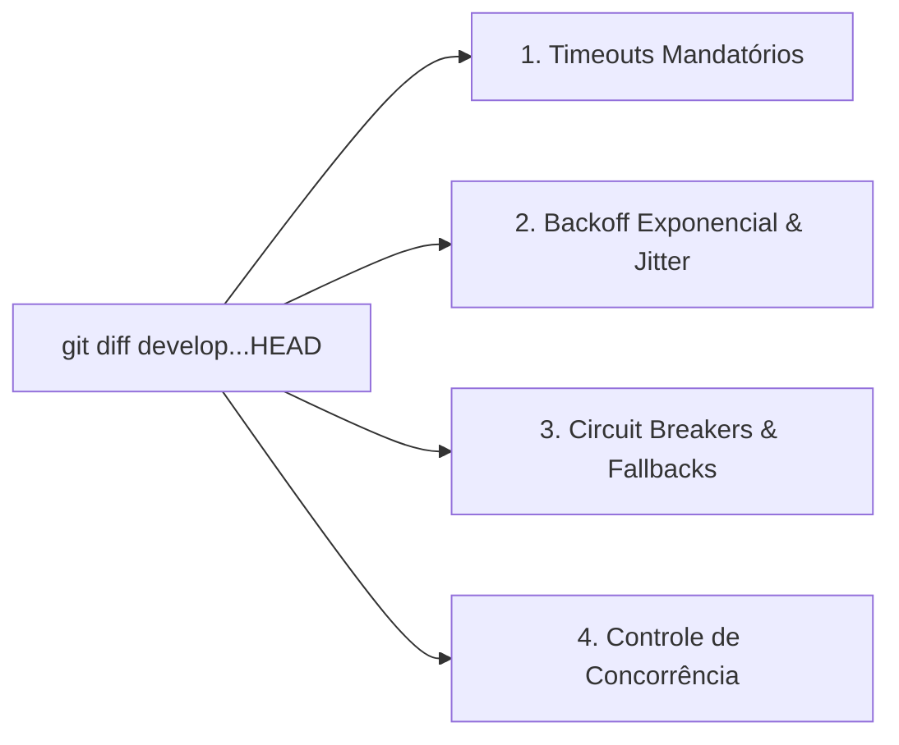

# Skill: Auditoria de Resiliência & Tolerância a Falhas (`review-resilience`)

A skill **`review-resilience`** atua no loop de auditorias especializadas da **Fase 4 (`/review`)**. Ela inspeciona as alterações da branch sob a ótica de robustez operacional, falhas distribuídas parciais, latência de rede e degradação graciosa, assegurando que o sistema não entre em colapso quando serviços externos ou dependências apresentarem instabilidade.

---

## 🎯 Pilares da Revisão de Resiliência (Diff-Based)

---

### 1. Timeouts Explícitos e Mandatórios
* **Regra Inegociável:** Nenhuma chamada que envolva I/O de rede (clientes HTTP, queries de banco de dados, publish em filas de mensageria ou chamadas gRPC) pode ser executada sem um timeout explícito definido.
* **Prevenção de Hang Infinito:** Impede que conexões presas esgotem os workers de processamento ou threads da aplicação servidora.

---

### 2. Políticas de Retentativa com Backoff Exponencial e Jitter
* **Retentativas Inteligentes:** Retenta apenas em erros transientes (ex: HTTP 503, 504 ou falhas de conexão TCP), nunca em erros de cliente definitivos (HTTP 400, 401, 403, 422).
* **Backoff com Jitter:** Aplica retardo exponencial cumulativo acrescido de ruído pseudo-aleatório (*jitter*) para evitar o efeito de manada (*Thundering Herd Problem*).

---

### 3. Circuit Breakers e Degradação Graciosa (Fallbacks)
* **Abertura de Circuito:** Interrompe novas requisições contra um gateway externo quando a taxa de falhas ultrapassa um limiar predeterminado, evitando sobrecarga no serviço degradado.
* **Fallback Estruturado:** Retorna respostas em cache, dados padrão ou modo de funcionalidade reduzida sem crashar a experiência do usuário final.

---

### 4. Gestão de Concorrência e Travamento
* Valida a utilização correta de travas otimistas (`version` em banco) ou pessimistas (`SELECT ... FOR UPDATE`) em mutações de saldo, vagas ou cupons de uso único, prevenindo deadlocks e corrupção de estado.

---

## 📋 Arquivos da Skill
* **Instruções Principais:** [`skills/review-resilience/SKILL.md`](file:///e:/Codigos/antigravity-agentic-workflows/skills/review-resilience/SKILL.md)
* **Checklist de Resiliência:** [`skills/review-resilience/references/checklist_resilience.md`](file:///e:/Codigos/antigravity-agentic-workflows/skills/review-resilience/references/checklist_resilience.md)
* **Template de Relatório:** [`skills/review-resilience/resources/template_resilience.md`](file:///e:/Codigos/antigravity-agentic-workflows/skills/review-resilience/resources/template_resilience.md)
