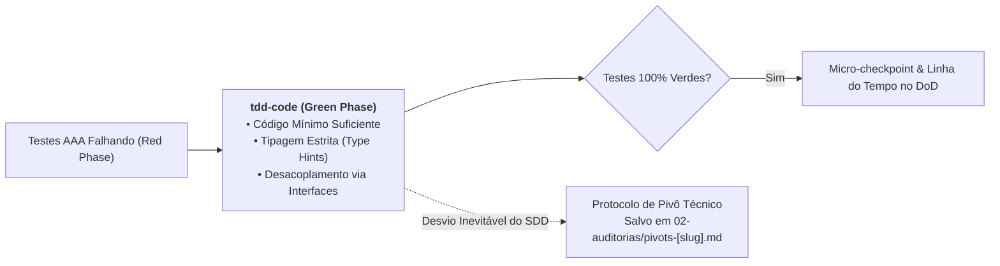

# Skill: Código Mínimo SOLID na Fase Verde (`tdd-code`)

A skill **`tdd-code`** atua na **Fase Verde (Green Phase)** do loop de TDD durante a **Fase 2 (`/implement`)**. Sua responsabilidade é implementar estritamente o código de produção mínimo e necessário para fazer a suíte de testes unitários do lote ativo passar com 100% de sucesso, priorizando simplicidade, tipagem estrita e rastreabilidade de decisões arquiteturais.

---

## 🎯 Princípios da Fase Verde (*Make It Work*)

---

### 1. "Make It Work" Antes da Otimização Prematura
* Implementa o código estritamente suficiente para satisfazer as asserções dos testes do lote.
* Evita abstrações desnecessárias, metaprogramação ou generalizações antecipadas que não foram exigidas pela suíte de testes do lote ativo.
* O refinamento estético e a eliminação de duplicações são delegados à Fase 3 (`/refactor`).

---

### 2. SOLID & Princípio da Responsabilidade Única (SRP)
* Mantém funções e métodos pequenos e coesos, com responsabilidades bem delimitadas.
* As classes de serviço de aplicação e casos de uso dependem exclusivamente de interfaces e portas abstratas, recebendo as implementações via injeção de dependências no construtor.

---

### 3. Tipagem Estrita (*Strict Type Hints*)
* Todas as assinaturas de métodos, funções e classes devem possuir anotações de tipo completas e explícitas para parâmetros de entrada e tipos de retorno.
* Assegura compatibilidade estática com checadores de tipo (`mypy`, `tsc`, `dart analyze`).

---

### 4. Protocolo de Pivô Arquitetural
* Se um obstáculo técnico real (incompatibilidade de biblioteca, limitação de runtime ou comportamento inesperado de API) forçar um desvio do blueprint original estabelecido no SDD, o agente não esconde a mudança:
  * Registra imediatamente o desvio no Obsidian Vault em `02-auditorias/pivots-[slug].md`.
  * Utiliza o template formal detalhando o desvio, a justificativa técnica e o impacto no contrato.

---

## 📋 Arquivos da Skill
* **Instruções Principais:** [`skills/tdd-code/SKILL.md`](file:///e:/Codigos/antigravity-agentic-workflows/skills/tdd-code/SKILL.md)
* **Template de Pivô Arquitetural:** [`skills/tdd-code/resources/pivot_template.md`](file:///e:/Codigos/antigravity-agentic-workflows/skills/tdd-code/resources/pivot_template.md)
