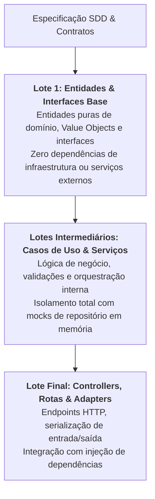

# Skill: Planejamento de Lotes TDD (`tdd-plan`)

A skill **`tdd-plan`** atua no início da **Fase 2 (`/implement`)**, analisando os cenários funcionais do BDD e o blueprint técnico do SDD para decompor a implementação em uma sequência ordenada de **Lotes de Contexto Dependentes** (*Dependent Context Batches*), gerando os artefatos interativos de controle da IDE antes de qualquer linha de código de produção ser escrita.

---

## 🎯 Diretrizes de Decomposição em Lotes

---

### 1. Dependência Linear de Contexto
A decomposição garante que a IA e o desenvolvedor construam o software de dentro para fora (Domain-Driven):
* Cada lote subsequente consome estritamente as classes e interfaces testadas e consolidadas nos lotes anteriores.
* Elimina a fragmentação onde a falta de uma interface básica bloqueia a escrita de use cases ou controllers.

---

### 2. Geração dos Artefatos de Governança
A skill instancia dois artefatos interativos no Antigravity IDE:
1. **`implementation_plan.md` (`RequestFeedback: true`):**
   * Detalhamento arquitetural completo dos lotes planejados, relação de arquivos a serem criados/modificados e estratégias de mock para fronteiras externas.
   * Atua como o portão de validação: o TDD só é iniciado após a aprovação explícita do usuário.
2. **`task_list.md`:**
   * Checklist dinâmico com estados interativos de progresso (`[ ]` Não iniciado $\rightarrow$ `[/]` Em execução $\rightarrow$ `[x]` Concluído e verificado com testes verdes).

---

## 📋 Arquivos da Skill
* **Instruções Principais:** [`skills/tdd-plan/SKILL.md`](file:///e:/Codigos/antigravity-agentic-workflows/skills/tdd-plan/SKILL.md)
* **Template do Plano de Implementação:** [`skills/tdd-plan/resources/plan_template.md`](file:///e:/Codigos/antigravity-agentic-workflows/skills/tdd-plan/resources/plan_template.md)
* **Template da Lista de Tarefas:** [`skills/tdd-plan/resources/task_template.md`](file:///e:/Codigos/antigravity-agentic-workflows/skills/tdd-plan/resources/task_template.md)
