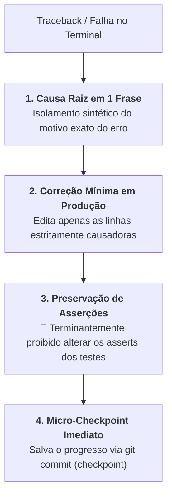

# Skill: Depuração Reativa & Correção Cirúrgica de Testes (`test-fix`)

A skill **`test-fix`** atua como o mecanismo de depuração cirúrgica de suporte para falhas de testes unitários ou de integração durante a **Fase 2 (`/implement`)** e a **Fase 3 (`/refactor`)**. Ela orienta a IA a ingerir logs de erro e stack traces do terminal, isolar a causa raiz em uma única sentença e aplicar a menor intervenção possível no código de produção para restabelecer o status verde sem desfigurar a suíte de testes.

---

## ⛔ Regras Estritas de Blindagem

---

### 1. Isolamento da Causa Raiz em 1 Sentença
* Antes de propor qualquer edição de arquivo, a IA deve formular expressamente a causa raiz do problema em uma frase precisa.
* **Exemplo de Formulação:**
  * *"O `OrderService` lança `KeyError` porque o payload recebido omite o campo opcional `discount_code` durante o cálculo do subtotal."*

---

### 2. Intervenção Cirúrgica no Código de Produção
* As alterações devem se ater estritamente ao ponto de falha no código de aplicação.
* É proibido aproveitar o momento do fix para fazer refatorações amplas de código que não falhou.

---

### 3. Preservação Inegociável dos Testes
* O teste unitário é a especificação formal do comportamento do sistema.
* Mudar expectativas de teste para mascarar um defeito de implementação é considerado anti-pattern grave e violação de integridade.

---

### 4. Micro-Checkpoint Imediato
* Assim que o comando de teste no terminal retornar com 100% dos testes verdes, a skill orienta a gravação imediata do micro-checkpoint via `@git` (Modo 2).

---

## 📋 Arquivos da Skill
* **Instruções Principais:** [`skills/test-fix/SKILL.md`](file:///e:/Codigos/antigravity-agentic-workflows/skills/test-fix/SKILL.md)
* **Manual de Depuração:** [`skills/test-fix/references/EXECUTION.md`](file:///e:/Codigos/antigravity-agentic-workflows/skills/test-fix/references/EXECUTION.md)
* **Template do Checklist de Diagnóstico:** [`skills/test-fix/resources/error_checklist_template.md`](file:///e:/Codigos/antigravity-agentic-workflows/skills/test-fix/resources/error_checklist_template.md)
