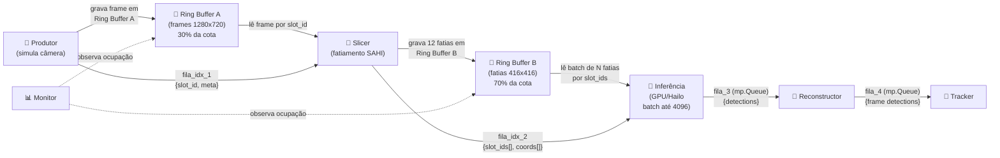

# Otimização do Benchmark: Fila de Índices + Ring Buffer de Memória Compartilhada

Substituir as `multiprocessing.Queue` que trafegam imagens pesadas por **Ring Buffers de Memória Compartilhada** (`SharedMemory`) com **Filas de Índices leves**, eliminando o gargalo de IPC que limitava a GPU a processar batches de ~1,9 fatias (ao invés de centenas).

## Contexto e Motivação

O benchmark atual ([resultados do cenário GPU_120FPS_SemRestricoes](file:///home/marcos.veniciu/melipona-tracking/resultados_benchmark/2026-07-19_03h47/benchmark.log#L34)) revelou que:
- A 120 FPS / 1800s, apenas **55.387 frames** foram processados (esperados: 216.000)
- O **batch médio real da GPU foi de apenas 1,9 fatias** (máximo configurado: 32)
- A `fila_2` permaneceu lotada (5.000 itens) durante todo o teste, mas a GPU não conseguia formar batches grandes
- A RTX 5090 de 32 GB ficou **ociosa** a maior parte do tempo

**Causa raiz:** O `multiprocessing.Queue` do Python serializa/desserializa (*pickle*) cada imagem individualmente via pipes do SO. A chamada `get_nowait()` no nó de inferência retorna `queue.Empty` antes que o próximo item termine de ser desempacotado, forçando a GPU a disparar com 1-2 fatias por vez.

---

## Decisões de Design Consolidadas (Entrevista)

| Decisão | Escolha |
|---|---|
| **Escopo dos Ring Buffers** | 2 Ring Buffers: **A** (frames, Produtor→Slicer) e **B** (fatias SAHI, Slicer→Inferência). Filas 3 e 4 permanecem `mp.Queue` padrão |
| **Proporção de RAM** | **70%** da cota `ram_limite_mb` para Ring Buffers (30% Ring Buffer A, 70% Ring Buffer B). Configurável via YAML com `ring_buffer_ram_pct` (default: 0.70) |
| **Backpressure** | Produtor **bloqueia** quando Ring Buffer A cheio (comportamento atual preservado) |
| **Pre-flight Batch Test** | Expandir `test_sizes` para valores altos (até 4096/8192), testando do **maior para o menor** (busca descendente) |
| **Primitiva de Memória** | `multiprocessing.shared_memory.SharedMemory` (Python ≥ 3.8, nativo, cross-platform ARM/x86) |
| **Estratégia de Batching** | **Micro-batching com timeout**: esperar até `batch_max` fatias OU timeout curto (5-10ms) |
| **Notificação do Slicer** | Slicer grava 12 fatias individualmente no Ring Buffer B, mas envia **1 única mensagem agrupada** na fila de índices |
| **Encapsulamento** | Classe `SharedRingBuffer` autônoma em `src/benchmark/shared_ring_buffer.py` |
| **Monitor** | Adicionar métricas de ocupação dos Ring Buffers (`ring_a_occupancy`, `ring_b_occupancy`) |
| **Compatibilidade CSV** | Manter colunas existentes + adicionar novas colunas dos Ring Buffers |
| **Testes** | Testes unitários do `SharedRingBuffer` + teste de integração do pipeline |

---

## Arquitetura Proposta



### Fluxo de Dados Detalhado

1. **Produtor** → grava frame no Ring Buffer A (slot `i`) → envia `{slot_id: i, frame_id, timestamp}` na fila de índices 1
2. **Slicer** → lê da fila de índices 1 → acessa frame no Ring Buffer A via `slot_id` → fatia em 12 pedaços → grava cada fatia no Ring Buffer B (slots `j..j+11`) → **libera slot `i` do Ring Buffer A** → envia `{frame_id, slot_ids: [j..j+11], slice_coords: [...]}` na fila de índices 2
3. **Inferência** → coleta múltiplas mensagens da fila de índices 2 (micro-batching com timeout) → acessa fatias no Ring Buffer B pelos `slot_ids` → executa inferência em batch → **libera slots do Ring Buffer B** → envia detecções na fila 3 (`mp.Queue`)
4. **Reconstructor** → lê detecções da fila 3 (sem imagens) → agrupa por `frame_id` → remapeia coordenadas → NMS → envia na fila 4
5. **Tracker** → lê da fila 4 → ByteTrack (inalterado)

---

## Proposta de Mudanças

### Componente: SharedRingBuffer (Novo)

#### [NEW] [shared_ring_buffer.py](file:///home/marcos.veniciu/melipona-tracking/src/benchmark/shared_ring_buffer.py)

Classe `SharedRingBuffer` que encapsula toda a lógica de memória compartilhada:

- **Alocação**: Cria um bloco contíguo de `SharedMemory` com `N` slots de tamanho fixo (ex: `slot_size = H * W * 3` bytes)
- **Escrita (`write_slot`)**: Recebe um `slot_id` e um `np.ndarray`, copia o array para o slot correspondente na memória compartilhada
- **Leitura (`read_slot`)**: Recebe um `slot_id`, retorna um `np.ndarray` (view, sem cópia) apontando para o slot na memória compartilhada
- **Alocação de Slot (`acquire_slot`)**: Retorna o próximo slot livre. Bloqueia se todos estiverem ocupados (backpressure via `Semaphore`)
- **Liberação de Slot (`release_slot`)**: Marca um slot como livre para reutilização
- **Ocupação (`occupancy`)**: Retorna `slots_usados / total_slots` para o monitor
- **Limpeza (`cleanup`)**: Chama `shm.close()` e `shm.unlink()` para liberar a memória ao final do benchmark
- **Conexão (`connect`)**: Para processos filhos se conectarem a um `SharedMemory` existente pelo nome

---

### Componente: Pipeline (Modificado)

#### [MODIFY] [pipeline.py](file:///home/marcos.veniciu/melipona-tracking/src/benchmark/pipeline.py)

- Substituir a função `calcular_maxsize_filas()` por `calcular_ring_buffers()`:
  - Calcula slots do Ring Buffer A: `(ram_total * 0.70 * 0.30) / tamanho_frame`
  - Calcula slots do Ring Buffer B: `(ram_total * 0.70 * 0.70) / tamanho_fatia`
  - Filas 3 e 4 mantêm `mp.Queue` com maxsize calculado dos 30% restantes
- Criar Ring Buffer A e B antes de lançar os processos
- Criar filas de índices leves (`mp.Queue` sem limite grande, pois trafegam apenas dicts pequenos)
- Passar referências dos Ring Buffers (nomes `SharedMemory`) para os processos filhos
- Ler `ring_buffer_ram_pct` do cenário YAML (default: 0.70)
- Garantir `cleanup()` dos Ring Buffers no `finally` do pipeline
- Atualizar constante `PROPORCAO_RAM_FILAS` para refletir a nova distribuição

---

### Componente: Nós do Pipeline (Modificados)

#### [MODIFY] [frame_producer.py](file:///home/marcos.veniciu/melipona-tracking/src/benchmark/nodes/frame_producer.py)

- Em vez de `fila_saida.put(item)`, o produtor faz:
  1. `slot_id = ring_buffer_a.acquire_slot()` (bloqueia se cheio = backpressure)
  2. `ring_buffer_a.write_slot(slot_id, frame)` (grava pixels na memória compartilhada)
  3. `fila_idx_1.put({"frame_id": N, "slot_id": slot_id, "video_width": W, "video_height": H, "timestamp_entrada": T})`
- Assinatura da função atualizada para receber `ring_buffer_a` e `fila_idx_1`

#### [MODIFY] [slicer.py](file:///home/marcos.veniciu/melipona-tracking/src/benchmark/nodes/slicer.py)

- Lê da `fila_idx_1` (recebe `slot_id` + metadados)
- Acessa o frame via `ring_buffer_a.read_slot(slot_id)` (zero-copy)
- Fatia em 12 pedaços
- Para cada fatia: `slot_b = ring_buffer_b.acquire_slot()` → `ring_buffer_b.write_slot(slot_b, fatia_array)`
- **Libera** `ring_buffer_a.release_slot(slot_id)` após terminar de fatiar
- Envia **1 mensagem agrupada** na `fila_idx_2`:
  ```python
  {
      "frame_id": N,
      "slot_ids": [s0, s1, ..., s11],
      "total_slices": 12,
      "slice_coords": [(x0,y0,w0,h0), ..., (x11,y11,w11,h11)],
      "video_width": W,
      "video_height": H,
      "timestamp_entrada": T
  }
  ```

#### [MODIFY] [inference.py](file:///home/marcos.veniciu/melipona-tracking/src/benchmark/nodes/inference.py)

- **Estratégia de micro-batching com timeout**:
  1. Espera pela primeira mensagem da `fila_idx_2` (bloqueante)
  2. Acumula mais mensagens com `timeout=0.005` até atingir `batch_max` ou estourar o timeout
  3. Extrai todas as fatias dos `slot_ids` acumulados via `ring_buffer_b.read_slot()`
  4. Executa inferência em batch na GPU
  5. **Libera** todos os `slot_ids` do Ring Buffer B após inferência
  6. Envia resultados na `fila_3` (mp.Queue padrão) com detecções + metadados (sem imagens)

#### [MODIFY] [reconstructor.py](file:///home/marcos.veniciu/melipona-tracking/src/benchmark/nodes/reconstructor.py)

- **Sem alteração funcional**: continua lendo da `fila_3` (mp.Queue) e agrupando detecções por `frame_id`
- A única mudança é adaptar o formato da mensagem recebida (que agora agrupa fatias por frame):
  - Recebe `{frame_id, slice_index, total_slices, slice_coords, detections}` como antes, mas vindas da inferência que já desempacotou os metadados

#### [MODIFY] [tracker.py](file:///home/marcos.veniciu/melipona-tracking/src/benchmark/nodes/tracker.py)

- **Sem alteração**: continua lendo da `fila_4` (mp.Queue), mesmo formato de antes

---

### Componente: Backends (Modificados)

#### [MODIFY] [pytorch_backend.py](file:///home/marcos.veniciu/melipona-tracking/src/benchmark/backends/pytorch_backend.py)

- Expandir `test_sizes` para `[8192, 4096, 2048, 1024, 512, 256, 128, 64, 32, 16]` (busca descendente)
- Parar no primeiro batch que funciona sem OOM e abaixo de 80% da VRAM
- Logar o batch máximo encontrado

---

### Componente: Monitor (Modificado)

#### [MODIFY] [monitor.py](file:///home/marcos.veniciu/melipona-tracking/src/benchmark/monitor.py)

- Adicionar métricas dos Ring Buffers ao `MetricaSample`:
  - `ring_a_occupancy`: percentual de ocupação (0.0 a 1.0) do Ring Buffer A
  - `ring_b_occupancy`: percentual de ocupação (0.0 a 1.0) do Ring Buffer B
  - `ring_a_total_slots`: capacidade total do Ring Buffer A
  - `ring_b_total_slots`: capacidade total do Ring Buffer B
- Manter todas as colunas CSV anteriores intactas
- Substituir observação de `fila_1_size` e `fila_2_size` pelas métricas dos Ring Buffers (as colunas `fila_1_size` e `fila_2_size` passam a representar a ocupação dos Ring Buffers em número de slots, mantendo a compatibilidade semântica)

---

### Componente: Configuração YAML (Modificado)

#### [MODIFY] [cenarios_gpu.yaml](file:///home/marcos.veniciu/melipona-tracking/cenarios_gpu.yaml)

- Adicionar campo opcional `ring_buffer_ram_pct: 0.70` em cada cenário (default se omitido)
- Exemplo:
  ```yaml
  - nome: "GPU_120FPS_SemRestricoes"
    frame_rate: 120
    ram_limite_mb: 16384
    ring_buffer_ram_pct: 0.70  # Novo: 70% da RAM para Ring Buffers
    ...
  ```

---

### Componente: Documentação (Atualizada)

#### [MODIFY] [00_planejamento_e_design.md](file:///home/marcos.veniciu/melipona-tracking/docs/benchmark/00_planejamento_e_design.md)

- Atualizar o diagrama Mermaid para refletir Ring Buffers
- Atualizar a tabela de decisões arquiteturais com as novas escolhas

#### [MODIFY] [fase3_nos_do_pipeline.md](file:///home/marcos.veniciu/melipona-tracking/docs/benchmark/fase3_nos_do_pipeline.md)

- Atualizar descrição de cada nó com a nova mecânica de Ring Buffer
- Documentar a classe `SharedRingBuffer`

#### [MODIFY] [fase4_monitor_e_pipeline.md](file:///home/marcos.veniciu/melipona-tracking/docs/benchmark/fase4_monitor_e_pipeline.md)

- Documentar novas métricas do monitor

---

### Componente: Testes (Novo)

#### [NEW] [tests/test_shared_ring_buffer.py](file:///home/marcos.veniciu/melipona-tracking/tests/test_shared_ring_buffer.py)

Testes unitários para o `SharedRingBuffer`:
- Alocação e liberação correta de slots
- Escrita e leitura de arrays NumPy com dados corretos
- Backpressure (bloqueio quando cheio)
- Leitura/escrita entre processos separados (`multiprocessing.Process`)
- Limpeza sem vazamento de memória (`cleanup()`)
- Teste de ocupação (`occupancy`)

#### [NEW] [tests/test_ring_buffer_integration.py](file:///home/marcos.veniciu/melipona-tracking/tests/test_ring_buffer_integration.py)

Teste de integração rápido (~30s) do pipeline completo com Ring Buffers:
- Valida que frames passam por todos os nós sem erros
- Verifica que o throughput e batch_size são superiores à versão anterior

---

## Verificação

### Testes Automatizados
```bash
# Testes unitários do SharedRingBuffer
python -m pytest tests/test_shared_ring_buffer.py -v

# Teste de integração do pipeline
python -m pytest tests/test_ring_buffer_integration.py -v
```

### Benchmark Comparativo
```bash
# Rodar cenário curto (60s) para validar melhoria
python -m src.benchmark.run_benchmark --config cenarios_gpu.yaml --cenario GPU_120FPS_SemRestricoes --duracao 60
```

Comparar com resultados anteriores:
- **batch_size_medio**: deve subir de ~1,9 para valores próximos ao máximo da GPU
- **produtor_fps**: deve subir de ~29 para valores mais próximos de 120
- **latencia_media_ms**: deve cair drasticamente de ~96s
- **ring_b_occupancy**: deve mostrar utilização real do buffer de fatias
