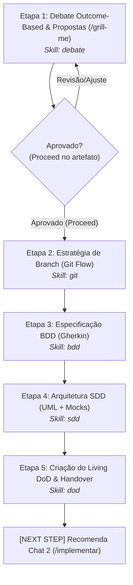
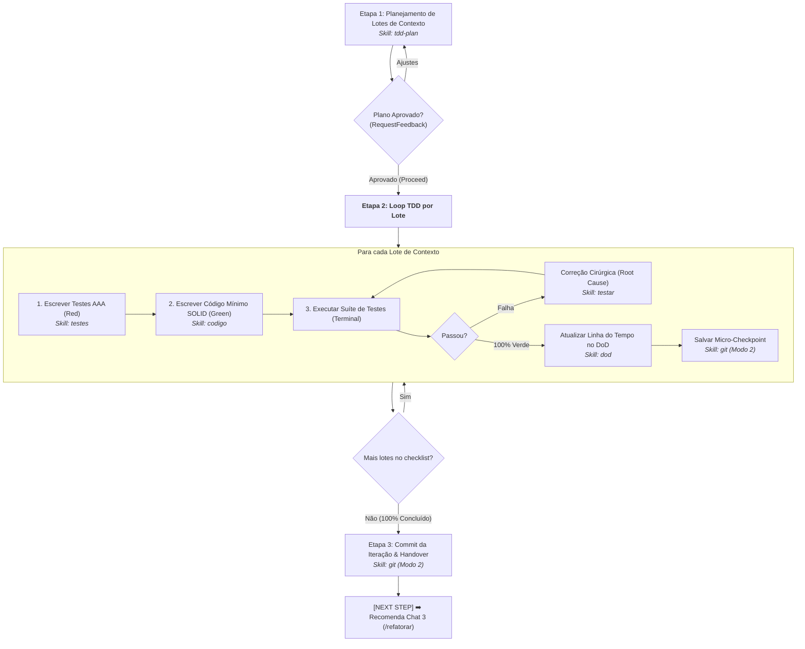
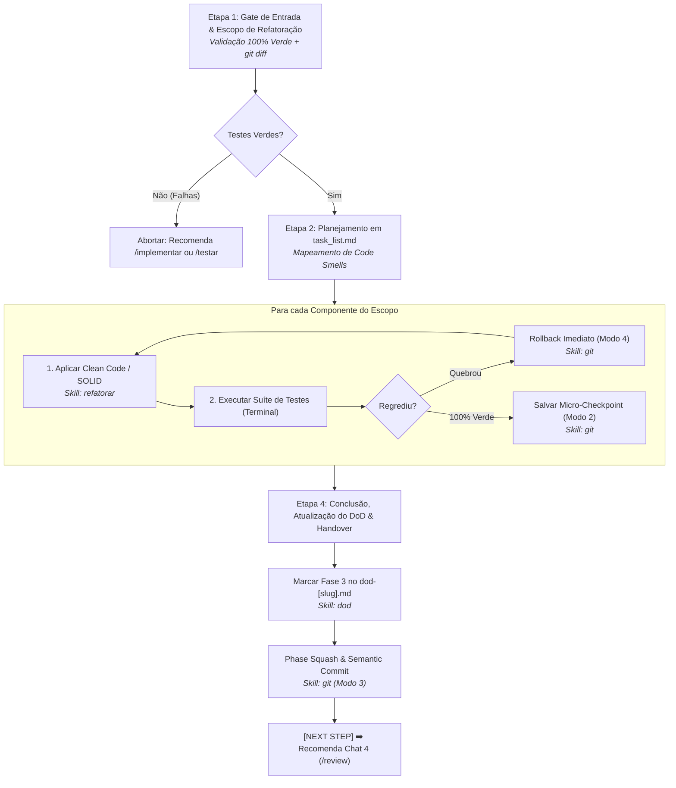
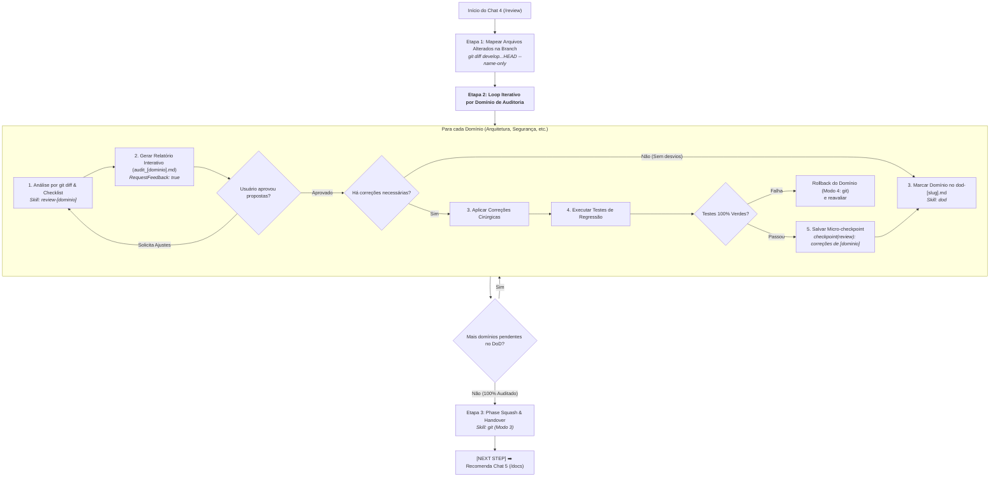
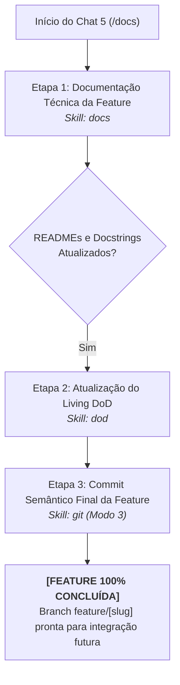
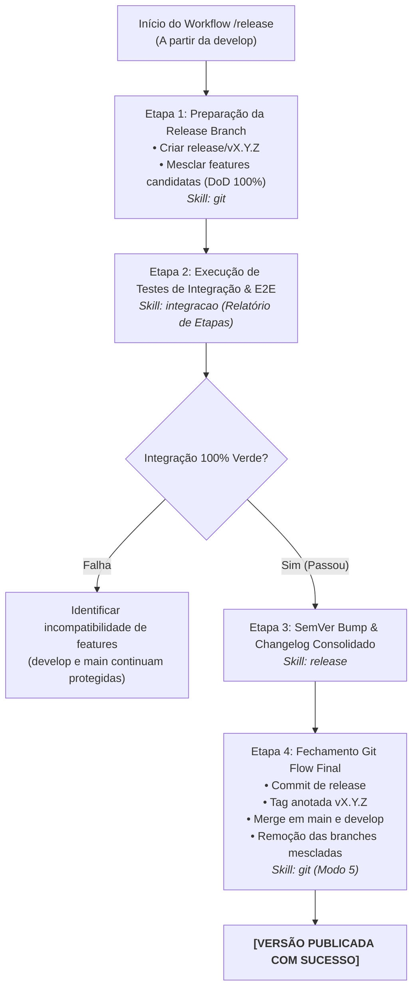
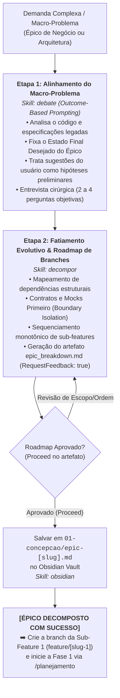

# Planejamento de Ajustes de Fluxos e Skills (Antigravity)

Este documento registra as decisões de design, diretrizes arquiteturais e o plano de evolução iterativo para os **Workflows** e as **Skills** do ecossistema Antigravity.

---

## 1. Visão Geral e Objetivos

* **Workflows (`workflows/` ou `.gemini/config/global_workflows/`):**
  * Devem atuar como guias de processo (playbooks / runbooks orquestradores de ponta a ponta).
  * Devem descrever o fluxo passo a passo de forma clara e visual (Mermaid, checklists, gatilhos de entrada e saída).
  * Devem explicitamente indicar **qual Skill utilizar** em cada etapa do processo.

* **Skills (`skills/` ou `.agents/skills/`):**
  * Devem seguir o Princípio da Responsabilidade Única (SRP).
  * Foco atômico e simplificado: cada skill resolve um domínio ou conjunto específico de procedimentos operacionais.
  * Estrutura padronizada do Antigravity (`SKILL.md` enxuto com progressive disclosure via `references/`, `resources/`, `scripts/`, `examples/`).

---

## 2. Princípios de Separação de Conceitos

| Conceito | O que responde | Papel Principal | Onde Fica / Como Atua |
| :--- | :--- | :--- | :--- |
| **Workflow** | *"Qual é o caminho? O que fazer agora?"* | Orquestrador de processo (etapas, rituais, pré-requisitos, validações, transição de fases) | Arquivos `.md` de fluxo acionados por slash commands (`/planejamento`, `/implementar`, etc.) |
| **Skill** | *"Como fazer tecnicamente esta tarefa específica?"* | Caixa de ferramentas modular e procedimento técnico especializado (SRP) | Pastas de skill com `SKILL.md` (ex: `git`, `tdd`, `review-security`, `release-semver`) |
| **Rule** | *"Quais são as restrições e padrões obrigatórios?"* | Guardrails e regras invioláveis (Clean Code, SOLID, convenções) | `GEMINI.md`, `AGENTS.md` ou `rules/*.md` |

---

## 3. Inventário Atual

### Workflows Mapeados
1. [artefatos.md](file:///e:/Codigos/antigravity-agentic-workflows/workflows/artefatos.md)
2. [ask.md](file:///e:/Codigos/antigravity-agentic-workflows/workflows/ask.md)
3. [debug.md](file:///e:/Codigos/antigravity-agentic-workflows/workflows/debug.md)
4. [docs.md](file:///e:/Codigos/antigravity-agentic-workflows/workflows/docs.md)
5. [implementar.md](file:///e:/Codigos/antigravity-agentic-workflows/workflows/implementar.md)
6. [infra.md](file:///e:/Codigos/antigravity-agentic-workflows/workflows/infra.md)
7. [planejamento.md](file:///e:/Codigos/antigravity-agentic-workflows/workflows/planejamento.md)
8. [refatorar.md](file:///e:/Codigos/antigravity-agentic-workflows/workflows/refatorar.md)
9. [release.md](file:///e:/Codigos/antigravity-agentic-workflows/workflows/release.md)
10. [review.md](file:///e:/Codigos/antigravity-agentic-workflows/workflows/review.md)
11. [testar.md](file:///e:/Codigos/antigravity-agentic-workflows/workflows/testar.md)

### Skills Mapeadas
1. `skills/artefatos`
2. `skills/ask`
3. `skills/debug`
4. `skills/docs`
5. `skills/git`
6. `skills/grafo`
7. `skills/implementar-code`
8. `skills/implementar-plan`
9. `skills/infra`
10. `skills/planejamento`
11. `skills/refatorar`
12. `skills/release`
13. `skills/review`
14. `skills/testar`

---

## 4. Log de Decisões e Próximos Passos
*(As decisões acordadas em conjunto serão registradas aqui de forma iterativa antes de qualquer refatoração de código/arquivos).*

- [x] **Alinhamento Inicial:** Definição do papel de Workflows vs Skills e introdução ao sistema do Antigravity.
- [x] **Fase 1 (Concepção & Arquitetura):** Planejamento da fusão de `workflows/planejamento.md` e `workflows/artefatos.md`, e decomposição das skills por SRP validada.
- [x] **Fase 2 (Desenvolvimento TDD):** Planejamento do workflow enxuto de implementação e decomposição das skills de TDD (plano, testes, código, testar, git e dod).
- [x] **Fase 3 (Refatoração):** Planejamento do workflow enxuto de refatoração e especialização da skill `refatorar` (Clean Code/SOLID).
- [x] **Fase 4 (Auditorias):** Planejamento do loop iterativo por domínio de auditoria, diff-based scoping e decomposição em skills atômicas especializadas.
- [x] **Fase 5 (Documentação Técnica da Feature):** Especialização de `/docs` na documentação pura (READMEs e docstrings) e marcação do DoD, sem merges prematuros.
- [x] **Workflow de Integração & Release:** Orquestração de release branch (`/release`), testes de integração e E2E com logs estruturados (`skills/integracao`), SemVer e Changelog (`skills/release`) e Git Flow final (`skills/git`).
- [x] **Skills Transversais & MCP:** Evolução de `skills/grafo` para `skills/obsidian`, criação de `skills/notebooklm` e enxugamento de `prompts/gemini.md`.
- [x] **Fase 0 (Decomposição de Épicos):** Workflow `/decompor` combinando `skills/debate` (Outcome-Based) e `skills/decompor` (fatiamento evolutivo monotônico em sub-features).

---

## 5. Especificação da Nova Fase 1: Concepção & Arquitetura

### 5.1 Decisões Estruturais
1. **Centralização do Pre-flight Check:**
   - A verificação de branch atual e busca de contexto no Obsidian pertencem ao protocolo de inicialização do agente (`prompts/gemini.md`), devendo ser removidos dos workflows individuais para evitar código redundante.
2. **Unificação dos Workflows de Fase 1:**
   - Fusão de `workflows/planejamento.md` e `workflows/artefatos.md` em um único workflow coeso: `/planejamento`.
   - Elimina a transição artificial dentro do mesmo Chat 1.
3. **Controle de Estado Visual (Revisão vs Aprovação):**
   - No Antigravity, artefatos com `RequestFeedback: true` pausam o agente.
   - O fluxo deve diferenciar claramente: se o usuário fizer comentários/pedir mudanças (Revisão), a IA atualiza o artefato e mantém o estado; somente quando houver confirmação explícita de aprovação (ou clique em "Proceed"), a IA avança para a próxima etapa.
4. **Governança Git Unificada (Decisão: Opção A):**
   - A skill `git` será a guardiã única de todas as operações locais de versionamento.
   - O controle e validação de branches Git Flow (antigo `validate_branch.sh` da skill de planejamento) será integrado à skill `git` como um modo operacional formal ("Mode 1: Git Flow & Branch Strategy").
5. **Debate Guiado por *Outcome-Based Prompting*:**
   - Eliminação do "Problema XY": o agente foca estritamente no **Estado Final Desejado** (resultado funcional e valor de negócio a ser alcançado) e não nos passos operacionais.
   - Pistas, passos ou bibliotecas sugeridas pelo usuário de "como fazer" são tratadas como **hipóteses preliminares/intenções**, e nunca como restrições técnicas mandatórias.
   - O agente atua como Arquiteto Principal: questiona premissas frágeis, diagnostica o código existente e realiza entrevista cirúrgica (limite de 2 a 4 perguntas objetivas) para sanar lacunas de regras de negócio.
   - Consolidação obrigatória de duas alternativas arquiteturais no artefato `propostas_planejamento.md`:
     - **Proposta 1 (Pragmática / Incremental):** Menor esforço e baixo atrito com código legado.
     - **Proposta 2 (Arquiteturalmente Ideal / Escalável):** Alto desacoplamento, padrões modernos e prontidão para escala.

### 5.2 As 5 Etapas do Novo Workflow `/planejamento`

### 5.3 Mapeamento de Skills da Fase 1 (SRP)

| Habilidade Proposta | Responsabilidade Única (SRP) | Recursos Associados |
| :--- | :--- | :--- |
| **`skills/debate`** | Conduzir inquirição socrática guiada por **Outcome-Based Prompting**: isolar o Estado Final Desejado, tratar sugestões de implementação do usuário como hipóteses, realizar entrevista cirúrgica (2 a 4 perguntas) e produzir o artefato comparativo com Proposta 1 (Pragmática) vs Proposta 2 (Ideal). | `resources/debate_rules.md`, `resources/template_propostas.md` |
| **`skills/git`** (Opção A) | Governança local Git unificada: • Modo 1: Git Flow & Branch Checkout • Modo 2: Micro-Checkpoints locais • Modo 3: Phase Closure Squash & Semantic Commit • Modo 4: Rollback de Emergência | `scripts/validate_branch.sh`, `resources/template_phase_commit.md`, `references/EXECUTION.md` |
| **`skills/bdd`** | Estruturação formal de cenários funcionais estritamente em Gherkin (`Given/When/Then`), mapeando o comportamento do Estado Final aprovado na proposta sem vazamento de detalhes técnicos. | `resources/template_planejamento.md`, `examples/bdd_checkout_example.md` |
| **`skills/sdd`** | Modelagem técnica de arquitetura: diagramas Mermaid seguros, contratos tipados (interfaces/DTOs/mocks) e lista de arquivos a alterar/criar com base na proposta arquitetural aprovada. | `resources/template_artefatos.md`, `examples/sdd_checkout_example.md` |
| **`skills/dod`** | Governança do ciclo de vida: geração e manutenção do Living DoD (`dod-[slug].md`), checklists de rastreabilidade de requisitos e critérios de aceite. | `resources/template_dod.md` |

### 5.4 Detalhamento Físico de Arquivos (Fase 1)

#### 1. Workflows
* **`[MODIFICAR]` [workflows/planejamento.md](file:///e:/Codigos/antigravity-agentic-workflows/workflows/planejamento.md):**
  - Reescrita como o orquestrador unificado de 5 etapas da Fase 1 (Chat 1).
  - Remoção da etapa duplicada de Pre-flight Check (que passa a residir exclusivamente em `prompts/gemini.md`).
  - Indicação clara das skills a utilizar em cada etapa (`debate`, `git`, `bdd`, `sdd`, `dod`).
  - Instrução explícita sobre o loop de revisão vs confirmação por botão "Proceed" no artefato de propostas.
  - Finalização com squash via `git` (Modo 3) e recomendação explícita do `[NEXT STEP]` para Chat 2 (`/implementar`).
* **`[REMOVER]` `workflows/artefatos.md`:**
  - Deletado após a fusão de suas responsabilidades nas etapas 4 e 5 do novo `workflows/planejamento.md`.

#### 2. Skills: Novas, Modificadas e Removidas
* **`[NOVO]` `skills/debate/`:**
  - `SKILL.md`: Diretrizes operacionais de Outcome-Based Prompting, separação entre Estado Final e Pistas de Implementação, limite estrito de 2 a 4 perguntas objetivas e geração das duas propostas arquiteturais.
  - `resources/debate_rules.md`: Regras de questionamento socrático, eliminação do "Problema XY" e matriz de avaliação de trade-offs.
  - `resources/template_propostas.md`: Template do artefato `propostas_planejamento.md` contendo seções: Estado Final Desejado, Análise das Pistas do Usuário, Proposta 1 (Pragmática/Incremental), Proposta 2 (Arquiteturalmente Ideal/Escalável) e Tabela Comparativa de Trade-offs.
* **`[MODIFICAR]` `skills/git/`:**
  - `SKILL.md`: Atualizar metadados e descrição para incluir o gerenciamento de branches Git Flow.
  - `scripts/validate_branch.sh`: Movido de `skills/planejamento/scripts/` para `skills/git/scripts/`.
  - `references/EXECUTION.md`: Atualizado com a documentação do "Modo 1: Git Flow & Branch Strategy" ao lado dos modos existentes (Micro-checkpoint, Phase Squash e Rollback).
  - `resources/template_phase_commit.md`: Mantido para uso no Modo 3.
* **`[NOVO]` `skills/bdd/`:**
  - `SKILL.md`: Responsabilidade única de formatação e estruturação de cenários Gherkin puros (`Given/When/Then`).
  - `resources/template_bdd.md`: Template do arquivo `01-concepcao/bdd-[slug].md` (adaptado de `skills/planejamento/resources/template_planejamento.md`).
  - `examples/bdd_checkout_example.md`: Exemplo de cenário Gherkin bem estruturado (movido de `skills/planejamento/examples/`).
* **`[NOVO]` `skills/sdd/`:**
  - `SKILL.md`: Responsabilidade única de modelagem arquitetural (UML Mermaid seguro, contratos tipados/mocks, impacto em arquivos).
  - `resources/template_sdd.md`: Template do arquivo `01-concepcao/sdd-[slug].md` (adaptado de `skills/artefatos/resources/template_artefatos.md`, removendo referências a DoD).
  - `references/sdd_execution.md`: Boas práticas de diagramas UML e contratos tipados (movido de `skills/artefatos/references/`).
  - `examples/sdd_checkout_example.md`: Exemplo de especificação técnica (movido de `skills/artefatos/examples/`).
  - `scripts/validate_sdd_contracts.py`: Script de validação de contratos (movido de `skills/artefatos/scripts/`).
* **`[NOVO]` `skills/dod/`:**
  - `SKILL.md`: Responsabilidade única de criação e manutenção da Definition of Done e do Living Log.
  - `resources/template_dod.md`: Template de `01-concepcao/dod-[slug].md` contendo seções de requisitos, linha do tempo da Fase 2, checklists de Fases 3/4/5 e critérios de aceite funcionais e NFRs.
* **`[REMOVER]` Pastas legadas:**
  - `skills/planejamento/` (substituída por `skills/debate`, `skills/bdd` e integração do branch na `skills/git`).
  - `skills/artefatos/` (substituída por `skills/sdd` e `skills/dod`).

#### 3. Documentação Geral
* **`[MODIFICAR]` [docs/README.md](file:///e:/Codigos/antigravity-agentic-workflows/docs/README.md):**
  - Atualizar o diagrama Mermaid principal (Fase 1 com apenas `/planejamento`).
  - Atualizar a descrição da Fase 1 para refletir o fluxo unificado.

---

## 6. Especificação da Nova Fase 2: Desenvolvimento TDD Iterativo

### 6.1 Diagnóstico do Fluxo Atual (`workflows/implementar.md`)
* **Problema Identificado:** O fluxo atual é extremamente verboso (64 linhas densas) e assume detalhes técnicos que pertencem às skills (regras de AAA de testes, type hints de código, sintaxe de commit de checkpoints e regras de rollback).
* **Solução:** O workflow deve atuar como um orquestrador limpo de **3 Etapas**, delegando as regras operacionais para as skills especializadas.

### 6.2 O Novo Workflow `/implementar`

### 6.3 Mapeamento de Skills da Fase 2 (SRP)

| Habilidade | Responsabilidade Única (SRP) | Recursos Associados |
| :--- | :--- | :--- |
| **`skills/tdd-plan`** | Decompor os requisitos do BDD/SDD em **Lotes de Contexto Dependentes** e gerar os artefatos `implementation_plan.md` e `task_list.md`. | `resources/task_template.md`, `resources/plan_template.md` |
| **`skills/testes`** | Escrever a suíte de testes unitários seguindo padrão estrito AAA (Arrange-Act-Assert) e isolamento cirúrgico de fronteiras por mocks (sem banco ou rede real). | `references/aaa_mock_patterns.md` |
| **`skills/codigo`** | Escrever o código de produção estritamente suficiente para tornar os testes verdes (Make it Work), tipagem completa e registro de pivôs de arquitetura em `02-auditorias/pivots-[slug].md`. | `resources/pivot_template.md` |
| **`skills/testar`** | Analisar tracebacks de testes falhando no terminal, isolar causa raiz em 1 frase e aplicar correções cirúrgicas no código de produção sem alterar os testes. | `references/EXECUTION.md`, `resources/error_checklist_template.md` |
| **`skills/dod`** *(Reaproveitada)* | Apendar entradas na seção `## 2. Linha do Tempo de Desenvolvimento` em `01-concepcao/dod-[slug].md` a cada lote concluído. | `resources/template_dod.md` |
| **`skills/git`** *(Reaproveitada)* | Gerar micro-checkpoints automáticos (`checkpoint(implementar): ...`) a cada lote aprovado para salvaguarda contra quebras. | `references/EXECUTION.md` (Modo 2) |

### 6.4 Detalhamento Físico de Arquivos (Fase 2)

#### 1. Workflows
* **`[MODIFICAR]` [workflows/implementar.md](file:///e:/Codigos/antigravity-agentic-workflows/workflows/implementar.md):**
  - Reduzir para um orquestrador limpo de 3 etapas.
  - Remover regras de terminal/código duplicadas.
  - Declarar as recomendações explícitas de skills em cada passo do loop TDD.

#### 2. Skills
* **`[NOVO / RENOMEAR]` `skills/tdd-plan/` (substitui `skills/implementar-plan`):**
  - `SKILL.md`: Focado exclusivamente na análise de dependência e geração de lotes no `implementation_plan.md` e `task_list.md`.
* **`[NOVO]` `skills/testes/` (extraído de `skills/implementar-code`):**
  - `SKILL.md`: Focado exclusivamente em geração de testes AAA, boas práticas de asserções e mocks.
* **`[NOVO]` `skills/codigo/` (extraído de `skills/implementar-code`):**
  - `SKILL.md`: Focado em implementação mínima de produção, tipagem estrita e registro de pivôs de arquitetura.
* **`[MANTER / REFINAR]` `skills/testar/`:**
  - Mantida para diagnóstico e correção cirúrgica de testes quebrando.
* **`[REMOVER]` Pastas legadas:**
  - `skills/implementar-plan/` e `skills/implementar-code/`.

---

## 7. Especificação da Nova Fase 3: Refatoração de Consolidação

### 7.1 Diagnóstico do Fluxo Atual (`workflows/refatorar.md`)
* **Problemas Identificados:**
  1. **Duplicação Interna:** O arquivo repete o mesmo fluxo duas vezes (primeiro em tópicos numerados de 1 a 4, depois na subseção "Execution Flow and Fault Tolerance" de 1 a 3 com comandos e descrições redundantes).
  2. **Violação de SRP no Workflow:** O workflow assume responsabilidades operacionais de Git (diff, micro-checkpoints, rollback) e do DoD diretamente em seu texto, em vez de delegar para as skills correspondentes.
  3. **Acoplamento na Skill `skills/refatorar`:** A skill continha regras de atualização de DoD e de escopo de Git, misturando governança com técnicas de engenharia de software (Clean Code / SOLID).

### 7.2 O Novo Workflow `/refatorar`

### 7.3 Mapeamento de Skills da Fase 3 (SRP)

| Habilidade | Responsabilidade Única (SRP) | Recursos Associados |
| :--- | :--- | :--- |
| **`skills/refatorar`** | Identificar e eliminar Code Smells (métodos longos, aninhamento excessivo, magic numbers, violação de SRP) aplicando princípios Clean Code e SOLID sem alterar o comportamento externo. | `references/EXECUTION.md`, `resources/refactor_checklist_template.md` |
| **`skills/git`** *(Reaproveitada)* | Governança Git da refatoração: • Obter arquivos modificados na branch (`git diff develop...HEAD --name-only`) • Micro-checkpoints locais por componente refatorado (Modo 2) • Rollback imediato caso um teste quebre (Modo 4: `git reset --hard HEAD`) • Phase Squash Commit ao concluir a fase (Modo 3) | `references/EXECUTION.md` |
| **`skills/dod`** *(Reaproveitada)* | Atualizar a seção `## 3. Refatoração & Auditorias` marcando `- [x] Fase 3: Refatoração Final (/refatorar)`. | `resources/template_dod.md` |

### 7.4 Detalhamento Físico de Arquivos (Fase 3)

#### 1. Workflows
* **`[MODIFICAR]` [workflows/refatorar.md](file:///e:/Codigos/antigravity-agentic-workflows/workflows/refatorar.md):**
  - Reescrita enxuta em 4 etapas sequenciais claras.
  - Eliminação da duplicação de texto existente entre a introdução e a subseção de Fault Tolerance.
  - Delegação explícita das ações de Git para `skills/git`, de DoD para `skills/dod` e de Clean Code para `skills/refatorar`.

#### 2. Skills
* **`[MODIFICAR]` `skills/refatorar/`:**
  - `SKILL.md`: Limpeza de regras de governança externa (DoD e Git); foco exclusivo em técnicas de refatoração, catálogo de Code Smells e matriz de evidências de refatoração.
  - `references/EXECUTION.md`: Catálogo prático de refatoração (Guard Clauses, Extract Method, Extract Class).

---

## 8. Especificação da Nova Fase 4: Auditorias Especializadas & Resolução

### 8.1 Diagnóstico do Fluxo Atual (`workflows/review.md`)
* **Problemas Identificados:**
  1. **Monolitismo e Sobrecarga Cognitiva:** O fluxo e a skill atual concentram 5 domínios heterogêneos (Arquitetura, Segurança, Qualidade/Geral, Performance, Resiliência) em um único bloco monolítico, poluindo o contexto e misturando responsabilidades.
  2. **Ausência de Iteração e Checkpoints Intermediários:** A auditoria global com correções em lote no final amplia exponencialmente o risco de quebras e impede o isolamento pontual de correções em caso de regressão.
  3. **Desperdício de Tokens:** Ler arquivos completos em vez de focar estritamente no `git diff` inspeciona código legado intocado e consome contexto desnecessariamente.

### 8.2 O Novo Workflow `/review`

### 8.3 Mapeamento de Skills da Fase 4 (SRP)

| Habilidade Proposta | Responsabilidade Única (SRP) | Recursos Associados |
| :--- | :--- | :--- |
| **`skills/review-arquitetura`** | Avaliar isolamento de camadas, acoplamento indevido, inversão de dependências e conformidade estrita com o blueprint arquitetural do SDD (`01-concepcao/sdd-[slug].md`). | `resources/template_arquitetura.md` `references/checklist_arquitetura.md` |
| **`skills/review-seguranca`** | Avaliar vulnerabilidades OWASP Top 10/ASVS, sanitização de inputs, ausência de credenciais ou secrets no diff, conformidade LGPD/GDPR e proteção de dados sensíveis em logs. | `resources/template_seguranca.md` `references/checklist_seguranca.md` |
| **`skills/review-qualidade`** | Avaliar complexidade ciclomática, manutenibilidade, duplicação de código, legibilidade e conformidade com padrões de estilo da linguagem. | `resources/template_geral.md` `references/checklist_geral.md` `scripts/ast_complexity.py` |
| **`skills/review-performance`** | Identificar potenciais gargalos computacionais, queries N+1, leaks de conexões/recursos, operações de I/O síncronas bloqueantes e complexidade algorítmica desnecessária. | `resources/template_performance.md` `references/checklist_performance.md` |
| **`skills/review-resiliencia`** | Validar estratégias de tolerância a falhas em chamadas externas, configurações de timeout, retries com backoff, circuit breakers e fallbacks estruturados. | `resources/template_resiliencia.md` `references/checklist_resiliencia.md` |
| **`skills/git`** *(Reaproveitada)* | Governança Git de auditoria: • Obter lista de arquivos alterados (`git diff develop...HEAD --name-only`) • Inspecionar snippets modificados (`git diff develop...HEAD --unified=3 -- "<file>"`) • Salvar micro-checkpoints após cada domínio corrigido (Modo 2) • Rollback imediato se correções quebrarem a suíte (Modo 4) • Phase Squash Commit ao finalizar a auditoria (Modo 3) | `references/EXECUTION.md` |
| **`skills/dod`** *(Reaproveitada)* | Atualização incremental do `01-concepcao/dod-[slug].md`, marcando os checkboxes correspondentes em `## 3. Refatoração & Auditorias` à medida que cada domínio é aprovado. | `resources/template_dod.md` |

### 8.4 Detalhamento Físico de Arquivos (Fase 4)

#### 1. Workflows
* **`[MODIFICAR]` [workflows/review.md](file:///e:/Codigos/antigravity-agentic-workflows/workflows/review.md):**
  - Reescrita como o orquestrador enxuto do loop de auditoria em 3 etapas.
  - Eliminação de regras de execução manual e acoplamento direto com sintaxes de Git e DoD.
  - Indicação clara das skills especializadas (`review-arquitetura`, `review-seguranca`, etc.) para cada iteração do loop.
  - Exigência estrita de análise pontual via `git diff` antes de qualquer leitura completa.
  - Finalização com Phase Squash via `skills/git` e recomendação do `[NEXT STEP]` para Chat 5 (`/docs`).

#### 2. Skills: Novas, Modificadas e Removidas
* **`[NOVO]` `skills/review-arquitetura/`:**
  - `SKILL.md`: Diretrizes e escopo para verificação de limites arquiteturais e aderência ao SDD.
  - `resources/template_arquitetura.md`: Template do relatório `audit_arquitetura.md`.
  - `references/checklist_arquitetura.md`: Checklist de verificação de acoplamento e camadas.
* **`[NOVO]` `skills/review-seguranca/`:**
  - `SKILL.md`: Diretrizes para auditoria OWASP, análise de secrets e integridade de dados.
  - `resources/template_seguranca.md`: Template do relatório `audit_seguranca.md`.
  - `references/checklist_seguranca.md`: Checklist de vulnerabilidades e segurança aplicacional.
* **`[NOVO]` `skills/review-qualidade/`:**
  - `SKILL.md`: Diretrizes para avaliação de complexidade e manutenibilidade de código.
  - `resources/template_geral.md`: Template do relatório `audit_qualidade.md`.
  - `references/checklist_geral.md`: Checklist de Clean Code e manutenibilidade.
  - `scripts/ast_complexity.py`: Script para análise automatizada de complexidade de código.
* **`[NOVO]` `skills/review-performance/`:**
  - `SKILL.md`: Diretrizes para detecção de gargalos de I/O, memória e queries ineficientes.
  - `resources/template_performance.md`: Template do relatório `audit_performance.md`.
  - `references/checklist_performance.md`: Checklist de performance e volumetria.
* **`[NOVO]` `skills/review-resiliencia/`:**
  - `SKILL.md`: Diretrizes para verificação de tolerância a falhas e chamadas externas.
  - `resources/template_resiliencia.md`: Template do relatório `audit_resiliencia.md`.
  - `references/checklist_resiliencia.md`: Checklist de resiliência e failover.
* **`[REMOVER]` Pasta legada:**
  - `skills/review/`: Deletada após migração e redistribuição atômica dos seus artefatos para as 5 novas skills especializadas.

---

## 9. Especificação da Nova Fase 5 da Feature: Documentação Técnica (`/docs`)

### 9.1 Diagnóstico do Fluxo Atual (`workflows/docs.md`)
* **Problemas Identificados:**
  1. **Transição Artificial para `/release`:** O fluxo orientava o usuário a rodar `/release` no mesmo chat da feature, misturando ciclos distintos.
  2. **Isolamento de Risco e Eliminação de Merges Prematuros:** A branch da feature (`feature/[slug]`) NÃO deve realizar merge direto em `develop` ao ser documentada. A feature encerra com código, testes, auditoria, documentação e DoD 100% concluídos, permanecendo isolada e pronta para ser integrada em lote durante o ciclo de publicação.
  3. **Restrição Linguística Incoerente:** O comando forçava a comunicação em inglês (*"Always respond in English"*), que deve ser removida.

### 9.2 O Novo Workflow `/docs`

### 9.3 Mapeamento de Skills da Fase 5 (SRP)

| Habilidade Proposta | Responsabilidade Única (SRP) | Recursos Associados |
| :--- | :--- | :--- |
| **`skills/docs`** | Atualizar documentação técnica viva: `README.md` raiz com novas capacidades da feature, `README.md` de módulos locais alterados e docstrings completas no código de produção. | `resources/template_readme_raiz.md` `resources/template_readme_local.md` |
| **`skills/dod`** *(Reaproveitada)* | Atualizar `01-concepcao/dod-[slug].md` marcando a seção `## 4. Documentação & Release` com `- [x] Documentação técnica atualizada via /docs`. | `resources/template_dod.md` |
| **`skills/git`** *(Reaproveitada)* | Gerar o commit semântico final da feature via Modo 3: `docs(feature): documentação técnica para [slug]`. | `references/EXECUTION.md` |

### 9.4 Detalhamento Físico de Arquivos (Fase 5)

#### 1. Workflows
* **`[MODIFICAR]` [workflows/docs.md](file:///e:/Codigos/antigravity-agentic-workflows/workflows/docs.md):**
  - Mantido como orquestrador oficial da Fase 5 (Chat 5 da feature).
  - Remoção da transição para `/release` e remoção estrita de qualquer instrução de merge.
  - Alinhamento de idioma para Português.

#### 2. Skills: Modificações
* **`[MODIFICAR]` `skills/docs/`:**
  - `SKILL.md`: Foco exclusivo em redação técnica viva (READMEs e docstrings).

---

## 10. Especificação do Workflow de Integração & Release (`/release`)

### 10.1 Diagnóstico e Motivação
* **Fundamento de Git Flow Real:**
  1. Branches individuais de feature (`feature/[slug]`) jamais devem fazer release ou bump de versão global (`v1.5.0` $\rightarrow$ `v1.5.1`).
  2. Uma release agrega um lote de uma ou mais features já finalizadas.
  3. **Portão de Integração e E2E:** Antes de qualquer merge em `main` ou `develop`, cria-se uma branch de release (`release/vX.Y.Z`) onde as features candidatas são mescladas e submetidas a uma suíte de **Testes de Integração e E2E** para verificar que múltiplos módulos e regras de negócio funcionam harmoniosamente em conjunto.

### 10.2 O Novo Workflow `/release`

### 10.3 Mapeamento de Skills de Integração & Release (SRP)

| Habilidade Proposta | Tipo / Origem | Responsabilidade Única (SRP) | Recursos Associados |
| :--- | :--- | :--- | :--- |
| **`skills/integracao`** | **`[NOVA]`** | Orquestrar e executar suítes de testes de integração e ponta a ponta (E2E) entre múltiplos módulos/features: • Estruturação de cenários Happy e Unhappy Path • Verificação de resiliência e degradação graciosa • Captura e formatação de logs detalhados de execução por etapas (relatório com evidências visuais) | `references/e2e_guidelines.md` `resources/template_relatorio_integracao.md` |
| **`skills/release`** | `[MODIFICAR]` | Calcular o incremento semântico de versão (Major, Minor, Patch) a partir do acumulado de commits semânticos das features incluídas e consolidar o `CHANGELOG.md` global e nota `03-releases/v[VERSION].md`. | `references/semver_rules.md` `resources/template_changelog.md` |
| **`skills/git`** | `[MODIFICAR]` | Governança de Release Git Flow (Modo 5): • Criação da branch `release/vX.Y.Z` • Mesclagem de branches candidatas • Criação de tag anotada `git tag -a v[VERSION]` • Merge em `main` e `develop` e exclusão de branches temporárias | `references/EXECUTION.md` (Modo 5) |
| **`skills/dod`** | `[REAPROVEITADA]` | Portão de entrada: validar que cada feature candidata possui 100% de seus checklists marcados no respectivo `dod-[slug].md` antes da mesclagem na release branch. | `resources/template_dod.md` |

### 10.4 Detalhamento Físico de Arquivos (Integração & Release)

#### 1. Workflows
* **`[MODIFICAR]` [workflows/release.md](file:///e:/Codigos/antigravity-agentic-workflows/workflows/release.md):**
  - Reescrita como o orquestrador do ciclo de publicação e integração em 4 etapas.
  - Eliminação da exigência de responder em inglês.
  - Delegação para `skills/integracao`, `skills/release`, `skills/dod` e `skills/git`.

#### 2. Skills: Novas e Modificadas
* **`[NOVO]` `skills/integracao/`:**
  - `SKILL.md`: Diretrizes para suítes de integração E2E, limites de fronteira e formatação de relatórios com logs de etapas.
  - `resources/template_relatorio_integracao.md`: Template para documentar evidências de execução da suíte de integração.
  - `references/e2e_guidelines.md`: Boas práticas para testes de ponta a ponta sem poluição de banco de dados e com testes de resiliência/unhappy path.
* **`[MODIFICAR]` `skills/release/`:**
  - `SKILL.md`: Foco exclusivo em SemVer cumulativo e geração de Changelog.
  - `references/semver_rules.md`: Matriz de cálculo cumulativo de versão.
  - `resources/template_changelog.md`: Template limpo, sem comandos Git soltos.
* **`[MODIFICAR]` `skills/git/`:**
  - `references/EXECUTION.md`: Formalização do "Modo 5: Release Branch & Git Flow Merge".

---

## 11. Especificação de Skills Transversais de Conhecimento e MCP (`obsidian` e `notebooklm`)

### 11.1 Diagnóstico e Motivação
* **Problemas Identificados em [prompts/gemini.md](file:///e:/Codigos/antigravity-agentic-workflows/prompts/gemini.md):**
  1. **Poluição do Prompt Global:** Instruções operacionais detalhadas sobre ferramentas de baixo nível (como estrutura de pastas do Obsidian `00-core-rules/` a `04-templates/`, comandos de `search_query`, uso de `vault_patch` e guardrails de NotebookLM) estão acopladas no prompt de sistema injetado em todo turno de todas as conversas.
  2. **Subutilização e Falta de Procedimento para o MCP NotebookLM:** O MCP expõe 20 ferramentas (`notebook_query`, `collection_create`, `source_describe`, etc.), mas não possui nenhuma documentação, manual de uso ou tratativa de autenticação em formato de skill.
  3. **Fragmentação do Obsidian:** A skill `skills/grafo` tratava apenas de ADRs e Pivôs, enquanto a busca de notas BDD/SDD e navegação ficavam dispersas entre `gemini.md` e `skills/ask`.

### 11.2 Mapeamento e Responsabilidades das Novas Skills

| Habilidade Proposta | Tipo / Origem | Responsabilidade Única (SRP) | Recursos Associados |
| :--- | :--- | :--- | :--- |
| **`skills/obsidian`** | Renomeação & Expansão de `skills/grafo` | Guardiã única da SSOT (Single Source of Truth) do Obsidian Vault: • Busca e leitura orientada a metadados (`search_query`, `vault_read`, `vault_get_document_map`) • Patching cirúrgico com `vault_patch` (por `heading` ou `frontmatter`) • Gestão de conhecimento atômico (ADRs em `00-core-rules/adrs/`, Pivôs em `02-auditorias/`, glossário e convenções) • Validação de integridade de wikilinks `[[nota]]` sem links órfãos | `references/EXECUTION.md` `resources/template_adr.md` `resources/template_pivot.md` `resources/template_domain_rule.md` |
| **`skills/notebooklm`** | **`[NOVA]`** | Operação de consultas semânticas e exploração de bases externas/fontes complexas no Google NotebookLM: • **Guardrail Mandatório:** Estritamente *User-Governed* (só acionar sob ordem expressa do usuário) • Exploração de cadernos e fontes (`notebook_list`, `source_describe`, `source_get_content`) • Consultas direcionadas ou transversais (`notebook_query`, `cross_notebook_query`) • Tratamento de ciclo de vida de tokens (`refresh_auth`, `save_auth_tokens`) • Respostas ancoradas em citações formais das fontes retornadas | `references/EXECUTION.md` `resources/query_patterns.md` |

### 11.3 Refatoração do Prompt Global ([prompts/gemini.md](file:///e:/Codigos/antigravity-agentic-workflows/prompts/gemini.md))
* **Remoção:** Retirar a listagem manual de pastas de vault, instruções de ferramentas MCP de baixo nível (`vault_patch`, `search_query`) e regras procedurais de querying.
* **Delegação Limpa:** A seção `## 3. MEMORY & TOOLS` passa a declarar os princípios de governança e delegar explicitamente:
  - Obsidian Vault como SSOT via `@obsidian`.
  - NotebookLM como base de consulta externa governada pelo usuário via `@notebooklm`.
  - Terminal protegido (não-autônomo para código de produção).
  - Clean Context Handover via `@git`.

### 11.4 Detalhamento Físico de Arquivos

#### 1. Modificação do Prompt do Sistema
* **`[MODIFICAR]` [prompts/gemini.md](file:///e:/Codigos/antigravity-agentic-workflows/prompts/gemini.md):**
  - Enxugamento do protocolo de inicialização e memória, delegando para as skills correspondentes.

#### 2. Skills: Renomeação, Expansão e Criação
* **`[RENOMEAR & MODIFICAR]` `skills/grafo/` ➔ `skills/obsidian/`:**
  - `SKILL.md`: Atualizar metadados para nome `obsidian` e escopo completo do Vault.
  - `references/EXECUTION.md`: Expandir com modos operacionais (Modo 1: Busca & Leitura, Modo 2: Patch Cirúrgico, Modo 3: Governança de ADRs/Pivôs, Modo 4: Integridade de Links).
* **`[NOVO]` `skills/notebooklm/`:**
  - `SKILL.md`: Definição de regras de operação do MCP `notebooklm`, guardrail *User-Governed* e catálogo de ferramentas.
  - `references/EXECUTION.md`: Procedimentos de autenticação, exploração de cadernos/fontes e sintaxe de queries.
  - `resources/query_patterns.md`: Padrões de prompt e formatação de respostas com citação de fontes.

---

## 12. Especificação da Fase 0: Macro-Arquitetura e Decomposição de Épicos (`/decompor`)

### 12.1 Diagnóstico e Motivação
* **O Problema do "Mega-PR" e Sobrecarga Cognitiva:**
  - Demandas de grande porte (ex: migração de mock para banco de dados real, reestruturação de múltiplos domínios, introdução de novos fluxos complexos) não cabem com segurança dentro do ciclo de uma única branch de feature.
  - Tentar fazer tudo em uma única branch gera PRs massivos, conflitos de merge, perda de controle do Living DoD e estouro da janela de contexto da LLM.
  - **Fatiamento Evolutivo Monotônico:** A decomposição não pode ser aleatória nem fragmentar o código de forma ingênua (onde fazer a etapa 2 exige reescrever a etapa 1). Ela deve seguir a regra de ouro do design evolutivo: **a Sub-feature $N+1$ consome e estende a Sub-feature $N$ sem quebrar seus contratos nem exigir refatorações destrutivas**.

### 12.2 O Novo Workflow `/decompor`

### 12.3 Mapeamento de Skills da Fase 0 (SRP)

| Habilidade Proposta | Tipo / Origem | Responsabilidade Única (SRP) | Recursos Associados |
| :--- | :--- | :--- | :--- |
| **`skills/debate`** | `[REAPROVEITADA]` | Conduzir inquirição socrática guiada por **Outcome-Based Prompting** no nível macro: fixar o objetivo final de negócio do épico, questionar premissas frágeis e alinhar o escopo antes da divisão técnica. | `resources/debate_rules.md` `resources/template_propostas.md` |
| **`skills/decompor`** | **`[NOVA]`** | Analisar acoplamentos de código e decompor o macro-desfecho em fatias verticais evolutivas: • **Monotonicidade:** Sub-feature $N+1$ consome $N$ sem retrabalho cíclico • **Contratos Primeiro:** Abstrações/interfaces e repositórios mock modelados na Sub-feature 1 antes da integração real • **Tamanho do Ciclo:** Cada sub-feature calibrada para caber no ciclo de 1 chat • **Artefato de Saída:** Geração do blueprint do épico com grafo de dependência Mermaid e lista de branches | `references/slicing_rules.md` `resources/template_epic.md` `examples/epic_decomposition_example.md` |
| **`skills/obsidian`** | `[REAPROVEITADA]` | Persistência atômica da nota do épico em `01-concepcao/epic-[slug].md` e vinculação de wikilinks às futuras notas BDD/SDD das sub-features. | `references/EXECUTION.md` |

### 12.4 Detalhamento Físico de Arquivos (Fase 0)

#### 1. Workflows
* **`[NOVO]` `workflows/decompor.md`:**
  - Orquestrador de macro-arquitetura e planejamento de épicos em 2 etapas (Debate Macro com `skills/debate` e Fatiamento com `skills/decompor`).
  - Finalização com criação do artefato do épico e recomendação do comando inicial para a Sub-feature 1 (`/planejamento`).

#### 2. Skills: Novas
* **`[NOVO]` `skills/decompor/`:**
  - `SKILL.md`: Diretrizes para análise arquitetural de grandes demandas, regras estritas de fatiamento vertical monotônico e catálogo de padrões de decomposição.
  - `resources/template_epic.md`: Template padrão para `epic-[slug].md` contendo: Visão do Épico, Grafo de Dependências Mermaid, Fichas de Sub-Features (Branch, Objetivo, Contratos Introduzidos, Critérios de Aceite e Próximo Passo).
  - `references/slicing_rules.md`: Guia técnico de fatiamento (Boundary First, Database Mock First, Pipeline Vertical, Anti-patterns de divisão horizontal).
  - `examples/epic_decomposition_example.md`: Exemplo prático de decomposição de épico complexo (baseado no caso real de persistência e diagnóstico delta).

