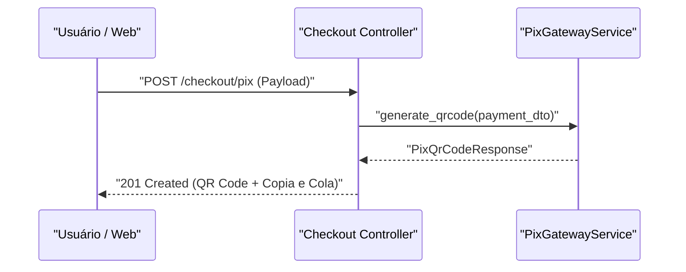

# 📐 Plano de Implementação (SDD): Checkout PIX

---

## 📋 Plano Sequencial de Implementação

| # | O Quê | Por Quê | Critério de Aceite | Dependências |
|---|---|---|---|---|
| 1 | Criar DTO `PixPaymentRequest` em `schemas/pix.py` | Definir contrato de entrada com validação de CPF | Validação Pydantic rejeitando CPF inválido | — |
| 2 | Criar serviço `PixGatewayService` em `services/pix.py` | Isolar integração HTTP com provedor bancário | Método `generate_qrcode` retornando Payload PIX válido | Etapa 1 |

---

## 🏗️ Arquitetura e Contratos



```python
from pydantic import BaseModel, Field

class PixPaymentRequest(BaseModel):
    order_id: str = Field(..., description="ID do pedido")
    amount: float = Field(..., gt=0, description="Valor em Reais")
    tax_id: str = Field(..., description="CPF/CNPJ do pagador")

```

---

## 💥 Análise de Impacto

| Arquivo / Módulo | Tipo de Mudança | Risco | Observações |
| --- | --- | --- | --- |
| `app/schemas/pix.py` | Additive | Baixo | Novo esquema de validação |
| `app/services/pix.py` | Additive | Médio | Novo serviço com dependência externa |

---

## 🔗 Contexto Relacionado (Obsidian Vault)

* [[bdd-checkout-pix]]