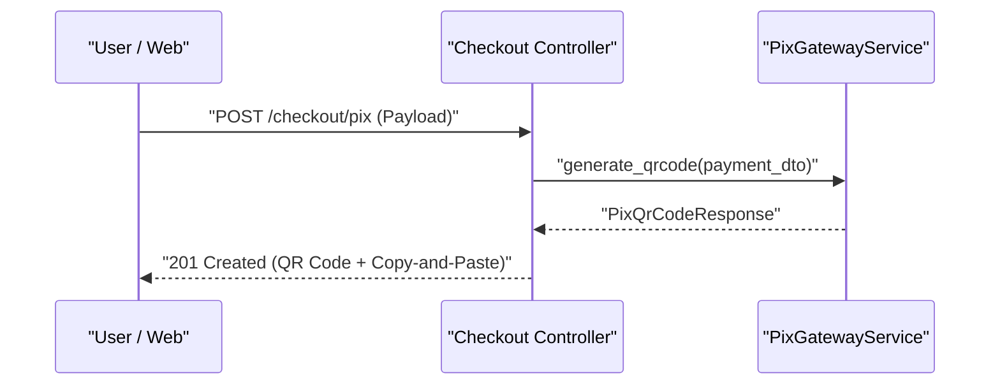

# 📐 Implementation Plan (SDD): Checkout PIX

---

## 📋 Sequential Implementation Plan

| # | What | Why | Acceptance Criterion | Dependencies |
|---|---|---|---|---|
| 1 | Create DTO `PixPaymentRequest` in `schemas/pix.py` | Define input contract with tax ID validation | Pydantic validation rejecting invalid tax ID | — |
| 2 | Create service `PixGatewayService` in `services/pix.py` | Isolate HTTP integration with banking provider | `generate_qrcode` method returning valid PIX Payload | Step 1 |

---

## 🏗️ Architecture and Contracts



```python
from pydantic import BaseModel, Field

class PixPaymentRequest(BaseModel):
    order_id: str = Field(..., description="Order ID")
    amount: float = Field(..., gt=0, description="Amount in Reais")
    tax_id: str = Field(..., description="Payer Tax ID (CPF/CNPJ)")

```

---

## 💥 Impact Analysis

| File / Module | Change Type | Risk | Notes |
| --- | --- | --- | --- |
| `app/schemas/pix.py` | Additive | Low | New validation schema |
| `app/services/pix.py` | Additive | Medium | New service with external dependency |

---

## 🔗 Related Context (Obsidian Vault)

* [[bdd-checkout-pix]]