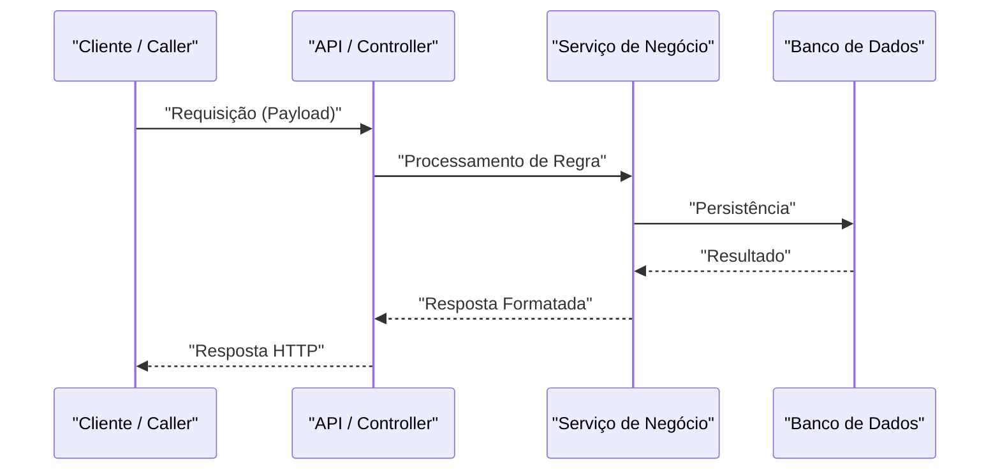

# 📐 Plano de Implementação (SDD): [Nome da Feature]

---

## 🎯 Objetivo

*Descreva resumidamente o problema que esta implementação resolve e o resultado técnico esperado ao final do desenvolvimento.*

---

## ⚠️ Pontos Críticos & Perguntas Abertas

> [!IMPORTANT]
> *Decisões de design, quebras de compatibilidade ou dependências críticas que exigem atenção especial durante a implementação.*

---

## 📋 Plano Sequencial de Implementação

| # | O Quê | Por Quê | Critério de Aceite | Dependências |
|---|---|---|---|---|
| 1 | [Descrição da alteração — arquivo/função] | [Regra de negócio ou justificativa técnica] | [Condição testável de conclusão] | — |
| 2 | [Próxima alteração] | [Justificativa] | [Critério] | Etapa 1 |

---

## 🏗️ Arquitetura e Contratos (Abordagem SDD)

### Diagrama UML de Sequência



### Contratos e Esquemas (Mocks)

```python
# Exemplo de Contrato / Schema Mock Tipado
from pydantic import BaseModel, Field

class ExemploSchema(BaseModel):
    id: str = Field(..., description="Identificador único")

```

---

## 💥 Análise de Impacto

| Arquivo / Módulo | Tipo de Mudança | Risco | Observações |
| --- | --- | --- | --- |
| `caminho/para/novo_arquivo.py` | Additive (novo código) | Baixo | Novo componente isolado |
| `caminho/para/arquivo_existente.py` | Mutative (modificação) | Média | Alteração de comportamento existente |

---

## 🔗 Contexto Relacionado (Obsidian Vault)

* [[bdd-{{FEATURE_SLUG}}]]
