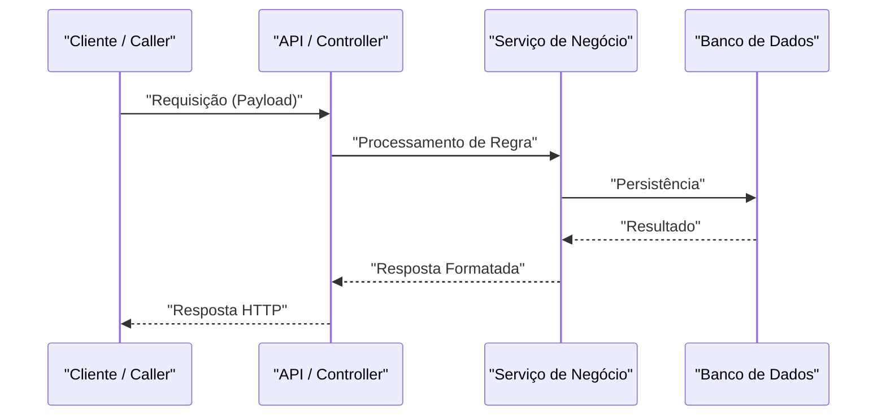
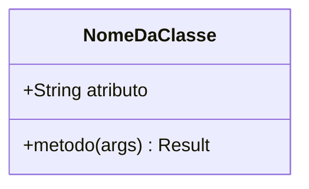

# 📐 Plano de Implementação (SDD): [Feature Name]

---

## 🎯 Objetivo

*Descreva resumidamente o problema que esta implementação resolve e o resultado técnico esperado ao final do desenvolvimento.*

---

## ⚠️ Pontos Críticos & Perguntas Abertas

> [!IMPORTANT]
> *Decisões de design, quebras de compatibilidade ou dependências críticas que exigem atenção especial durante a implementação.*

---

## 📋 Plano Sequencial de Implementação

| # | O Quê | Por Quê | Critério de Aceite | Dependências |
|---|---|---|---|---|
| 1 | [Descrição da alteração — arquivo/função] | [Regra de negócio ou justificativa técnica] | [Condição testável de conclusão] | — |
| 2 | [Próxima alteração] | [Justificativa] | [Critério] | Etapa 1 |
| 3 | ... | ... | ... | ... |

---

## 🏗️ Arquitetura e Contratos (Abordagem SDD)

*Diagramas UML em formato Mermaid.js e contratos tipados que servem como especificação rígida para a fase de código.*

### Diagrama UML de Sequência



### Diagrama UML de Classes (se aplicável)



### Contratos e Esquemas (Mocks)

*Definição de interfaces, esquemas de validação (ex: Pydantic, Zod, TypeScript) ou rotas que atuam como contrato da funcionalidade.*

```python
# Exemplo de Contrato / Schema Mock
class FuncionalidadeSchema(BaseModel):
    campo: str
```

---

## 💥 Análise de Impacto

| Arquivo / Módulo | Tipo de Mudança | Risco | Observações |
|---|---|---|---|
| `caminho/para/novo_arquivo.py` | Additive (novo código) | Baixo | Novo componente isolado |
| `caminho/para/arquivo_existente.py` | Mutative (modificação) | Média | Alteração de comportamento existente |

---

## ✅ Checklist de Qualidade (Pré-Aprovação)

- [ ] Todas as etapas do plano sequencial possuem critérios de aceite testáveis.
- [ ] Diagramas Mermaid utilizam rótulos entre aspas e correspondem a componentes reais da codebase.
- [ ] Análise de impacto contempla todos os arquivos que serão alterados ou criados.
- [ ] Nenhum código-fonte de produção ou teste foi incluído neste documento.

---

## 🔗 Contexto Relacionado (Obsidian Vault)

*Links bidirecionais para notas de contexto e escopo no Obsidian:*
- [[bdd-feature-slug]]
