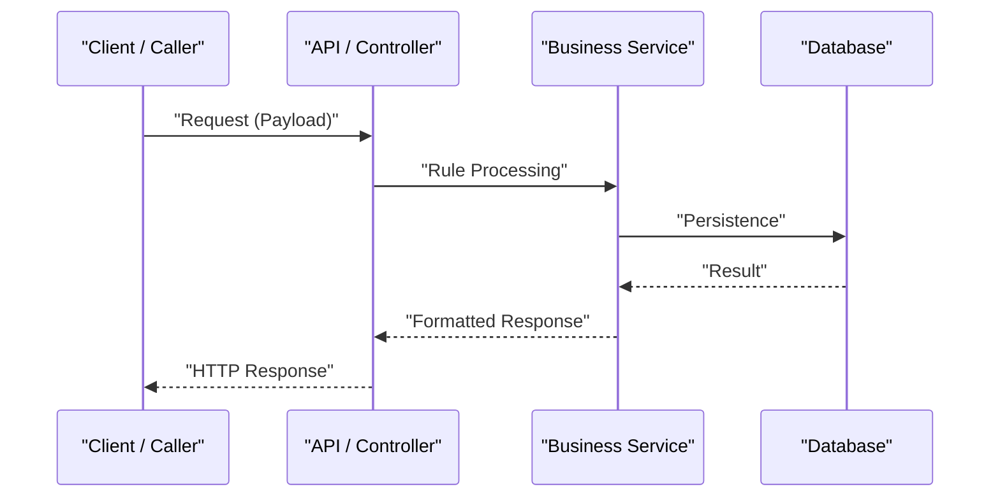

# 📐 Implementation Plan (SDD): [Feature Name]

---

## 🎯 Goal

*Briefly describe the problem this implementation solves and the expected technical outcome at the end of development.*

---

## ⚠️ Critical Points & Open Questions

> [!IMPORTANT]
> *Design decisions, breaking changes, or critical dependencies requiring special attention during implementation.*

---

## 📋 Sequential Implementation Plan

| # | What | Why | Acceptance Criterion | Dependencies |
|---|---|---|---|---|
| 1 | [Description of change — file/function] | [Business rule or technical justification] | [Testable condition of completion] | — |
| 2 | [Next change] | [Justification] | [Criterion] | Step 1 |

---

## 🏗️ Architecture and Contracts (SDD Approach)

### UML Sequence Diagram



### Contracts and Schemas (Mocks)

```python
# Example Typed Mock Schema / Contract
from pydantic import BaseModel, Field

class ExampleSchema(BaseModel):
    id: str = Field(..., description="Unique identifier")

```

---

## 💥 Impact Analysis

| File / Module | Change Type | Risk | Notes |
| --- | --- | --- | --- |
| `path/to/new_file.py` | Additive (new code) | Low | Isolated new component |
| `path/to/existing_file.py` | Mutative (modification) | Medium | Existing behavior alteration |

---

## 🔗 Related Context (Obsidian Vault)

* [[bdd-{{FEATURE_SLUG}}]]
