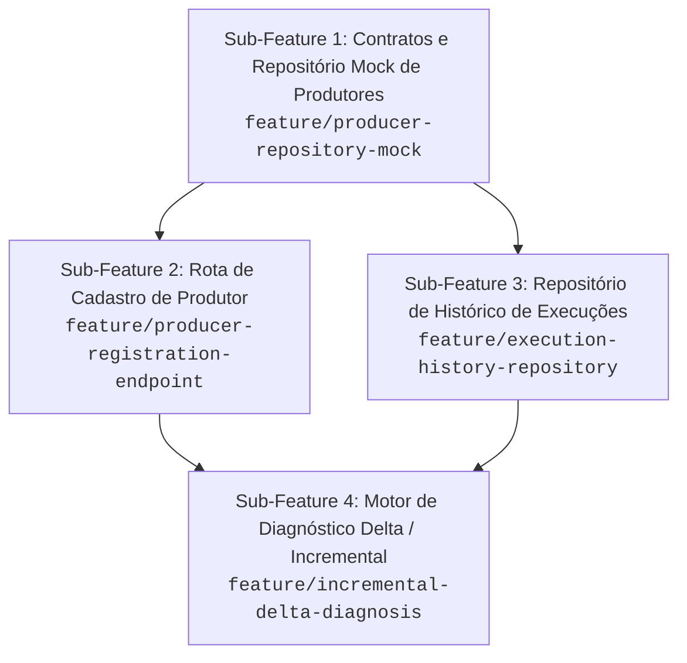

# Exemplo de Decomposição de Épico: Gestão de Produtores e Diagnóstico Delta

Este exemplo documenta a divisão prática do épico da API Ishikawa Educampo em 4 sub-features independentes e evolutivas.

---

## 🎯 Visão do Épico
Eliminar a lentidão e o alto custo de LLM gerados por diagnósticos repetidos, substituindo o arquivo estático `farms.json` por repositórios tipados (com mock inicial), cadastro de produtor e motor de diagnóstico delta.

---

## 🏗️ Grafo de Dependências

---

## 📋 Fichas das Sub-Features

### 1. `feature/producer-repository-mock`
* **Objetivo:** Estabelecer a interface `IProducerRepository` e implementar `InMemoryProducerRepository` com seed carregado do `farms.json`.
* **Entregas:** Modelos `Producer` e `Farm`, contratos de busca por ID e email.
* **Impacto:** Zero rotas existentes quebradas; fundação para todas as próximas features.

### 2. `feature/producer-registration-endpoint`
* **Objetivo:** Criar o endpoint `POST /api/produtores` para registro com senha e verificação de duplicidade de e-mail.
* **Entregas:** Schema Pydantic, hashing de senha, handler da rota consumindo `IProducerRepository`.

### 3. `feature/execution-history-repository`
* **Objetivo:** Modelar contratos e persistência em mock para entradas e saídas de diagnósticos, benchmarks e simulações.
* **Entregas:** Interface `IDiagnosticHistoryRepository` e armazenamento de diagnósticos por produtor.

### 4. `feature/incremental-delta-diagnosis`
* **Objetivo:** Implementar comparador de alterações no payload e chamar a LLM apenas para os pilares Ishikawa afetados.
* **Entregas:** Algoritmo delta, orquestração cirúrgica da LLM e gravação automática no histórico.
