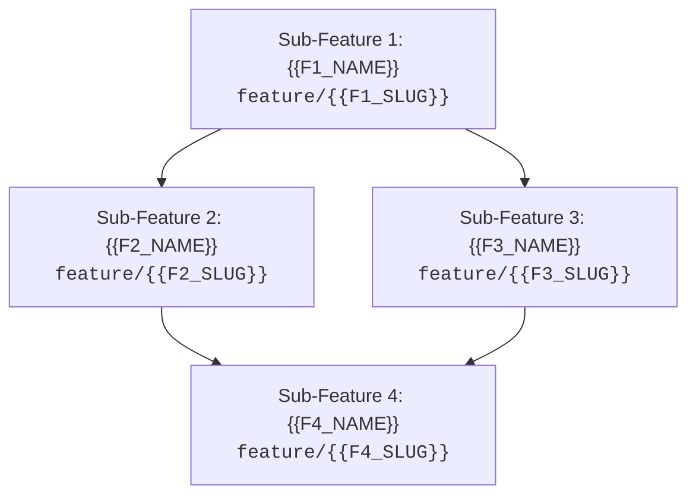

# 🗺️ Epic Blueprint: {{EPIC_TITLE}}

## 🎯 1. Visão Geral & Estado Final Desejado
* **Problema do Legado:** {{LEGACY_PROBLEM}}
* **Resultado Esperado (Outcome):** {{FINAL_OUTCOME}}

---

## 🏗️ 2. Grafo de Dependências das Sub-Features

---

## 📋 3. Roteiro Sequencial de Sub-Features

### 🔹 Sub-Feature 1: `feature/{{F1_SLUG}}` - {{F1_NAME}}
* **Objetivo:** {{F1_OBJECTIVE}}
* **Contratos / Abstrações Introduzidos:** {{F1_CONTRACTS}}
* **Critério de Conclusão:** {{F1_DOD}}
* **Próximo Passo:** Executar `/planejamento` nesta branch.

---

### 🔹 Sub-Feature 2: `feature/{{F2_SLUG}}` - {{F2_NAME}}
* **Dependência:** Requer `feature/{{F1_SLUG}}` concluída e mesclada em `develop`.
* **Objetivo:** {{F2_OBJECTIVE}}
* **Contratos / Abstrações Introduzidos:** {{F2_CONTRACTS}}
* **Critério de Conclusão:** {{F2_DOD}}

---

### 🔹 Sub-Feature 3: `feature/{{F3_SLUG}}` - {{F3_NAME}}
* **Dependência:** Requer `feature/{{F1_SLUG}}` concluída e mesclada em `develop`.
* **Objetivo:** {{F3_OBJECTIVE}}
* **Contratos / Abstrações Introduzidos:** {{F3_CONTRACTS}}
* **Critério de Conclusão:** {{F3_DOD}}

---

### 🔹 Sub-Feature 4: `feature/{{F4_SLUG}}` - {{F4_NAME}}
* **Dependência:** Requer `feature/{{F2_SLUG}}` e `feature/{{F3_SLUG}}` concluídas.
* **Objetivo:** {{F4_OBJECTIVE}}
* **Integração Final:** {{F4_INTEGRATION}}
* **Critério de Conclusão:** {{F4_DOD}}
