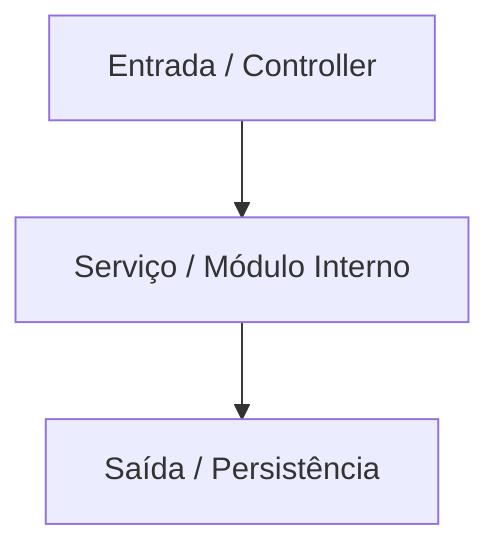

# 📂 Documentação do Diretório: `[Nome do Diretório]`

## 🎯 Visão Geral
* **Propósito:** `[Descrição clara da responsabilidade arquitetural do diretório]`
* **Camada:** `[Ex: Domínio / Infraestrutura / Aplicação]`

## 🏗️ Arquitetura e Fluxo de Dados

## 🗂️ Mapeamento de Componentes
* `📄 arquivo_principal.py`: `[Descrição do papel do arquivo]`
* `📄 utils.py`: `[Funções utilitárias]`

## 🧠 Decisões de Design & Trade-offs
* **Decisão:** `[Descrição da escolha técnica]`
* **Motivação:** `[Motivo e alternativas descartadas]`

## 🧪 Estratégia de Testes
* **Tipos de Testes:** `[Unitários / Integração]`
* **Cenários Críticos:** `[Casos de borda cobertos]`

## 🔗 Related Context
* Obsidian Vault: `[[nome-da-nota-relevante]]`
